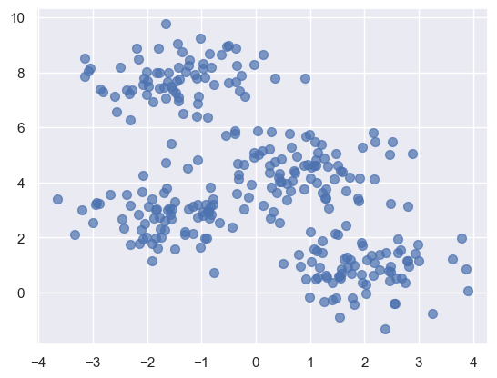
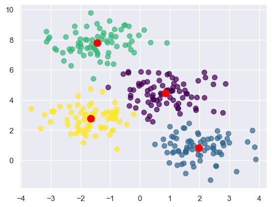
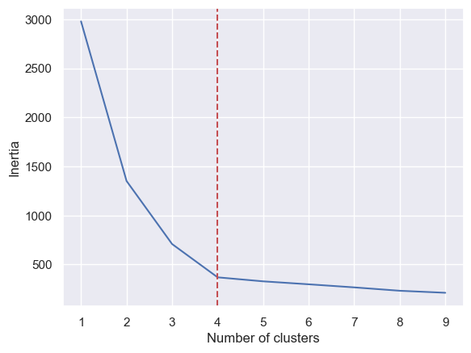
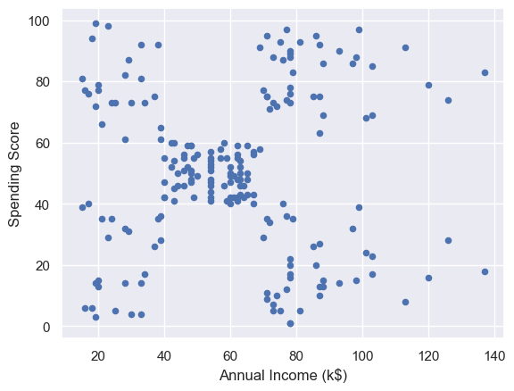
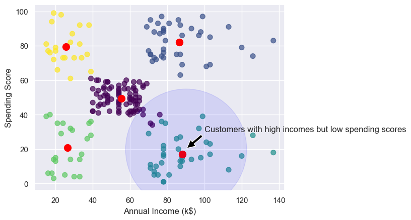
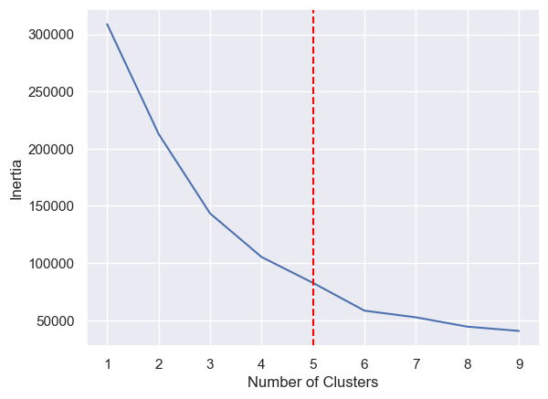

# Unsupervised Learning with k-Means clustering


- [<span class="toc-section-number">1</span> Applying k-Means Clustering
  to Customer Data](#applying-k-means-clustering-to-customer-data)
- [<span class="toc-section-number">2</span> Segmenting customers using
  more than two
  dimensions](#segmenting-customers-using-more-than-two-dimensions)

``` python
import matplotlib.pyplot as plt
import seaborn as sns

sns.set()
```

``` python
from sklearn.datasets import make_blobs

points, cluster_indexes = make_blobs(
    n_samples=300, centers=4, cluster_std=0.8, random_state=0
)

x = points[:, 0]
y = points[:, 1]

plt.scatter(x, y, s=50, alpha=0.7);
```



``` python
from sklearn.cluster import KMeans

# Here we set the number of clusters to 4.
# This may not be optimal.
kmeans = KMeans(n_clusters=4, random_state=0)
kmeans.fit(points)

predicted_cluster_indexes = kmeans.predict(points)
plt.scatter(x, y, c=predicted_cluster_indexes, s=50, alpha=0.7, cmap="viridis")

centers = kmeans.cluster_centers_
plt.scatter(centers[:, 0], centers[:, 1], c="red", s=100);
```



Picking the right number of clusters with the *elbow method*.

The *elbow method* plots inertias (the sum of squared distances of the
data points to the closest cluster center) as a function of cluster
counts.

The best number of cluster can be determined by looking for the sharpest
elbow in the curve (red vertical line in the plot below).

``` python
inertias = []
for i in range(1, 10):
    kmeans = KMeans(n_clusters=i, random_state=0)
    kmeans.fit(points)
    inertias.append(kmeans.inertia_)

plt.plot(range(1, 10), inertias)
plt.xlabel("Number of clusters")
plt.ylabel("Inertia")
plt.axvline(4, linestyle="--", c="r");
```



## Applying k-Means Clustering to Customer Data

``` python
import pandas as pd

customers = pd.read_csv("customers.csv")
customers.head()
```

<div>
<style scoped>
    .dataframe tbody tr th:only-of-type {
        vertical-align: middle;
    }
&#10;    .dataframe tbody tr th {
        vertical-align: top;
    }
&#10;    .dataframe thead th {
        text-align: right;
    }
</style>

|     | CustomerID | Gender | Age | Annual Income (k\$) | Spending Score (1-100) |
|-----|------------|--------|-----|---------------------|------------------------|
| 0   | 1          | Male   | 19  | 15                  | 39                     |
| 1   | 2          | Male   | 21  | 15                  | 81                     |
| 2   | 3          | Female | 20  | 16                  | 6                      |
| 3   | 4          | Female | 23  | 16                  | 77                     |
| 4   | 5          | Female | 31  | 17                  | 40                     |

</div>

``` python
import matplotlib.pyplot as plt
import seaborn as sns

sns.set()
```

``` python
customers.plot(
    x="Annual Income (k$)",
    y="Spending Score (1-100)",
    ylabel="Spending Score",
    style=dict(s=50, alpha=0.7),
    kind="scatter",
);
```



``` python
from sklearn.cluster import KMeans

points = customers[["Annual Income (k$)", "Spending Score (1-100)"]].values
x = points[:, 0]
y = points[:, 1]

kmeans = KMeans(n_clusters=5, random_state=0)
kmeans.fit(points)

predicted_cluster_indexes = kmeans.predict(points)

plt.scatter(
    x, y, c=list(map(int, predicted_cluster_indexes)), s=50, alpha=0.7, cmap="viridis"
)
plt.xlabel("Annual Income (k$)")
plt.ylabel("Spending Score")


centers = kmeans.cluster_centers_
plt.scatter(centers[:, 0], centers[:, 1], c="red", s=100)

plt.scatter(90, 20, 30000, color="blue", alpha=0.1)
plt.annotate(
    "Customers with high incomes but low spending scores",
    xy=(90, 20),
    xytext=(100, 30),
    arrowprops=dict(facecolor="black", shrink=0.05),
);
```



``` python
df = customers.copy()
df["Cluster"] = kmeans.predict(points)
df.head()
```

<div>
<style scoped>
    .dataframe tbody tr th:only-of-type {
        vertical-align: middle;
    }
&#10;    .dataframe tbody tr th {
        vertical-align: top;
    }
&#10;    .dataframe thead th {
        text-align: right;
    }
</style>

|     | CustomerID | Gender | Age | Annual Income (k\$) | Spending Score (1-100) | Cluster |
|-----|------------|--------|-----|---------------------|------------------------|---------|
| 0   | 1          | Male   | 19  | 15                  | 39                     | 3       |
| 1   | 2          | Male   | 21  | 15                  | 81                     | 4       |
| 2   | 3          | Female | 20  | 16                  | 6                      | 3       |
| 3   | 4          | Female | 23  | 16                  | 77                     | 4       |
| 4   | 5          | Female | 31  | 17                  | 40                     | 3       |

</div>

``` python
import numpy as np

# Get the cluster index for a customer with a high income and low spending score.
cluster = kmeans.predict(np.array([[120, 20]]))[0]

# Filter the DataFrame to include only customes in that cluster.
clustered_df = df[df["Cluster"] == cluster]

# Show the customer IDs.
clustered_df["CustomerID"].values
```

    array([125, 129, 131, 135, 137, 139, 141, 145, 147, 149, 151, 153, 155,
           157, 159, 161, 163, 165, 167, 169, 171, 173, 175, 177, 179, 181,
           183, 185, 187, 189, 191, 193, 195, 197, 199])

## Segmenting customers using more than two dimensions

``` python
from sklearn.preprocessing import LabelEncoder

df = customers.copy()
encoder = LabelEncoder()
df["Gender"] = encoder.fit_transform(df["Gender"])
df.head()
```

<div>
<style scoped>
    .dataframe tbody tr th:only-of-type {
        vertical-align: middle;
    }
&#10;    .dataframe tbody tr th {
        vertical-align: top;
    }
&#10;    .dataframe thead th {
        text-align: right;
    }
</style>

|     | CustomerID | Gender | Age | Annual Income (k\$) | Spending Score (1-100) |
|-----|------------|--------|-----|---------------------|------------------------|
| 0   | 1          | 1      | 19  | 15                  | 39                     |
| 1   | 2          | 1      | 21  | 15                  | 81                     |
| 2   | 3          | 0      | 20  | 16                  | 6                      |
| 3   | 4          | 0      | 23  | 16                  | 77                     |
| 4   | 5          | 0      | 31  | 17                  | 40                     |

</div>

``` python
encoder.classes_
```

    array(['Female', 'Male'], dtype=object)

``` python
df.columns
```

    Index(['CustomerID', 'Gender', 'Age', 'Annual Income (k$)',
           'Spending Score (1-100)'],
          dtype='object')

``` python
# Always define the columns we are working with.
points = df[["Gender", "Age", "Annual Income (k$)", "Spending Score (1-100)"]]
inertias = []

for i in range(1, 10):
    kmeans = KMeans(n_clusters=i, random_state=0)
    kmeans.fit(points)
    inertias.append(kmeans.inertia_)

plt.plot(range(1, 10), inertias)
plt.xlabel("Number of Clusters")
plt.ylabel("Inertia")
plt.axvline(5, linestyle="--", c="red");
```



``` python
kmeans = KMeans(n_clusters=5, random_state=0)
kmeans.fit(points)
```

<style>#sk-container-id-1 {
  /* Definition of color scheme common for light and dark mode */
  --sklearn-color-text: #000;
  --sklearn-color-text-muted: #666;
  --sklearn-color-line: gray;
  /* Definition of color scheme for unfitted estimators */
  --sklearn-color-unfitted-level-0: #fff5e6;
  --sklearn-color-unfitted-level-1: #f6e4d2;
  --sklearn-color-unfitted-level-2: #ffe0b3;
  --sklearn-color-unfitted-level-3: chocolate;
  /* Definition of color scheme for fitted estimators */
  --sklearn-color-fitted-level-0: #f0f8ff;
  --sklearn-color-fitted-level-1: #d4ebff;
  --sklearn-color-fitted-level-2: #b3dbfd;
  --sklearn-color-fitted-level-3: cornflowerblue;
&#10;  /* Specific color for light theme */
  --sklearn-color-text-on-default-background: var(--sg-text-color, var(--theme-code-foreground, var(--jp-content-font-color1, black)));
  --sklearn-color-background: var(--sg-background-color, var(--theme-background, var(--jp-layout-color0, white)));
  --sklearn-color-border-box: var(--sg-text-color, var(--theme-code-foreground, var(--jp-content-font-color1, black)));
  --sklearn-color-icon: #696969;
&#10;  @media (prefers-color-scheme: dark) {
    /* Redefinition of color scheme for dark theme */
    --sklearn-color-text-on-default-background: var(--sg-text-color, var(--theme-code-foreground, var(--jp-content-font-color1, white)));
    --sklearn-color-background: var(--sg-background-color, var(--theme-background, var(--jp-layout-color0, #111)));
    --sklearn-color-border-box: var(--sg-text-color, var(--theme-code-foreground, var(--jp-content-font-color1, white)));
    --sklearn-color-icon: #878787;
  }
}
&#10;#sk-container-id-1 {
  color: var(--sklearn-color-text);
}
&#10;#sk-container-id-1 pre {
  padding: 0;
}
&#10;#sk-container-id-1 input.sk-hidden--visually {
  border: 0;
  clip: rect(1px 1px 1px 1px);
  clip: rect(1px, 1px, 1px, 1px);
  height: 1px;
  margin: -1px;
  overflow: hidden;
  padding: 0;
  position: absolute;
  width: 1px;
}
&#10;#sk-container-id-1 div.sk-dashed-wrapped {
  border: 1px dashed var(--sklearn-color-line);
  margin: 0 0.4em 0.5em 0.4em;
  box-sizing: border-box;
  padding-bottom: 0.4em;
  background-color: var(--sklearn-color-background);
}
&#10;#sk-container-id-1 div.sk-container {
  /* jupyter's `normalize.less` sets `[hidden] { display: none; }`
     but bootstrap.min.css set `[hidden] { display: none !important; }`
     so we also need the `!important` here to be able to override the
     default hidden behavior on the sphinx rendered scikit-learn.org.
     See: https://github.com/scikit-learn/scikit-learn/issues/21755 */
  display: inline-block !important;
  position: relative;
}
&#10;#sk-container-id-1 div.sk-text-repr-fallback {
  display: none;
}
&#10;div.sk-parallel-item,
div.sk-serial,
div.sk-item {
  /* draw centered vertical line to link estimators */
  background-image: linear-gradient(var(--sklearn-color-text-on-default-background), var(--sklearn-color-text-on-default-background));
  background-size: 2px 100%;
  background-repeat: no-repeat;
  background-position: center center;
}
&#10;/* Parallel-specific style estimator block */
&#10;#sk-container-id-1 div.sk-parallel-item::after {
  content: "";
  width: 100%;
  border-bottom: 2px solid var(--sklearn-color-text-on-default-background);
  flex-grow: 1;
}
&#10;#sk-container-id-1 div.sk-parallel {
  display: flex;
  align-items: stretch;
  justify-content: center;
  background-color: var(--sklearn-color-background);
  position: relative;
}
&#10;#sk-container-id-1 div.sk-parallel-item {
  display: flex;
  flex-direction: column;
}
&#10;#sk-container-id-1 div.sk-parallel-item:first-child::after {
  align-self: flex-end;
  width: 50%;
}
&#10;#sk-container-id-1 div.sk-parallel-item:last-child::after {
  align-self: flex-start;
  width: 50%;
}
&#10;#sk-container-id-1 div.sk-parallel-item:only-child::after {
  width: 0;
}
&#10;/* Serial-specific style estimator block */
&#10;#sk-container-id-1 div.sk-serial {
  display: flex;
  flex-direction: column;
  align-items: center;
  background-color: var(--sklearn-color-background);
  padding-right: 1em;
  padding-left: 1em;
}
&#10;
/* Toggleable style: style used for estimator/Pipeline/ColumnTransformer box that is
clickable and can be expanded/collapsed.
- Pipeline and ColumnTransformer use this feature and define the default style
- Estimators will overwrite some part of the style using the `sk-estimator` class
*/
&#10;/* Pipeline and ColumnTransformer style (default) */
&#10;#sk-container-id-1 div.sk-toggleable {
  /* Default theme specific background. It is overwritten whether we have a
  specific estimator or a Pipeline/ColumnTransformer */
  background-color: var(--sklearn-color-background);
}
&#10;/* Toggleable label */
#sk-container-id-1 label.sk-toggleable__label {
  cursor: pointer;
  display: flex;
  width: 100%;
  margin-bottom: 0;
  padding: 0.5em;
  box-sizing: border-box;
  text-align: center;
  align-items: start;
  justify-content: space-between;
  gap: 0.5em;
}
&#10;#sk-container-id-1 label.sk-toggleable__label .caption {
  font-size: 0.6rem;
  font-weight: lighter;
  color: var(--sklearn-color-text-muted);
}
&#10;#sk-container-id-1 label.sk-toggleable__label-arrow:before {
  /* Arrow on the left of the label */
  content: "▸";
  float: left;
  margin-right: 0.25em;
  color: var(--sklearn-color-icon);
}
&#10;#sk-container-id-1 label.sk-toggleable__label-arrow:hover:before {
  color: var(--sklearn-color-text);
}
&#10;/* Toggleable content - dropdown */
&#10;#sk-container-id-1 div.sk-toggleable__content {
  max-height: 0;
  max-width: 0;
  overflow: hidden;
  text-align: left;
  /* unfitted */
  background-color: var(--sklearn-color-unfitted-level-0);
}
&#10;#sk-container-id-1 div.sk-toggleable__content.fitted {
  /* fitted */
  background-color: var(--sklearn-color-fitted-level-0);
}
&#10;#sk-container-id-1 div.sk-toggleable__content pre {
  margin: 0.2em;
  border-radius: 0.25em;
  color: var(--sklearn-color-text);
  /* unfitted */
  background-color: var(--sklearn-color-unfitted-level-0);
}
&#10;#sk-container-id-1 div.sk-toggleable__content.fitted pre {
  /* unfitted */
  background-color: var(--sklearn-color-fitted-level-0);
}
&#10;#sk-container-id-1 input.sk-toggleable__control:checked~div.sk-toggleable__content {
  /* Expand drop-down */
  max-height: 200px;
  max-width: 100%;
  overflow: auto;
}
&#10;#sk-container-id-1 input.sk-toggleable__control:checked~label.sk-toggleable__label-arrow:before {
  content: "▾";
}
&#10;/* Pipeline/ColumnTransformer-specific style */
&#10;#sk-container-id-1 div.sk-label input.sk-toggleable__control:checked~label.sk-toggleable__label {
  color: var(--sklearn-color-text);
  background-color: var(--sklearn-color-unfitted-level-2);
}
&#10;#sk-container-id-1 div.sk-label.fitted input.sk-toggleable__control:checked~label.sk-toggleable__label {
  background-color: var(--sklearn-color-fitted-level-2);
}
&#10;/* Estimator-specific style */
&#10;/* Colorize estimator box */
#sk-container-id-1 div.sk-estimator input.sk-toggleable__control:checked~label.sk-toggleable__label {
  /* unfitted */
  background-color: var(--sklearn-color-unfitted-level-2);
}
&#10;#sk-container-id-1 div.sk-estimator.fitted input.sk-toggleable__control:checked~label.sk-toggleable__label {
  /* fitted */
  background-color: var(--sklearn-color-fitted-level-2);
}
&#10;#sk-container-id-1 div.sk-label label.sk-toggleable__label,
#sk-container-id-1 div.sk-label label {
  /* The background is the default theme color */
  color: var(--sklearn-color-text-on-default-background);
}
&#10;/* On hover, darken the color of the background */
#sk-container-id-1 div.sk-label:hover label.sk-toggleable__label {
  color: var(--sklearn-color-text);
  background-color: var(--sklearn-color-unfitted-level-2);
}
&#10;/* Label box, darken color on hover, fitted */
#sk-container-id-1 div.sk-label.fitted:hover label.sk-toggleable__label.fitted {
  color: var(--sklearn-color-text);
  background-color: var(--sklearn-color-fitted-level-2);
}
&#10;/* Estimator label */
&#10;#sk-container-id-1 div.sk-label label {
  font-family: monospace;
  font-weight: bold;
  display: inline-block;
  line-height: 1.2em;
}
&#10;#sk-container-id-1 div.sk-label-container {
  text-align: center;
}
&#10;/* Estimator-specific */
#sk-container-id-1 div.sk-estimator {
  font-family: monospace;
  border: 1px dotted var(--sklearn-color-border-box);
  border-radius: 0.25em;
  box-sizing: border-box;
  margin-bottom: 0.5em;
  /* unfitted */
  background-color: var(--sklearn-color-unfitted-level-0);
}
&#10;#sk-container-id-1 div.sk-estimator.fitted {
  /* fitted */
  background-color: var(--sklearn-color-fitted-level-0);
}
&#10;/* on hover */
#sk-container-id-1 div.sk-estimator:hover {
  /* unfitted */
  background-color: var(--sklearn-color-unfitted-level-2);
}
&#10;#sk-container-id-1 div.sk-estimator.fitted:hover {
  /* fitted */
  background-color: var(--sklearn-color-fitted-level-2);
}
&#10;/* Specification for estimator info (e.g. "i" and "?") */
&#10;/* Common style for "i" and "?" */
&#10;.sk-estimator-doc-link,
a:link.sk-estimator-doc-link,
a:visited.sk-estimator-doc-link {
  float: right;
  font-size: smaller;
  line-height: 1em;
  font-family: monospace;
  background-color: var(--sklearn-color-background);
  border-radius: 1em;
  height: 1em;
  width: 1em;
  text-decoration: none !important;
  margin-left: 0.5em;
  text-align: center;
  /* unfitted */
  border: var(--sklearn-color-unfitted-level-1) 1pt solid;
  color: var(--sklearn-color-unfitted-level-1);
}
&#10;.sk-estimator-doc-link.fitted,
a:link.sk-estimator-doc-link.fitted,
a:visited.sk-estimator-doc-link.fitted {
  /* fitted */
  border: var(--sklearn-color-fitted-level-1) 1pt solid;
  color: var(--sklearn-color-fitted-level-1);
}
&#10;/* On hover */
div.sk-estimator:hover .sk-estimator-doc-link:hover,
.sk-estimator-doc-link:hover,
div.sk-label-container:hover .sk-estimator-doc-link:hover,
.sk-estimator-doc-link:hover {
  /* unfitted */
  background-color: var(--sklearn-color-unfitted-level-3);
  color: var(--sklearn-color-background);
  text-decoration: none;
}
&#10;div.sk-estimator.fitted:hover .sk-estimator-doc-link.fitted:hover,
.sk-estimator-doc-link.fitted:hover,
div.sk-label-container:hover .sk-estimator-doc-link.fitted:hover,
.sk-estimator-doc-link.fitted:hover {
  /* fitted */
  background-color: var(--sklearn-color-fitted-level-3);
  color: var(--sklearn-color-background);
  text-decoration: none;
}
&#10;/* Span, style for the box shown on hovering the info icon */
.sk-estimator-doc-link span {
  display: none;
  z-index: 9999;
  position: relative;
  font-weight: normal;
  right: .2ex;
  padding: .5ex;
  margin: .5ex;
  width: min-content;
  min-width: 20ex;
  max-width: 50ex;
  color: var(--sklearn-color-text);
  box-shadow: 2pt 2pt 4pt #999;
  /* unfitted */
  background: var(--sklearn-color-unfitted-level-0);
  border: .5pt solid var(--sklearn-color-unfitted-level-3);
}
&#10;.sk-estimator-doc-link.fitted span {
  /* fitted */
  background: var(--sklearn-color-fitted-level-0);
  border: var(--sklearn-color-fitted-level-3);
}
&#10;.sk-estimator-doc-link:hover span {
  display: block;
}
&#10;/* "?"-specific style due to the `<a>` HTML tag */
&#10;#sk-container-id-1 a.estimator_doc_link {
  float: right;
  font-size: 1rem;
  line-height: 1em;
  font-family: monospace;
  background-color: var(--sklearn-color-background);
  border-radius: 1rem;
  height: 1rem;
  width: 1rem;
  text-decoration: none;
  /* unfitted */
  color: var(--sklearn-color-unfitted-level-1);
  border: var(--sklearn-color-unfitted-level-1) 1pt solid;
}
&#10;#sk-container-id-1 a.estimator_doc_link.fitted {
  /* fitted */
  border: var(--sklearn-color-fitted-level-1) 1pt solid;
  color: var(--sklearn-color-fitted-level-1);
}
&#10;/* On hover */
#sk-container-id-1 a.estimator_doc_link:hover {
  /* unfitted */
  background-color: var(--sklearn-color-unfitted-level-3);
  color: var(--sklearn-color-background);
  text-decoration: none;
}
&#10;#sk-container-id-1 a.estimator_doc_link.fitted:hover {
  /* fitted */
  background-color: var(--sklearn-color-fitted-level-3);
}
</style><div id="sk-container-id-1" class="sk-top-container"><div class="sk-text-repr-fallback"><pre>KMeans(n_clusters=5, random_state=0)</pre><b>In a Jupyter environment, please rerun this cell to show the HTML representation or trust the notebook. <br />On GitHub, the HTML representation is unable to render, please try loading this page with nbviewer.org.</b></div><div class="sk-container" hidden><div class="sk-item"><div class="sk-estimator fitted sk-toggleable"><input class="sk-toggleable__control sk-hidden--visually" id="sk-estimator-id-1" type="checkbox" checked><label for="sk-estimator-id-1" class="sk-toggleable__label fitted sk-toggleable__label-arrow"><div><div>KMeans</div></div><div><a class="sk-estimator-doc-link fitted" rel="noreferrer" target="_blank" href="https://scikit-learn.org/1.6/modules/generated/sklearn.cluster.KMeans.html">?<span>Documentation for KMeans</span></a><span class="sk-estimator-doc-link fitted">i<span>Fitted</span></span></div></label><div class="sk-toggleable__content fitted"><pre>KMeans(n_clusters=5, random_state=0)</pre></div> </div></div></div></div>

``` python
df["Cluster"] = kmeans.predict(points)
df.head()
```

<div>
<style scoped>
    .dataframe tbody tr th:only-of-type {
        vertical-align: middle;
    }
&#10;    .dataframe tbody tr th {
        vertical-align: top;
    }
&#10;    .dataframe thead th {
        text-align: right;
    }
</style>

|     | CustomerID | Gender | Age | Annual Income (k\$) | Spending Score (1-100) | Cluster |
|-----|------------|--------|-----|---------------------|------------------------|---------|
| 0   | 1          | 1      | 19  | 15                  | 39                     | 2       |
| 1   | 2          | 1      | 21  | 15                  | 81                     | 2       |
| 2   | 3          | 0      | 20  | 16                  | 6                      | 0       |
| 3   | 4          | 0      | 23  | 16                  | 77                     | 2       |
| 4   | 5          | 0      | 31  | 17                  | 40                     | 0       |

</div>

``` python
results = pd.DataFrame(
    columns=[
        "Cluster",
        "Average Age",
        "Average income",
        "Average Spending Index",
        "Number of Females",
        "Number of Males",
    ]
)

for i, center in enumerate(kmeans.cluster_centers_):
    age = center[1]  # Average age for current cluster
    income = center[2]  # Average income for current cluster
    spend = center[3]  # Average spending score for current cluster

    gdf = df[df["Cluster"] == i]  # Group DataFrame
    females = gdf[gdf["Gender"] == 0].shape[0]  # See LabelEncoder().classes_
    males = gdf[gdf["Gender"] == 1].shape[0]
    results.loc[i] = [i, age, income, spend, females, males]

results.head()
```

<div>
<style scoped>
    .dataframe tbody tr th:only-of-type {
        vertical-align: middle;
    }
&#10;    .dataframe tbody tr th {
        vertical-align: top;
    }
&#10;    .dataframe thead th {
        text-align: right;
    }
</style>

|  | Cluster | Average Age | Average income | Average Spending Index | Number of Females | Number of Males |
|----|----|----|----|----|----|----|
| 0 | 0.0 | 54.060000 | 40.460000 | 36.720000 | 28.0 | 22.0 |
| 1 | 1.0 | 32.692308 | 86.538462 | 82.128205 | 21.0 | 18.0 |
| 2 | 2.0 | 25.250000 | 25.833333 | 76.916667 | 14.0 | 10.0 |
| 3 | 3.0 | 41.647059 | 88.735294 | 16.764706 | 15.0 | 19.0 |
| 4 | 4.0 | 33.396226 | 58.056604 | 48.773585 | 34.0 | 19.0 |

</div>

``` python
# Target customers with high incomes, but low spending scores for a promotion.
results.style.map(
    lambda _: f"background-color: rgba(255, 0, 0, 0.2)",
    subset=(results.index[3],),
)
```

<style type="text/css">
#T_46e91_row3_col0, #T_46e91_row3_col1, #T_46e91_row3_col2, #T_46e91_row3_col3, #T_46e91_row3_col4, #T_46e91_row3_col5 {
  background-color: rgba(255, 0, 0, 0.2);
}
</style>

|   | Cluster | Average Age | Average income | Average Spending Index | Number of Females | Number of Males |
|----|----|----|----|----|----|----|
| 0 | 0.000000 | 54.060000 | 40.460000 | 36.720000 | 28.000000 | 22.000000 |
| 1 | 1.000000 | 32.692308 | 86.538462 | 82.128205 | 21.000000 | 18.000000 |
| 2 | 2.000000 | 25.250000 | 25.833333 | 76.916667 | 14.000000 | 10.000000 |
| 3 | 3.000000 | 41.647059 | 88.735294 | 16.764706 | 15.000000 | 19.000000 |
| 4 | 4.000000 | 33.396226 | 58.056604 | 48.773585 | 34.000000 | 19.000000 |

``` python
# Some of the biggest spenders are young people with modest incomes.
results.style.map(
    lambda _: f"background-color: rgba(0, 255, 0, 0.2)",
    subset=(results.index[2],),
)
```

<style type="text/css">
#T_74330_row2_col0, #T_74330_row2_col1, #T_74330_row2_col2, #T_74330_row2_col3, #T_74330_row2_col4, #T_74330_row2_col5 {
  background-color: rgba(0, 255, 0, 0.2);
}
</style>

|   | Cluster | Average Age | Average income | Average Spending Index | Number of Females | Number of Males |
|----|----|----|----|----|----|----|
| 0 | 0.000000 | 54.060000 | 40.460000 | 36.720000 | 28.000000 | 22.000000 |
| 1 | 1.000000 | 32.692308 | 86.538462 | 82.128205 | 21.000000 | 18.000000 |
| 2 | 2.000000 | 25.250000 | 25.833333 | 76.916667 | 14.000000 | 10.000000 |
| 3 | 3.000000 | 41.647059 | 88.735294 | 16.764706 | 15.000000 | 19.000000 |
| 4 | 4.000000 | 33.396226 | 58.056604 | 48.773585 | 34.000000 | 19.000000 |
