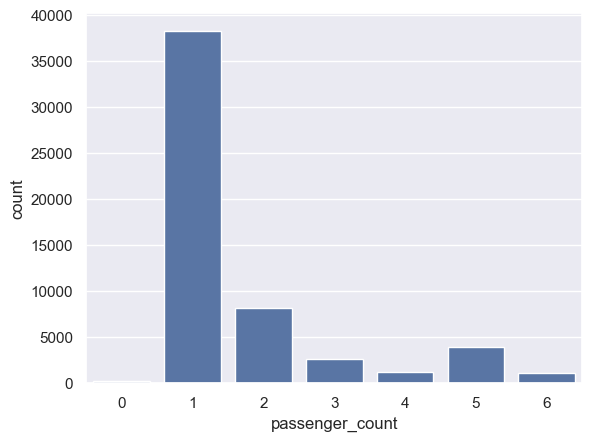

# Regression Models


- [<span class="toc-section-number">1</span> Accuracy Measures for
  Regression Models](#accuracy-measures-for-regression-models)
- [<span class="toc-section-number">2</span> Using Regression to Predict
  Taxi Fares](#using-regression-to-predict-taxi-fares)

## Accuracy Measures for Regression Models

``` python
from sklearn.datasets import fetch_california_housing
from sklearn.utils import shuffle

df = fetch_california_housing(as_frame=True).frame
df = shuffle(df, random_state=0)
df = df.head(1000)
df.head()
```

<div>
<style scoped>
    .dataframe tbody tr th:only-of-type {
        vertical-align: middle;
    }
&#10;    .dataframe tbody tr th {
        vertical-align: top;
    }
&#10;    .dataframe thead th {
        text-align: right;
    }
</style>

|  | MedInc | HouseAge | AveRooms | AveBedrms | Population | AveOccup | Latitude | Longitude | MedHouseVal |
|----|----|----|----|----|----|----|----|----|----|
| 14740 | 4.1518 | 22.0 | 5.663073 | 1.075472 | 1551.0 | 4.180593 | 32.58 | -117.05 | 1.369 |
| 10101 | 5.7796 | 32.0 | 6.107226 | 0.927739 | 1296.0 | 3.020979 | 33.92 | -117.97 | 2.413 |
| 20566 | 4.3487 | 29.0 | 5.930712 | 1.026217 | 1554.0 | 2.910112 | 38.65 | -121.84 | 2.007 |
| 2670 | 2.4511 | 37.0 | 4.992958 | 1.316901 | 390.0 | 2.746479 | 33.20 | -115.60 | 0.725 |
| 15709 | 5.0049 | 25.0 | 4.319261 | 1.039578 | 649.0 | 1.712401 | 37.79 | -122.43 | 4.600 |

</div>

``` python
from sklearn.linear_model import LinearRegression
from sklearn.model_selection import train_test_split

X = df.drop(["MedHouseVal"], axis=1)
y = df["MedHouseVal"]

X_train, X_test, y_train, y_test = train_test_split(X, y, test_size=0.2, random_state=0)

model = LinearRegression()
model.fit(X_train, y_train)
model.score(X_test, y_test)
```

    0.5863264047398474

``` python
X_train, X_test, y_train, y_test = train_test_split(X, y, test_size=0.2, random_state=1)

model = LinearRegression()
model.fit(X_train, y_train)
model.score(X_test, y_test)
```

    0.6255168893408654

``` python
from sklearn.model_selection import cross_val_score

cross_val_score(model, X, y, cv=5).mean()
```

    np.float64(0.6145211085585898)

``` python
model.fit(X, y)
```

<style>#sk-container-id-1 {
  /* Definition of color scheme common for light and dark mode */
  --sklearn-color-text: #000;
  --sklearn-color-text-muted: #666;
  --sklearn-color-line: gray;
  /* Definition of color scheme for unfitted estimators */
  --sklearn-color-unfitted-level-0: #fff5e6;
  --sklearn-color-unfitted-level-1: #f6e4d2;
  --sklearn-color-unfitted-level-2: #ffe0b3;
  --sklearn-color-unfitted-level-3: chocolate;
  /* Definition of color scheme for fitted estimators */
  --sklearn-color-fitted-level-0: #f0f8ff;
  --sklearn-color-fitted-level-1: #d4ebff;
  --sklearn-color-fitted-level-2: #b3dbfd;
  --sklearn-color-fitted-level-3: cornflowerblue;
&#10;  /* Specific color for light theme */
  --sklearn-color-text-on-default-background: var(--sg-text-color, var(--theme-code-foreground, var(--jp-content-font-color1, black)));
  --sklearn-color-background: var(--sg-background-color, var(--theme-background, var(--jp-layout-color0, white)));
  --sklearn-color-border-box: var(--sg-text-color, var(--theme-code-foreground, var(--jp-content-font-color1, black)));
  --sklearn-color-icon: #696969;
&#10;  @media (prefers-color-scheme: dark) {
    /* Redefinition of color scheme for dark theme */
    --sklearn-color-text-on-default-background: var(--sg-text-color, var(--theme-code-foreground, var(--jp-content-font-color1, white)));
    --sklearn-color-background: var(--sg-background-color, var(--theme-background, var(--jp-layout-color0, #111)));
    --sklearn-color-border-box: var(--sg-text-color, var(--theme-code-foreground, var(--jp-content-font-color1, white)));
    --sklearn-color-icon: #878787;
  }
}
&#10;#sk-container-id-1 {
  color: var(--sklearn-color-text);
}
&#10;#sk-container-id-1 pre {
  padding: 0;
}
&#10;#sk-container-id-1 input.sk-hidden--visually {
  border: 0;
  clip: rect(1px 1px 1px 1px);
  clip: rect(1px, 1px, 1px, 1px);
  height: 1px;
  margin: -1px;
  overflow: hidden;
  padding: 0;
  position: absolute;
  width: 1px;
}
&#10;#sk-container-id-1 div.sk-dashed-wrapped {
  border: 1px dashed var(--sklearn-color-line);
  margin: 0 0.4em 0.5em 0.4em;
  box-sizing: border-box;
  padding-bottom: 0.4em;
  background-color: var(--sklearn-color-background);
}
&#10;#sk-container-id-1 div.sk-container {
  /* jupyter's `normalize.less` sets `[hidden] { display: none; }`
     but bootstrap.min.css set `[hidden] { display: none !important; }`
     so we also need the `!important` here to be able to override the
     default hidden behavior on the sphinx rendered scikit-learn.org.
     See: https://github.com/scikit-learn/scikit-learn/issues/21755 */
  display: inline-block !important;
  position: relative;
}
&#10;#sk-container-id-1 div.sk-text-repr-fallback {
  display: none;
}
&#10;div.sk-parallel-item,
div.sk-serial,
div.sk-item {
  /* draw centered vertical line to link estimators */
  background-image: linear-gradient(var(--sklearn-color-text-on-default-background), var(--sklearn-color-text-on-default-background));
  background-size: 2px 100%;
  background-repeat: no-repeat;
  background-position: center center;
}
&#10;/* Parallel-specific style estimator block */
&#10;#sk-container-id-1 div.sk-parallel-item::after {
  content: "";
  width: 100%;
  border-bottom: 2px solid var(--sklearn-color-text-on-default-background);
  flex-grow: 1;
}
&#10;#sk-container-id-1 div.sk-parallel {
  display: flex;
  align-items: stretch;
  justify-content: center;
  background-color: var(--sklearn-color-background);
  position: relative;
}
&#10;#sk-container-id-1 div.sk-parallel-item {
  display: flex;
  flex-direction: column;
}
&#10;#sk-container-id-1 div.sk-parallel-item:first-child::after {
  align-self: flex-end;
  width: 50%;
}
&#10;#sk-container-id-1 div.sk-parallel-item:last-child::after {
  align-self: flex-start;
  width: 50%;
}
&#10;#sk-container-id-1 div.sk-parallel-item:only-child::after {
  width: 0;
}
&#10;/* Serial-specific style estimator block */
&#10;#sk-container-id-1 div.sk-serial {
  display: flex;
  flex-direction: column;
  align-items: center;
  background-color: var(--sklearn-color-background);
  padding-right: 1em;
  padding-left: 1em;
}
&#10;
/* Toggleable style: style used for estimator/Pipeline/ColumnTransformer box that is
clickable and can be expanded/collapsed.
- Pipeline and ColumnTransformer use this feature and define the default style
- Estimators will overwrite some part of the style using the `sk-estimator` class
*/
&#10;/* Pipeline and ColumnTransformer style (default) */
&#10;#sk-container-id-1 div.sk-toggleable {
  /* Default theme specific background. It is overwritten whether we have a
  specific estimator or a Pipeline/ColumnTransformer */
  background-color: var(--sklearn-color-background);
}
&#10;/* Toggleable label */
#sk-container-id-1 label.sk-toggleable__label {
  cursor: pointer;
  display: flex;
  width: 100%;
  margin-bottom: 0;
  padding: 0.5em;
  box-sizing: border-box;
  text-align: center;
  align-items: start;
  justify-content: space-between;
  gap: 0.5em;
}
&#10;#sk-container-id-1 label.sk-toggleable__label .caption {
  font-size: 0.6rem;
  font-weight: lighter;
  color: var(--sklearn-color-text-muted);
}
&#10;#sk-container-id-1 label.sk-toggleable__label-arrow:before {
  /* Arrow on the left of the label */
  content: "▸";
  float: left;
  margin-right: 0.25em;
  color: var(--sklearn-color-icon);
}
&#10;#sk-container-id-1 label.sk-toggleable__label-arrow:hover:before {
  color: var(--sklearn-color-text);
}
&#10;/* Toggleable content - dropdown */
&#10;#sk-container-id-1 div.sk-toggleable__content {
  max-height: 0;
  max-width: 0;
  overflow: hidden;
  text-align: left;
  /* unfitted */
  background-color: var(--sklearn-color-unfitted-level-0);
}
&#10;#sk-container-id-1 div.sk-toggleable__content.fitted {
  /* fitted */
  background-color: var(--sklearn-color-fitted-level-0);
}
&#10;#sk-container-id-1 div.sk-toggleable__content pre {
  margin: 0.2em;
  border-radius: 0.25em;
  color: var(--sklearn-color-text);
  /* unfitted */
  background-color: var(--sklearn-color-unfitted-level-0);
}
&#10;#sk-container-id-1 div.sk-toggleable__content.fitted pre {
  /* unfitted */
  background-color: var(--sklearn-color-fitted-level-0);
}
&#10;#sk-container-id-1 input.sk-toggleable__control:checked~div.sk-toggleable__content {
  /* Expand drop-down */
  max-height: 200px;
  max-width: 100%;
  overflow: auto;
}
&#10;#sk-container-id-1 input.sk-toggleable__control:checked~label.sk-toggleable__label-arrow:before {
  content: "▾";
}
&#10;/* Pipeline/ColumnTransformer-specific style */
&#10;#sk-container-id-1 div.sk-label input.sk-toggleable__control:checked~label.sk-toggleable__label {
  color: var(--sklearn-color-text);
  background-color: var(--sklearn-color-unfitted-level-2);
}
&#10;#sk-container-id-1 div.sk-label.fitted input.sk-toggleable__control:checked~label.sk-toggleable__label {
  background-color: var(--sklearn-color-fitted-level-2);
}
&#10;/* Estimator-specific style */
&#10;/* Colorize estimator box */
#sk-container-id-1 div.sk-estimator input.sk-toggleable__control:checked~label.sk-toggleable__label {
  /* unfitted */
  background-color: var(--sklearn-color-unfitted-level-2);
}
&#10;#sk-container-id-1 div.sk-estimator.fitted input.sk-toggleable__control:checked~label.sk-toggleable__label {
  /* fitted */
  background-color: var(--sklearn-color-fitted-level-2);
}
&#10;#sk-container-id-1 div.sk-label label.sk-toggleable__label,
#sk-container-id-1 div.sk-label label {
  /* The background is the default theme color */
  color: var(--sklearn-color-text-on-default-background);
}
&#10;/* On hover, darken the color of the background */
#sk-container-id-1 div.sk-label:hover label.sk-toggleable__label {
  color: var(--sklearn-color-text);
  background-color: var(--sklearn-color-unfitted-level-2);
}
&#10;/* Label box, darken color on hover, fitted */
#sk-container-id-1 div.sk-label.fitted:hover label.sk-toggleable__label.fitted {
  color: var(--sklearn-color-text);
  background-color: var(--sklearn-color-fitted-level-2);
}
&#10;/* Estimator label */
&#10;#sk-container-id-1 div.sk-label label {
  font-family: monospace;
  font-weight: bold;
  display: inline-block;
  line-height: 1.2em;
}
&#10;#sk-container-id-1 div.sk-label-container {
  text-align: center;
}
&#10;/* Estimator-specific */
#sk-container-id-1 div.sk-estimator {
  font-family: monospace;
  border: 1px dotted var(--sklearn-color-border-box);
  border-radius: 0.25em;
  box-sizing: border-box;
  margin-bottom: 0.5em;
  /* unfitted */
  background-color: var(--sklearn-color-unfitted-level-0);
}
&#10;#sk-container-id-1 div.sk-estimator.fitted {
  /* fitted */
  background-color: var(--sklearn-color-fitted-level-0);
}
&#10;/* on hover */
#sk-container-id-1 div.sk-estimator:hover {
  /* unfitted */
  background-color: var(--sklearn-color-unfitted-level-2);
}
&#10;#sk-container-id-1 div.sk-estimator.fitted:hover {
  /* fitted */
  background-color: var(--sklearn-color-fitted-level-2);
}
&#10;/* Specification for estimator info (e.g. "i" and "?") */
&#10;/* Common style for "i" and "?" */
&#10;.sk-estimator-doc-link,
a:link.sk-estimator-doc-link,
a:visited.sk-estimator-doc-link {
  float: right;
  font-size: smaller;
  line-height: 1em;
  font-family: monospace;
  background-color: var(--sklearn-color-background);
  border-radius: 1em;
  height: 1em;
  width: 1em;
  text-decoration: none !important;
  margin-left: 0.5em;
  text-align: center;
  /* unfitted */
  border: var(--sklearn-color-unfitted-level-1) 1pt solid;
  color: var(--sklearn-color-unfitted-level-1);
}
&#10;.sk-estimator-doc-link.fitted,
a:link.sk-estimator-doc-link.fitted,
a:visited.sk-estimator-doc-link.fitted {
  /* fitted */
  border: var(--sklearn-color-fitted-level-1) 1pt solid;
  color: var(--sklearn-color-fitted-level-1);
}
&#10;/* On hover */
div.sk-estimator:hover .sk-estimator-doc-link:hover,
.sk-estimator-doc-link:hover,
div.sk-label-container:hover .sk-estimator-doc-link:hover,
.sk-estimator-doc-link:hover {
  /* unfitted */
  background-color: var(--sklearn-color-unfitted-level-3);
  color: var(--sklearn-color-background);
  text-decoration: none;
}
&#10;div.sk-estimator.fitted:hover .sk-estimator-doc-link.fitted:hover,
.sk-estimator-doc-link.fitted:hover,
div.sk-label-container:hover .sk-estimator-doc-link.fitted:hover,
.sk-estimator-doc-link.fitted:hover {
  /* fitted */
  background-color: var(--sklearn-color-fitted-level-3);
  color: var(--sklearn-color-background);
  text-decoration: none;
}
&#10;/* Span, style for the box shown on hovering the info icon */
.sk-estimator-doc-link span {
  display: none;
  z-index: 9999;
  position: relative;
  font-weight: normal;
  right: .2ex;
  padding: .5ex;
  margin: .5ex;
  width: min-content;
  min-width: 20ex;
  max-width: 50ex;
  color: var(--sklearn-color-text);
  box-shadow: 2pt 2pt 4pt #999;
  /* unfitted */
  background: var(--sklearn-color-unfitted-level-0);
  border: .5pt solid var(--sklearn-color-unfitted-level-3);
}
&#10;.sk-estimator-doc-link.fitted span {
  /* fitted */
  background: var(--sklearn-color-fitted-level-0);
  border: var(--sklearn-color-fitted-level-3);
}
&#10;.sk-estimator-doc-link:hover span {
  display: block;
}
&#10;/* "?"-specific style due to the `<a>` HTML tag */
&#10;#sk-container-id-1 a.estimator_doc_link {
  float: right;
  font-size: 1rem;
  line-height: 1em;
  font-family: monospace;
  background-color: var(--sklearn-color-background);
  border-radius: 1rem;
  height: 1rem;
  width: 1rem;
  text-decoration: none;
  /* unfitted */
  color: var(--sklearn-color-unfitted-level-1);
  border: var(--sklearn-color-unfitted-level-1) 1pt solid;
}
&#10;#sk-container-id-1 a.estimator_doc_link.fitted {
  /* fitted */
  border: var(--sklearn-color-fitted-level-1) 1pt solid;
  color: var(--sklearn-color-fitted-level-1);
}
&#10;/* On hover */
#sk-container-id-1 a.estimator_doc_link:hover {
  /* unfitted */
  background-color: var(--sklearn-color-unfitted-level-3);
  color: var(--sklearn-color-background);
  text-decoration: none;
}
&#10;#sk-container-id-1 a.estimator_doc_link.fitted:hover {
  /* fitted */
  background-color: var(--sklearn-color-fitted-level-3);
}
</style><div id="sk-container-id-1" class="sk-top-container"><div class="sk-text-repr-fallback"><pre>LinearRegression()</pre><b>In a Jupyter environment, please rerun this cell to show the HTML representation or trust the notebook. <br />On GitHub, the HTML representation is unable to render, please try loading this page with nbviewer.org.</b></div><div class="sk-container" hidden><div class="sk-item"><div class="sk-estimator fitted sk-toggleable"><input class="sk-toggleable__control sk-hidden--visually" id="sk-estimator-id-1" type="checkbox" checked><label for="sk-estimator-id-1" class="sk-toggleable__label fitted sk-toggleable__label-arrow"><div><div>LinearRegression</div></div><div><a class="sk-estimator-doc-link fitted" rel="noreferrer" target="_blank" href="https://scikit-learn.org/1.6/modules/generated/sklearn.linear_model.LinearRegression.html">?<span>Documentation for LinearRegression</span></a><span class="sk-estimator-doc-link fitted">i<span>Fitted</span></span></div></label><div class="sk-toggleable__content fitted"><pre>LinearRegression()</pre></div> </div></div></div></div>

## Using Regression to Predict Taxi Fares

``` python
import pandas as pd

df = pd.read_csv("taxi-fares.csv", parse_dates=["pickup_datetime"])
df.head()
```

<div>
<style scoped>
    .dataframe tbody tr th:only-of-type {
        vertical-align: middle;
    }
&#10;    .dataframe tbody tr th {
        vertical-align: top;
    }
&#10;    .dataframe thead th {
        text-align: right;
    }
</style>

|  | key | fare_amount | pickup_datetime | pickup_longitude | pickup_latitude | dropoff_longitude | dropoff_latitude | passenger_count |
|----|----|----|----|----|----|----|----|----|
| 0 | 2014-06-15 17:11:00.000000107 | 7.0 | 2014-06-15 17:11:00+00:00 | -73.995420 | 40.759662 | -73.987607 | 40.751247 | 1 |
| 1 | 2011-03-14 22:43:00.00000095 | 4.9 | 2011-03-14 22:43:00+00:00 | -73.993552 | 40.731110 | -73.998497 | 40.737200 | 5 |
| 2 | 2011-02-14 15:14:00.00000067 | 6.1 | 2011-02-14 15:14:00+00:00 | -73.972380 | 40.749527 | -73.990638 | 40.745328 | 1 |
| 3 | 2009-10-29 11:29:00.00000040 | 6.9 | 2009-10-29 11:29:00+00:00 | -73.973703 | 40.763542 | -73.984253 | 40.758603 | 5 |
| 4 | 2011-07-02 10:38:00.00000028 | 10.5 | 2011-07-02 10:38:00+00:00 | -73.921262 | 40.743615 | -73.967383 | 40.765162 | 1 |

</div>

``` python
import matplotlib.pyplot as plt
import seaborn as sns

sns.set()
```

``` python
sns.countplot(x=df["passenger_count"]);
```



``` python
# Predict the fare amount only for single passengers.
df = df[df["passenger_count"] == 1]
df = df.drop(["key", "passenger_count"], axis=1)
df.head()
```

<div>
<style scoped>
    .dataframe tbody tr th:only-of-type {
        vertical-align: middle;
    }
&#10;    .dataframe tbody tr th {
        vertical-align: top;
    }
&#10;    .dataframe thead th {
        text-align: right;
    }
</style>

|  | fare_amount | pickup_datetime | pickup_longitude | pickup_latitude | dropoff_longitude | dropoff_latitude |
|----|----|----|----|----|----|----|
| 0 | 7.0 | 2014-06-15 17:11:00+00:00 | -73.995420 | 40.759662 | -73.987607 | 40.751247 |
| 2 | 6.1 | 2011-02-14 15:14:00+00:00 | -73.972380 | 40.749527 | -73.990638 | 40.745328 |
| 4 | 10.5 | 2011-07-02 10:38:00+00:00 | -73.921262 | 40.743615 | -73.967383 | 40.765162 |
| 5 | 15.3 | 2011-12-09 20:03:00+00:00 | -73.973500 | 40.792610 | -73.936035 | 40.856548 |
| 8 | 7.7 | 2011-04-02 01:05:15+00:00 | -73.979564 | 40.735405 | -73.955686 | 40.768065 |

</div>

``` python
df.shape
```

    (38233, 6)

``` python
# Find out how much influence input variables such as latitude and longitude have on the values in the `fare_amount` column.
corr_matrix = df.corr()
corr_matrix["fare_amount"].sort_values(ascending=False)
```

    fare_amount          1.000000
    pickup_datetime      0.115992
    dropoff_longitude    0.020438
    pickup_longitude     0.015742
    pickup_latitude     -0.015915
    dropoff_latitude    -0.021711
    Name: fare_amount, dtype: float64

``` python
from math import sqrt

for i, row in df.iterrows():
    dt = row["pickup_datetime"]
    df.at[i, "day_of_week"] = dt.weekday()
    df.at[i, "pickup_time"] = dt.hour

    x = (row["dropoff_longitude"] - row["pickup_longitude"]) * 54.6
    y = (row["dropoff_latitude"] - row["pickup_latitude"]) * 69.0
    distance = sqrt(x**2 + y**2)

    df.at[i, "distance"] = distance

df.head()
```

<div>
<style scoped>
    .dataframe tbody tr th:only-of-type {
        vertical-align: middle;
    }
&#10;    .dataframe tbody tr th {
        vertical-align: top;
    }
&#10;    .dataframe thead th {
        text-align: right;
    }
</style>

|  | fare_amount | pickup_datetime | pickup_longitude | pickup_latitude | dropoff_longitude | dropoff_latitude | day_of_week | pickup_time | distance |
|----|----|----|----|----|----|----|----|----|----|
| 0 | 7.0 | 2014-06-15 17:11:00+00:00 | -73.995420 | 40.759662 | -73.987607 | 40.751247 | 6.0 | 17.0 | 0.720497 |
| 2 | 6.1 | 2011-02-14 15:14:00+00:00 | -73.972380 | 40.749527 | -73.990638 | 40.745328 | 0.0 | 15.0 | 1.038136 |
| 4 | 10.5 | 2011-07-02 10:38:00+00:00 | -73.921262 | 40.743615 | -73.967383 | 40.765162 | 5.0 | 10.0 | 2.924341 |
| 5 | 15.3 | 2011-12-09 20:03:00+00:00 | -73.973500 | 40.792610 | -73.936035 | 40.856548 | 4.0 | 20.0 | 4.862893 |
| 8 | 7.7 | 2011-04-02 01:05:15+00:00 | -73.979564 | 40.735405 | -73.955686 | 40.768065 | 5.0 | 1.0 | 2.603493 |

</div>

``` python
df.drop(
    columns=[
        "pickup_datetime",
        "pickup_longitude",
        "pickup_latitude",
        "dropoff_longitude",
        "dropoff_latitude",
    ],
    inplace=True,
)
df.head()
```

<div>
<style scoped>
    .dataframe tbody tr th:only-of-type {
        vertical-align: middle;
    }
&#10;    .dataframe tbody tr th {
        vertical-align: top;
    }
&#10;    .dataframe thead th {
        text-align: right;
    }
</style>

|     | fare_amount | day_of_week | pickup_time | distance |
|-----|-------------|-------------|-------------|----------|
| 0   | 7.0         | 6.0         | 17.0        | 0.720497 |
| 2   | 6.1         | 0.0         | 15.0        | 1.038136 |
| 4   | 10.5        | 5.0         | 10.0        | 2.924341 |
| 5   | 15.3        | 4.0         | 20.0        | 4.862893 |
| 8   | 7.7         | 5.0         | 1.0         | 2.603493 |

</div>

``` python
corr_matrix = df.corr()
corr_matrix["fare_amount"].sort_values(ascending=False)
```

    fare_amount    1.000000
    distance       0.045873
    day_of_week    0.009196
    pickup_time   -0.019722
    Name: fare_amount, dtype: float64

Observation: - there still isn’t a strong correlation between distance
traveled and fare amount

``` python
# The dataset contains outlier, which skews the result of machine learning models.
# Filter the dataset by eliminating the negative fare amounts and placing reasonable limits on fares and distance.
df.describe()
```

<div>
<style scoped>
    .dataframe tbody tr th:only-of-type {
        vertical-align: middle;
    }
&#10;    .dataframe tbody tr th {
        vertical-align: top;
    }
&#10;    .dataframe thead th {
        text-align: right;
    }
</style>

|       | fare_amount  | day_of_week  | pickup_time  | distance     |
|-------|--------------|--------------|--------------|--------------|
| count | 38233.000000 | 38233.000000 | 38233.000000 | 38233.000000 |
| mean  | 11.214115    | 2.951534     | 13.387989    | 12.018397    |
| std   | 9.703149     | 1.932809     | 6.446519     | 217.357022   |
| min   | -22.100000   | 0.000000     | 0.000000     | 0.000000     |
| 25%   | 6.000000     | 1.000000     | 9.000000     | 0.762116     |
| 50%   | 8.500000     | 3.000000     | 14.000000    | 1.331326     |
| 75%   | 12.500000    | 5.000000     | 19.000000    | 2.402226     |
| max   | 256.000000   | 6.000000     | 23.000000    | 4923.837280  |

</div>

``` python
df = df[(df["distance"] > 1.0) & (df["distance"] < 10.0)]
df = df[(df["fare_amount"] > 0.0) & (df["fare_amount"] < 50.0)]

corr_matrix = df.corr()
corr_matrix["fare_amount"].sort_values(ascending=False)
```

    fare_amount    1.000000
    distance       0.851913
    day_of_week   -0.003570
    pickup_time   -0.023085
    Name: fare_amount, dtype: float64

Most (85%) of the variance in the fare amounts is explained by the
distance traveled.

``` python
from sklearn.linear_model import LinearRegression

X = df.drop(["fare_amount"], axis=1)
y = df["fare_amount"]
```

``` python
model = LinearRegression()
cross_val_score(model, X, y, cv=5).mean()
```

    np.float64(0.7258845061910325)

``` python
from sklearn.ensemble import RandomForestRegressor

model = RandomForestRegressor(random_state=0)
cross_val_score(
    model,
    X,
    y,
    cv=5,
).mean()
```

    np.float64(0.7060071042112949)

``` python
from sklearn.ensemble import GradientBoostingRegressor

model = GradientBoostingRegressor(random_state=0)
cross_val_score(model, X, y, cv=5).mean()
```

    np.float64(0.750496262408626)

``` python
model.fit(X, y)

model.predict(
    pd.DataFrame({"day_of_week": [4], "pickup_time": [17], "distance": [2.0]})
)
```

    array([11.49105571])

``` python
model.predict(
    pd.DataFrame({"day_of_week": [5], "pickup_time": [17], "distance": [2.0]})
)
```

    array([10.95309995])
