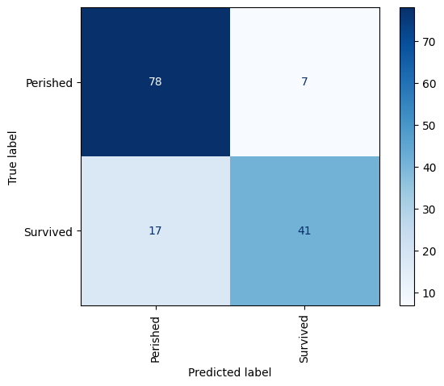

``` python
import pandas as pd
from sklearn.preprocessing import LabelEncoder

data = [[10, "red"], [20, "blue"], [12, "red"], [16, "green"], [22, "blue"]]
df = pd.DataFrame(data, columns=["Length", "Color"])
df.head()
```

<div>
<style scoped>
    .dataframe tbody tr th:only-of-type {
        vertical-align: middle;
    }
&#10;    .dataframe tbody tr th {
        vertical-align: top;
    }
&#10;    .dataframe thead th {
        text-align: right;
    }
</style>

|     | Length | Color |
|-----|--------|-------|
| 0   | 10     | red   |
| 1   | 20     | blue  |
| 2   | 12     | red   |
| 3   | 16     | green |
| 4   | 22     | blue  |

</div>

``` python
encoder = LabelEncoder()
df["Color"] = encoder.fit_transform(df["Color"])
df.head()
```

<div>
<style scoped>
    .dataframe tbody tr th:only-of-type {
        vertical-align: middle;
    }
&#10;    .dataframe tbody tr th {
        vertical-align: top;
    }
&#10;    .dataframe thead th {
        text-align: right;
    }
</style>

|     | Length | Color |
|-----|--------|-------|
| 0   | 10     | 2     |
| 1   | 20     | 0     |
| 2   | 12     | 2     |
| 3   | 16     | 1     |
| 4   | 22     | 0     |

</div>

``` python
data = [[10, "red"], [20, "blue"], [12, "red"], [16, "green"], [22, "blue"]]
df = pd.DataFrame(data, columns=["Length", "Color"])

# one-hot encoding
df = pd.get_dummies(df, columns=["Color"])
df.head()
```

<div>
<style scoped>
    .dataframe tbody tr th:only-of-type {
        vertical-align: middle;
    }
&#10;    .dataframe tbody tr th {
        vertical-align: top;
    }
&#10;    .dataframe thead th {
        text-align: right;
    }
</style>

|     | Length | Color_blue | Color_green | Color_red |
|-----|--------|------------|-------------|-----------|
| 0   | 10     | False      | False       | True      |
| 1   | 20     | True       | False       | False     |
| 2   | 12     | False      | False       | True      |
| 3   | 16     | False      | True        | False     |
| 4   | 22     | True       | False       | False     |

</div>

``` python
import pandas as pd

df = pd.read_csv("titanic.csv")
df.head()
```

<div>
<style scoped>
    .dataframe tbody tr th:only-of-type {
        vertical-align: middle;
    }
&#10;    .dataframe tbody tr th {
        vertical-align: top;
    }
&#10;    .dataframe thead th {
        text-align: right;
    }
</style>

|  | PassengerId | Survived | Pclass | Name | Sex | Age | SibSp | Parch | Ticket | Fare | Cabin | Embarked |
|----|----|----|----|----|----|----|----|----|----|----|----|----|
| 0 | 1 | 0 | 3 | Braund, Mr. Owen Harris | male | 22.0 | 1 | 0 | A/5 21171 | 7.2500 | NaN | S |
| 1 | 2 | 1 | 1 | Cumings, Mrs. John Bradley (Florence Briggs Th... | female | 38.0 | 1 | 0 | PC 17599 | 71.2833 | C85 | C |
| 2 | 3 | 1 | 3 | Heikkinen, Miss. Laina | female | 26.0 | 0 | 0 | STON/O2. 3101282 | 7.9250 | NaN | S |
| 3 | 4 | 1 | 1 | Futrelle, Mrs. Jacques Heath (Lily May Peel) | female | 35.0 | 1 | 0 | 113803 | 53.1000 | C123 | S |
| 4 | 5 | 0 | 3 | Allen, Mr. William Henry | male | 35.0 | 0 | 0 | 373450 | 8.0500 | NaN | S |

</div>

``` python
df.info()
```

    <class 'pandas.core.frame.DataFrame'>
    RangeIndex: 891 entries, 0 to 890
    Data columns (total 12 columns):
     #   Column       Non-Null Count  Dtype  
    ---  ------       --------------  -----  
     0   PassengerId  891 non-null    int64  
     1   Survived     891 non-null    int64  
     2   Pclass       891 non-null    int64  
     3   Name         891 non-null    object 
     4   Sex          891 non-null    object 
     5   Age          714 non-null    float64
     6   SibSp        891 non-null    int64  
     7   Parch        891 non-null    int64  
     8   Ticket       891 non-null    object 
     9   Fare         891 non-null    float64
     10  Cabin        204 non-null    object 
     11  Embarked     889 non-null    object 
    dtypes: float64(2), int64(5), object(5)
    memory usage: 83.7+ KB

``` python
df = df[["Survived", "Age", "Sex", "Pclass"]]
df = pd.get_dummies(df, columns=["Sex", "Pclass"])
df.dropna(inplace=True)
df.head()
```

<div>
<style scoped>
    .dataframe tbody tr th:only-of-type {
        vertical-align: middle;
    }
&#10;    .dataframe tbody tr th {
        vertical-align: top;
    }
&#10;    .dataframe thead th {
        text-align: right;
    }
</style>

|     | Survived | Age  | Sex_female | Sex_male | Pclass_1 | Pclass_2 | Pclass_3 |
|-----|----------|------|------------|----------|----------|----------|----------|
| 0   | 0        | 22.0 | False      | True     | False    | False    | True     |
| 1   | 1        | 38.0 | True       | False    | True     | False    | False    |
| 2   | 1        | 26.0 | True       | False    | False    | False    | True     |
| 3   | 1        | 35.0 | True       | False    | True     | False    | False    |
| 4   | 0        | 35.0 | False      | True     | False    | False    | True     |

</div>

``` python
from sklearn.model_selection import train_test_split

X = df.drop("Survived", axis=1)
y = df["Survived"]

X_train, X_test, y_train, y_test = train_test_split(
    X, y, test_size=0.2, stratify=y, random_state=0
)
```

``` python
from sklearn.linear_model import LogisticRegression

model = LogisticRegression(random_state=0)
model.fit(X_train, y_train)
model.score(X_test, y_test)
```

    0.8321678321678322

``` python
from sklearn.model_selection import cross_val_score

cross_val_score(model, X, y, cv=5).mean()
```

    np.float64(0.7857480547621394)

``` python
from sklearn.metrics import ConfusionMatrixDisplay as cmd

cmd.from_estimator(
    model,
    X_test,
    y_test,
    display_labels=["Perished", "Survived"],
    cmap="Blues",
    xticks_rotation="vertical",
);
```



``` python
from sklearn.metrics import precision_score, recall_score

y_pred = model.predict(X_test)
precision = precision_score(y_test, y_pred)
recall = recall_score(y_test, y_pred)
sensitivity = recall
specificity = recall_score(y_test, y_pred, pos_label=0)

print("Precision:", precision)
print("Recall:", recall)
print("Sensitivity:", sensitivity)
print("Specificity:", specificity)
```

    Precision: 0.8541666666666666
    Recall: 0.7068965517241379
    Sensitivity: 0.7068965517241379
    Specificity: 0.9176470588235294

``` python
female = pd.DataFrame(
    {
        "Age": [30],
        "Sex_female": [1],
        "Sex_male": [0],
        "Pclass_1": [1],
        "Pclass_2": [0],
        "Pclass_3": [0],
    }
)
model.predict(female)[0]
```

    np.int64(1)

``` python
probability = model.predict_proba(female)[0][1]
print(f"Probability of survival: {probability:.1%}")
```

    Probability of survival: 91.6%

``` python
male = pd.DataFrame(
    {
        "Age": [60],
        "Sex_female": [0],
        "Sex_male": [1],
        "Pclass_1": [0],
        "Pclass_2": [0],
        "Pclass_3": [1],
    }
)
model.predict(male)[0]
```

    np.int64(0)

``` python
probability = model.predict_proba(male)[0][1]
print(f"Probability of survival: {probability:.1%}")
```

    Probability of survival: 2.9%
