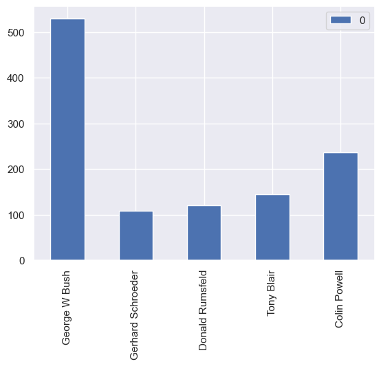
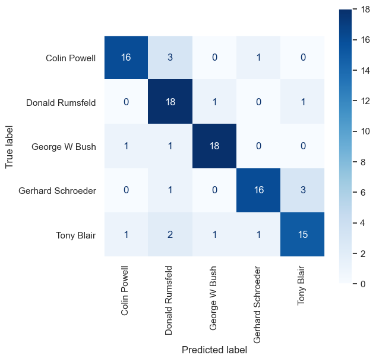

# Using SVM for facial recognition

``` python
import numpy as np
import pandas as pd
from sklearn.datasets import fetch_lfw_people

faces = fetch_lfw_people(min_faces_per_person=100, slice_=None)
faces.image = faces.images[:, 35:97, 39:86]
faces.data = faces.images.reshape(
    faces.images.shape[0], faces.images.shape[1] * faces.images.shape[2]
)

print(faces.target_names)
print(faces.images.shape)
```

    ['Colin Powell' 'Donald Rumsfeld' 'George W Bush' 'Gerhard Schroeder'
     'Tony Blair']
    (1140, 125, 125)

``` python
import matplotlib.pyplot as plt

fig, ax = plt.subplots(3, 8, figsize=(18, 10))
for i, axi in enumerate(ax.flat):
    axi.imshow(faces.images[i], cmap="gist_gray")
    axi.set(xticks=[], yticks=[], xlabel=faces.target_names[faces.target[i]])
```


``` python
import seaborn as sns

sns.set()

from collections import Counter

counts = Counter(faces.target)
names = {}

for key in counts.keys():
    names[faces.target_names[key]] = counts[key]

df = pd.DataFrame.from_dict(names, orient="index")
df.plot(kind="bar")
```



``` python
mask = np.zeros(faces.target.shape, dtype=bool)

for target in np.unique(faces.target):
    mask[np.where(faces.target == target)[0][:100]] = 1

X = faces.data[mask]
y = faces.target[mask]
X.shape
```

    (500, 15625)

``` python
from sklearn.model_selection import GridSearchCV
from sklearn.svm import SVC

svc = SVC(kernel="linear")

grid = {"C": [0.1, 1, 10, 100]}

grid_search = GridSearchCV(estimator=svc, param_grid=grid, cv=5, verbose=2)
grid_search.fit(X, y)  # Train the model with different parameters.
grid_search.best_score_
```

    Fitting 5 folds for each of 4 candidates, totalling 20 fits
    [CV] END ..............................................C=0.1; total time=   0.7s
    [CV] END ..............................................C=0.1; total time=   0.6s
    [CV] END ..............................................C=0.1; total time=   0.6s
    [CV] END ..............................................C=0.1; total time=   0.6s
    [CV] END ..............................................C=0.1; total time=   0.6s
    [CV] END ................................................C=1; total time=   0.6s
    [CV] END ................................................C=1; total time=   0.6s
    [CV] END ................................................C=1; total time=   0.7s
    [CV] END ................................................C=1; total time=   0.6s
    [CV] END ................................................C=1; total time=   0.6s
    [CV] END ...............................................C=10; total time=   0.6s
    [CV] END ...............................................C=10; total time=   0.6s
    [CV] END ...............................................C=10; total time=   0.7s
    [CV] END ...............................................C=10; total time=   0.7s
    [CV] END ...............................................C=10; total time=   0.7s
    [CV] END ..............................................C=100; total time=   0.7s
    [CV] END ..............................................C=100; total time=   0.7s
    [CV] END ..............................................C=100; total time=   0.7s
    [CV] END ..............................................C=100; total time=   0.6s
    [CV] END ..............................................C=100; total time=   0.6s

    np.float64(0.734)

``` python
from sklearn.pipeline import make_pipeline
from sklearn.preprocessing import StandardScaler

scaler = StandardScaler()
svc = SVC(kernel="linear")
pipe = make_pipeline(scaler, svc)
grid = {"svc__C": [0.1, 1, 10, 100]}

grid_search = GridSearchCV(estimator=pipe, param_grid=grid, cv=5, verbose=2)
grid_search.fit(X, y)
grid_search.best_score_
```

    Fitting 5 folds for each of 4 candidates, totalling 20 fits
    [CV] END .........................................svc__C=0.1; total time=   0.7s
    [CV] END .........................................svc__C=0.1; total time=   0.6s
    [CV] END .........................................svc__C=0.1; total time=   0.6s
    [CV] END .........................................svc__C=0.1; total time=   0.6s
    [CV] END .........................................svc__C=0.1; total time=   0.6s
    [CV] END ...........................................svc__C=1; total time=   0.6s
    [CV] END ...........................................svc__C=1; total time=   0.6s
    [CV] END ...........................................svc__C=1; total time=   0.6s
    [CV] END ...........................................svc__C=1; total time=   0.6s
    [CV] END ...........................................svc__C=1; total time=   0.6s
    [CV] END ..........................................svc__C=10; total time=   0.6s
    [CV] END ..........................................svc__C=10; total time=   0.6s
    [CV] END ..........................................svc__C=10; total time=   0.6s
    [CV] END ..........................................svc__C=10; total time=   0.6s
    [CV] END ..........................................svc__C=10; total time=   0.6s
    [CV] END .........................................svc__C=100; total time=   0.6s
    [CV] END .........................................svc__C=100; total time=   0.6s
    [CV] END .........................................svc__C=100; total time=   0.6s
    [CV] END .........................................svc__C=100; total time=   0.6s
    [CV] END .........................................svc__C=100; total time=   0.6s

    np.float64(0.8140000000000001)

``` python
grid_search.best_params_
```

    {'svc__C': 0.1}

``` python
from sklearn.pipeline import make_pipeline
from sklearn.preprocessing import StandardScaler

scaler = StandardScaler()
svc = SVC(kernel="poly")
pipe = make_pipeline(scaler, svc)
grid = {
    "svc__C": [0.1, 1, 10, 100],
    "svc__gamma": [0.01, 0.25, 0.5, 0.75, 1],
    "svc__degree": [1, 2, 3, 4, 5],
}

grid_search = GridSearchCV(estimator=pipe, param_grid=grid, cv=5, verbose=2)
grid_search.fit(X, y)
grid_search.best_score_
```

    Fitting 5 folds for each of 100 candidates, totalling 500 fits
    [CV] END .........svc__C=0.1, svc__degree=1, svc__gamma=0.01; total time=   0.7s
    [CV] END .........svc__C=0.1, svc__degree=1, svc__gamma=0.01; total time=   0.6s
    [CV] END .........svc__C=0.1, svc__degree=1, svc__gamma=0.01; total time=   0.6s
    [CV] END .........svc__C=0.1, svc__degree=1, svc__gamma=0.01; total time=   0.6s
    [CV] END .........svc__C=0.1, svc__degree=1, svc__gamma=0.01; total time=   0.6s
    [CV] END .........svc__C=0.1, svc__degree=1, svc__gamma=0.25; total time=   0.6s
    [CV] END .........svc__C=0.1, svc__degree=1, svc__gamma=0.25; total time=   0.6s
    [CV] END .........svc__C=0.1, svc__degree=1, svc__gamma=0.25; total time=   0.6s
    [CV] END .........svc__C=0.1, svc__degree=1, svc__gamma=0.25; total time=   0.7s
    [CV] END .........svc__C=0.1, svc__degree=1, svc__gamma=0.25; total time=   0.6s
    [CV] END ..........svc__C=0.1, svc__degree=1, svc__gamma=0.5; total time=   0.6s
    [CV] END ..........svc__C=0.1, svc__degree=1, svc__gamma=0.5; total time=   0.6s
    [CV] END ..........svc__C=0.1, svc__degree=1, svc__gamma=0.5; total time=   0.6s
    [CV] END ..........svc__C=0.1, svc__degree=1, svc__gamma=0.5; total time=   0.6s
    [CV] END ..........svc__C=0.1, svc__degree=1, svc__gamma=0.5; total time=   0.6s
    [CV] END .........svc__C=0.1, svc__degree=1, svc__gamma=0.75; total time=   0.6s
    [CV] END .........svc__C=0.1, svc__degree=1, svc__gamma=0.75; total time=   0.6s
    [CV] END .........svc__C=0.1, svc__degree=1, svc__gamma=0.75; total time=   0.6s
    [CV] END .........svc__C=0.1, svc__degree=1, svc__gamma=0.75; total time=   0.6s
    [CV] END .........svc__C=0.1, svc__degree=1, svc__gamma=0.75; total time=   0.6s
    [CV] END ............svc__C=0.1, svc__degree=1, svc__gamma=1; total time=   0.6s
    [CV] END ............svc__C=0.1, svc__degree=1, svc__gamma=1; total time=   0.6s
    [CV] END ............svc__C=0.1, svc__degree=1, svc__gamma=1; total time=   0.6s
    [CV] END ............svc__C=0.1, svc__degree=1, svc__gamma=1; total time=   0.6s
    [CV] END ............svc__C=0.1, svc__degree=1, svc__gamma=1; total time=   0.6s
    [CV] END .........svc__C=0.1, svc__degree=2, svc__gamma=0.01; total time=   0.7s
    [CV] END .........svc__C=0.1, svc__degree=2, svc__gamma=0.01; total time=   0.7s
    [CV] END .........svc__C=0.1, svc__degree=2, svc__gamma=0.01; total time=   0.7s
    [CV] END .........svc__C=0.1, svc__degree=2, svc__gamma=0.01; total time=   0.7s
    [CV] END .........svc__C=0.1, svc__degree=2, svc__gamma=0.01; total time=   0.7s
    [CV] END .........svc__C=0.1, svc__degree=2, svc__gamma=0.25; total time=   0.7s
    [CV] END .........svc__C=0.1, svc__degree=2, svc__gamma=0.25; total time=   0.7s
    [CV] END .........svc__C=0.1, svc__degree=2, svc__gamma=0.25; total time=   0.7s
    [CV] END .........svc__C=0.1, svc__degree=2, svc__gamma=0.25; total time=   0.7s
    [CV] END .........svc__C=0.1, svc__degree=2, svc__gamma=0.25; total time=   0.7s
    [CV] END ..........svc__C=0.1, svc__degree=2, svc__gamma=0.5; total time=   0.7s
    [CV] END ..........svc__C=0.1, svc__degree=2, svc__gamma=0.5; total time=   0.7s
    [CV] END ..........svc__C=0.1, svc__degree=2, svc__gamma=0.5; total time=   0.7s
    [CV] END ..........svc__C=0.1, svc__degree=2, svc__gamma=0.5; total time=   0.7s
    [CV] END ..........svc__C=0.1, svc__degree=2, svc__gamma=0.5; total time=   0.7s
    [CV] END .........svc__C=0.1, svc__degree=2, svc__gamma=0.75; total time=   0.7s
    [CV] END .........svc__C=0.1, svc__degree=2, svc__gamma=0.75; total time=   0.7s
    [CV] END .........svc__C=0.1, svc__degree=2, svc__gamma=0.75; total time=   0.7s
    [CV] END .........svc__C=0.1, svc__degree=2, svc__gamma=0.75; total time=   0.7s
    [CV] END .........svc__C=0.1, svc__degree=2, svc__gamma=0.75; total time=   0.7s
    [CV] END ............svc__C=0.1, svc__degree=2, svc__gamma=1; total time=   0.7s
    [CV] END ............svc__C=0.1, svc__degree=2, svc__gamma=1; total time=   0.7s
    [CV] END ............svc__C=0.1, svc__degree=2, svc__gamma=1; total time=   0.7s
    [CV] END ............svc__C=0.1, svc__degree=2, svc__gamma=1; total time=   0.7s
    [CV] END ............svc__C=0.1, svc__degree=2, svc__gamma=1; total time=   0.7s
    [CV] END .........svc__C=0.1, svc__degree=3, svc__gamma=0.01; total time=   0.7s
    [CV] END .........svc__C=0.1, svc__degree=3, svc__gamma=0.01; total time=   0.7s
    [CV] END .........svc__C=0.1, svc__degree=3, svc__gamma=0.01; total time=   0.8s
    [CV] END .........svc__C=0.1, svc__degree=3, svc__gamma=0.01; total time=   0.8s
    [CV] END .........svc__C=0.1, svc__degree=3, svc__gamma=0.01; total time=   0.8s
    [CV] END .........svc__C=0.1, svc__degree=3, svc__gamma=0.25; total time=   0.8s
    [CV] END .........svc__C=0.1, svc__degree=3, svc__gamma=0.25; total time=   0.8s
    [CV] END .........svc__C=0.1, svc__degree=3, svc__gamma=0.25; total time=   0.8s
    [CV] END .........svc__C=0.1, svc__degree=3, svc__gamma=0.25; total time=   0.8s
    [CV] END .........svc__C=0.1, svc__degree=3, svc__gamma=0.25; total time=   0.8s
    [CV] END ..........svc__C=0.1, svc__degree=3, svc__gamma=0.5; total time=   0.8s
    [CV] END ..........svc__C=0.1, svc__degree=3, svc__gamma=0.5; total time=   0.8s
    [CV] END ..........svc__C=0.1, svc__degree=3, svc__gamma=0.5; total time=   0.8s
    [CV] END ..........svc__C=0.1, svc__degree=3, svc__gamma=0.5; total time=   0.8s
    [CV] END ..........svc__C=0.1, svc__degree=3, svc__gamma=0.5; total time=   0.8s
    [CV] END .........svc__C=0.1, svc__degree=3, svc__gamma=0.75; total time=   0.8s
    [CV] END .........svc__C=0.1, svc__degree=3, svc__gamma=0.75; total time=   0.8s
    [CV] END .........svc__C=0.1, svc__degree=3, svc__gamma=0.75; total time=   0.8s
    [CV] END .........svc__C=0.1, svc__degree=3, svc__gamma=0.75; total time=   0.8s
    [CV] END .........svc__C=0.1, svc__degree=3, svc__gamma=0.75; total time=   0.8s
    [CV] END ............svc__C=0.1, svc__degree=3, svc__gamma=1; total time=   0.8s
    [CV] END ............svc__C=0.1, svc__degree=3, svc__gamma=1; total time=   0.8s
    [CV] END ............svc__C=0.1, svc__degree=3, svc__gamma=1; total time=   0.8s
    [CV] END ............svc__C=0.1, svc__degree=3, svc__gamma=1; total time=   0.8s
    [CV] END ............svc__C=0.1, svc__degree=3, svc__gamma=1; total time=   0.8s
    [CV] END .........svc__C=0.1, svc__degree=4, svc__gamma=0.01; total time=   0.8s
    [CV] END .........svc__C=0.1, svc__degree=4, svc__gamma=0.01; total time=   0.8s
    [CV] END .........svc__C=0.1, svc__degree=4, svc__gamma=0.01; total time=   0.8s
    [CV] END .........svc__C=0.1, svc__degree=4, svc__gamma=0.01; total time=   0.8s
    [CV] END .........svc__C=0.1, svc__degree=4, svc__gamma=0.01; total time=   0.8s
    [CV] END .........svc__C=0.1, svc__degree=4, svc__gamma=0.25; total time=   0.8s
    [CV] END .........svc__C=0.1, svc__degree=4, svc__gamma=0.25; total time=   0.8s
    [CV] END .........svc__C=0.1, svc__degree=4, svc__gamma=0.25; total time=   0.8s
    [CV] END .........svc__C=0.1, svc__degree=4, svc__gamma=0.25; total time=   0.8s
    [CV] END .........svc__C=0.1, svc__degree=4, svc__gamma=0.25; total time=   0.8s
    [CV] END ..........svc__C=0.1, svc__degree=4, svc__gamma=0.5; total time=   0.8s
    [CV] END ..........svc__C=0.1, svc__degree=4, svc__gamma=0.5; total time=   0.8s
    [CV] END ..........svc__C=0.1, svc__degree=4, svc__gamma=0.5; total time=   0.8s
    [CV] END ..........svc__C=0.1, svc__degree=4, svc__gamma=0.5; total time=   0.8s
    [CV] END ..........svc__C=0.1, svc__degree=4, svc__gamma=0.5; total time=   0.8s
    [CV] END .........svc__C=0.1, svc__degree=4, svc__gamma=0.75; total time=   0.8s
    [CV] END .........svc__C=0.1, svc__degree=4, svc__gamma=0.75; total time=   0.8s
    [CV] END .........svc__C=0.1, svc__degree=4, svc__gamma=0.75; total time=   0.8s
    [CV] END .........svc__C=0.1, svc__degree=4, svc__gamma=0.75; total time=   0.8s
    [CV] END .........svc__C=0.1, svc__degree=4, svc__gamma=0.75; total time=   0.8s
    [CV] END ............svc__C=0.1, svc__degree=4, svc__gamma=1; total time=   0.8s
    [CV] END ............svc__C=0.1, svc__degree=4, svc__gamma=1; total time=   0.8s
    [CV] END ............svc__C=0.1, svc__degree=4, svc__gamma=1; total time=   0.8s
    [CV] END ............svc__C=0.1, svc__degree=4, svc__gamma=1; total time=   0.8s
    [CV] END ............svc__C=0.1, svc__degree=4, svc__gamma=1; total time=   0.8s
    [CV] END .........svc__C=0.1, svc__degree=5, svc__gamma=0.01; total time=   0.8s
    [CV] END .........svc__C=0.1, svc__degree=5, svc__gamma=0.01; total time=   0.8s
    [CV] END .........svc__C=0.1, svc__degree=5, svc__gamma=0.01; total time=   0.8s
    [CV] END .........svc__C=0.1, svc__degree=5, svc__gamma=0.01; total time=   0.8s
    [CV] END .........svc__C=0.1, svc__degree=5, svc__gamma=0.01; total time=   0.8s
    [CV] END .........svc__C=0.1, svc__degree=5, svc__gamma=0.25; total time=   0.8s
    [CV] END .........svc__C=0.1, svc__degree=5, svc__gamma=0.25; total time=   0.8s
    [CV] END .........svc__C=0.1, svc__degree=5, svc__gamma=0.25; total time=   0.8s
    [CV] END .........svc__C=0.1, svc__degree=5, svc__gamma=0.25; total time=   0.8s
    [CV] END .........svc__C=0.1, svc__degree=5, svc__gamma=0.25; total time=   0.8s
    [CV] END ..........svc__C=0.1, svc__degree=5, svc__gamma=0.5; total time=   0.8s
    [CV] END ..........svc__C=0.1, svc__degree=5, svc__gamma=0.5; total time=   0.8s
    [CV] END ..........svc__C=0.1, svc__degree=5, svc__gamma=0.5; total time=   0.8s
    [CV] END ..........svc__C=0.1, svc__degree=5, svc__gamma=0.5; total time=   0.8s
    [CV] END ..........svc__C=0.1, svc__degree=5, svc__gamma=0.5; total time=   0.8s
    [CV] END .........svc__C=0.1, svc__degree=5, svc__gamma=0.75; total time=   0.8s
    [CV] END .........svc__C=0.1, svc__degree=5, svc__gamma=0.75; total time=   0.8s
    [CV] END .........svc__C=0.1, svc__degree=5, svc__gamma=0.75; total time=   0.8s
    [CV] END .........svc__C=0.1, svc__degree=5, svc__gamma=0.75; total time=   0.8s
    [CV] END .........svc__C=0.1, svc__degree=5, svc__gamma=0.75; total time=   0.8s
    [CV] END ............svc__C=0.1, svc__degree=5, svc__gamma=1; total time=   0.8s
    [CV] END ............svc__C=0.1, svc__degree=5, svc__gamma=1; total time=   0.8s
    [CV] END ............svc__C=0.1, svc__degree=5, svc__gamma=1; total time=   0.8s
    [CV] END ............svc__C=0.1, svc__degree=5, svc__gamma=1; total time=   0.8s
    [CV] END ............svc__C=0.1, svc__degree=5, svc__gamma=1; total time=   0.8s
    [CV] END ...........svc__C=1, svc__degree=1, svc__gamma=0.01; total time=   0.7s
    [CV] END ...........svc__C=1, svc__degree=1, svc__gamma=0.01; total time=   0.7s
    [CV] END ...........svc__C=1, svc__degree=1, svc__gamma=0.01; total time=   0.7s
    [CV] END ...........svc__C=1, svc__degree=1, svc__gamma=0.01; total time=   0.7s
    [CV] END ...........svc__C=1, svc__degree=1, svc__gamma=0.01; total time=   0.7s
    [CV] END ...........svc__C=1, svc__degree=1, svc__gamma=0.25; total time=   0.7s
    [CV] END ...........svc__C=1, svc__degree=1, svc__gamma=0.25; total time=   0.7s
    [CV] END ...........svc__C=1, svc__degree=1, svc__gamma=0.25; total time=   0.7s
    [CV] END ...........svc__C=1, svc__degree=1, svc__gamma=0.25; total time=   0.7s
    [CV] END ...........svc__C=1, svc__degree=1, svc__gamma=0.25; total time=   0.7s
    [CV] END ............svc__C=1, svc__degree=1, svc__gamma=0.5; total time=   0.7s
    [CV] END ............svc__C=1, svc__degree=1, svc__gamma=0.5; total time=   0.7s
    [CV] END ............svc__C=1, svc__degree=1, svc__gamma=0.5; total time=   0.7s
    [CV] END ............svc__C=1, svc__degree=1, svc__gamma=0.5; total time=   0.7s
    [CV] END ............svc__C=1, svc__degree=1, svc__gamma=0.5; total time=   0.7s
    [CV] END ...........svc__C=1, svc__degree=1, svc__gamma=0.75; total time=   0.7s
    [CV] END ...........svc__C=1, svc__degree=1, svc__gamma=0.75; total time=   0.7s
    [CV] END ...........svc__C=1, svc__degree=1, svc__gamma=0.75; total time=   0.7s
    [CV] END ...........svc__C=1, svc__degree=1, svc__gamma=0.75; total time=   0.7s
    [CV] END ...........svc__C=1, svc__degree=1, svc__gamma=0.75; total time=   0.7s
    [CV] END ..............svc__C=1, svc__degree=1, svc__gamma=1; total time=   0.7s
    [CV] END ..............svc__C=1, svc__degree=1, svc__gamma=1; total time=   0.7s
    [CV] END ..............svc__C=1, svc__degree=1, svc__gamma=1; total time=   0.7s
    [CV] END ..............svc__C=1, svc__degree=1, svc__gamma=1; total time=   0.7s
    [CV] END ..............svc__C=1, svc__degree=1, svc__gamma=1; total time=   0.7s
    [CV] END ...........svc__C=1, svc__degree=2, svc__gamma=0.01; total time=   0.8s
    [CV] END ...........svc__C=1, svc__degree=2, svc__gamma=0.01; total time=   0.8s
    [CV] END ...........svc__C=1, svc__degree=2, svc__gamma=0.01; total time=   0.8s
    [CV] END ...........svc__C=1, svc__degree=2, svc__gamma=0.01; total time=   0.8s
    [CV] END ...........svc__C=1, svc__degree=2, svc__gamma=0.01; total time=   0.8s
    [CV] END ...........svc__C=1, svc__degree=2, svc__gamma=0.25; total time=   0.8s
    [CV] END ...........svc__C=1, svc__degree=2, svc__gamma=0.25; total time=   0.8s
    [CV] END ...........svc__C=1, svc__degree=2, svc__gamma=0.25; total time=   0.8s
    [CV] END ...........svc__C=1, svc__degree=2, svc__gamma=0.25; total time=   0.8s
    [CV] END ...........svc__C=1, svc__degree=2, svc__gamma=0.25; total time=   0.8s
    [CV] END ............svc__C=1, svc__degree=2, svc__gamma=0.5; total time=   0.8s
    [CV] END ............svc__C=1, svc__degree=2, svc__gamma=0.5; total time=   0.8s
    [CV] END ............svc__C=1, svc__degree=2, svc__gamma=0.5; total time=   0.8s
    [CV] END ............svc__C=1, svc__degree=2, svc__gamma=0.5; total time=   0.8s
    [CV] END ............svc__C=1, svc__degree=2, svc__gamma=0.5; total time=   0.8s
    [CV] END ...........svc__C=1, svc__degree=2, svc__gamma=0.75; total time=   0.8s
    [CV] END ...........svc__C=1, svc__degree=2, svc__gamma=0.75; total time=   0.8s
    [CV] END ...........svc__C=1, svc__degree=2, svc__gamma=0.75; total time=   0.8s
    [CV] END ...........svc__C=1, svc__degree=2, svc__gamma=0.75; total time=   0.8s
    [CV] END ...........svc__C=1, svc__degree=2, svc__gamma=0.75; total time=   0.8s
    [CV] END ..............svc__C=1, svc__degree=2, svc__gamma=1; total time=   0.8s
    [CV] END ..............svc__C=1, svc__degree=2, svc__gamma=1; total time=   0.8s
    [CV] END ..............svc__C=1, svc__degree=2, svc__gamma=1; total time=   0.8s
    [CV] END ..............svc__C=1, svc__degree=2, svc__gamma=1; total time=   0.8s
    [CV] END ..............svc__C=1, svc__degree=2, svc__gamma=1; total time=   0.8s
    [CV] END ...........svc__C=1, svc__degree=3, svc__gamma=0.01; total time=   0.8s
    [CV] END ...........svc__C=1, svc__degree=3, svc__gamma=0.01; total time=   0.8s
    [CV] END ...........svc__C=1, svc__degree=3, svc__gamma=0.01; total time=   0.8s
    [CV] END ...........svc__C=1, svc__degree=3, svc__gamma=0.01; total time=   0.8s
    [CV] END ...........svc__C=1, svc__degree=3, svc__gamma=0.01; total time=   0.8s
    [CV] END ...........svc__C=1, svc__degree=3, svc__gamma=0.25; total time=   0.8s
    [CV] END ...........svc__C=1, svc__degree=3, svc__gamma=0.25; total time=   0.8s
    [CV] END ...........svc__C=1, svc__degree=3, svc__gamma=0.25; total time=   0.8s
    [CV] END ...........svc__C=1, svc__degree=3, svc__gamma=0.25; total time=   0.8s
    [CV] END ...........svc__C=1, svc__degree=3, svc__gamma=0.25; total time=   0.8s
    [CV] END ............svc__C=1, svc__degree=3, svc__gamma=0.5; total time=   0.8s
    [CV] END ............svc__C=1, svc__degree=3, svc__gamma=0.5; total time=   0.8s
    [CV] END ............svc__C=1, svc__degree=3, svc__gamma=0.5; total time=   0.8s
    [CV] END ............svc__C=1, svc__degree=3, svc__gamma=0.5; total time=   0.8s
    [CV] END ............svc__C=1, svc__degree=3, svc__gamma=0.5; total time=   0.8s
    [CV] END ...........svc__C=1, svc__degree=3, svc__gamma=0.75; total time=   0.8s
    [CV] END ...........svc__C=1, svc__degree=3, svc__gamma=0.75; total time=   0.8s
    [CV] END ...........svc__C=1, svc__degree=3, svc__gamma=0.75; total time=   0.8s
    [CV] END ...........svc__C=1, svc__degree=3, svc__gamma=0.75; total time=   0.8s
    [CV] END ...........svc__C=1, svc__degree=3, svc__gamma=0.75; total time=   0.8s
    [CV] END ..............svc__C=1, svc__degree=3, svc__gamma=1; total time=   0.8s
    [CV] END ..............svc__C=1, svc__degree=3, svc__gamma=1; total time=   0.8s
    [CV] END ..............svc__C=1, svc__degree=3, svc__gamma=1; total time=   0.8s
    [CV] END ..............svc__C=1, svc__degree=3, svc__gamma=1; total time=   0.8s
    [CV] END ..............svc__C=1, svc__degree=3, svc__gamma=1; total time=   0.8s
    [CV] END ...........svc__C=1, svc__degree=4, svc__gamma=0.01; total time=   0.8s
    [CV] END ...........svc__C=1, svc__degree=4, svc__gamma=0.01; total time=   0.8s
    [CV] END ...........svc__C=1, svc__degree=4, svc__gamma=0.01; total time=   0.8s
    [CV] END ...........svc__C=1, svc__degree=4, svc__gamma=0.01; total time=   0.8s
    [CV] END ...........svc__C=1, svc__degree=4, svc__gamma=0.01; total time=   0.8s
    [CV] END ...........svc__C=1, svc__degree=4, svc__gamma=0.25; total time=   0.8s
    [CV] END ...........svc__C=1, svc__degree=4, svc__gamma=0.25; total time=   0.8s
    [CV] END ...........svc__C=1, svc__degree=4, svc__gamma=0.25; total time=   0.8s
    [CV] END ...........svc__C=1, svc__degree=4, svc__gamma=0.25; total time=   0.8s
    [CV] END ...........svc__C=1, svc__degree=4, svc__gamma=0.25; total time=   0.8s
    [CV] END ............svc__C=1, svc__degree=4, svc__gamma=0.5; total time=   0.8s
    [CV] END ............svc__C=1, svc__degree=4, svc__gamma=0.5; total time=   0.8s
    [CV] END ............svc__C=1, svc__degree=4, svc__gamma=0.5; total time=   0.8s
    [CV] END ............svc__C=1, svc__degree=4, svc__gamma=0.5; total time=   0.8s
    [CV] END ............svc__C=1, svc__degree=4, svc__gamma=0.5; total time=   0.8s
    [CV] END ...........svc__C=1, svc__degree=4, svc__gamma=0.75; total time=   0.8s
    [CV] END ...........svc__C=1, svc__degree=4, svc__gamma=0.75; total time=   0.8s
    [CV] END ...........svc__C=1, svc__degree=4, svc__gamma=0.75; total time=   0.8s
    [CV] END ...........svc__C=1, svc__degree=4, svc__gamma=0.75; total time=   0.8s
    [CV] END ...........svc__C=1, svc__degree=4, svc__gamma=0.75; total time=   0.8s
    [CV] END ..............svc__C=1, svc__degree=4, svc__gamma=1; total time=   0.8s
    [CV] END ..............svc__C=1, svc__degree=4, svc__gamma=1; total time=   0.8s
    [CV] END ..............svc__C=1, svc__degree=4, svc__gamma=1; total time=   0.8s
    [CV] END ..............svc__C=1, svc__degree=4, svc__gamma=1; total time=   0.8s
    [CV] END ..............svc__C=1, svc__degree=4, svc__gamma=1; total time=   0.8s
    [CV] END ...........svc__C=1, svc__degree=5, svc__gamma=0.01; total time=   0.8s
    [CV] END ...........svc__C=1, svc__degree=5, svc__gamma=0.01; total time=   0.8s
    [CV] END ...........svc__C=1, svc__degree=5, svc__gamma=0.01; total time=   0.8s
    [CV] END ...........svc__C=1, svc__degree=5, svc__gamma=0.01; total time=   0.8s
    [CV] END ...........svc__C=1, svc__degree=5, svc__gamma=0.01; total time=   0.8s
    [CV] END ...........svc__C=1, svc__degree=5, svc__gamma=0.25; total time=   0.8s
    [CV] END ...........svc__C=1, svc__degree=5, svc__gamma=0.25; total time=   0.8s
    [CV] END ...........svc__C=1, svc__degree=5, svc__gamma=0.25; total time=   0.8s
    [CV] END ...........svc__C=1, svc__degree=5, svc__gamma=0.25; total time=   0.8s
    [CV] END ...........svc__C=1, svc__degree=5, svc__gamma=0.25; total time=   0.8s
    [CV] END ............svc__C=1, svc__degree=5, svc__gamma=0.5; total time=   0.8s
    [CV] END ............svc__C=1, svc__degree=5, svc__gamma=0.5; total time=   0.8s
    [CV] END ............svc__C=1, svc__degree=5, svc__gamma=0.5; total time=   0.8s
    [CV] END ............svc__C=1, svc__degree=5, svc__gamma=0.5; total time=   0.8s
    [CV] END ............svc__C=1, svc__degree=5, svc__gamma=0.5; total time=   0.8s
    [CV] END ...........svc__C=1, svc__degree=5, svc__gamma=0.75; total time=   0.8s
    [CV] END ...........svc__C=1, svc__degree=5, svc__gamma=0.75; total time=   0.8s
    [CV] END ...........svc__C=1, svc__degree=5, svc__gamma=0.75; total time=   0.8s
    [CV] END ...........svc__C=1, svc__degree=5, svc__gamma=0.75; total time=   0.8s
    [CV] END ...........svc__C=1, svc__degree=5, svc__gamma=0.75; total time=   0.8s
    [CV] END ..............svc__C=1, svc__degree=5, svc__gamma=1; total time=   0.8s
    [CV] END ..............svc__C=1, svc__degree=5, svc__gamma=1; total time=   0.8s
    [CV] END ..............svc__C=1, svc__degree=5, svc__gamma=1; total time=   0.8s
    [CV] END ..............svc__C=1, svc__degree=5, svc__gamma=1; total time=   0.8s
    [CV] END ..............svc__C=1, svc__degree=5, svc__gamma=1; total time=   0.8s
    [CV] END ..........svc__C=10, svc__degree=1, svc__gamma=0.01; total time=   0.7s
    [CV] END ..........svc__C=10, svc__degree=1, svc__gamma=0.01; total time=   0.7s
    [CV] END ..........svc__C=10, svc__degree=1, svc__gamma=0.01; total time=   0.7s
    [CV] END ..........svc__C=10, svc__degree=1, svc__gamma=0.01; total time=   0.7s
    [CV] END ..........svc__C=10, svc__degree=1, svc__gamma=0.01; total time=   0.7s
    [CV] END ..........svc__C=10, svc__degree=1, svc__gamma=0.25; total time=   0.7s
    [CV] END ..........svc__C=10, svc__degree=1, svc__gamma=0.25; total time=   0.7s
    [CV] END ..........svc__C=10, svc__degree=1, svc__gamma=0.25; total time=   0.7s
    [CV] END ..........svc__C=10, svc__degree=1, svc__gamma=0.25; total time=   0.7s
    [CV] END ..........svc__C=10, svc__degree=1, svc__gamma=0.25; total time=   0.7s
    [CV] END ...........svc__C=10, svc__degree=1, svc__gamma=0.5; total time=   0.7s
    [CV] END ...........svc__C=10, svc__degree=1, svc__gamma=0.5; total time=   0.7s
    [CV] END ...........svc__C=10, svc__degree=1, svc__gamma=0.5; total time=   0.7s
    [CV] END ...........svc__C=10, svc__degree=1, svc__gamma=0.5; total time=   0.7s
    [CV] END ...........svc__C=10, svc__degree=1, svc__gamma=0.5; total time=   0.7s
    [CV] END ..........svc__C=10, svc__degree=1, svc__gamma=0.75; total time=   0.7s
    [CV] END ..........svc__C=10, svc__degree=1, svc__gamma=0.75; total time=   0.7s
    [CV] END ..........svc__C=10, svc__degree=1, svc__gamma=0.75; total time=   0.7s
    [CV] END ..........svc__C=10, svc__degree=1, svc__gamma=0.75; total time=   0.7s
    [CV] END ..........svc__C=10, svc__degree=1, svc__gamma=0.75; total time=   0.7s
    [CV] END .............svc__C=10, svc__degree=1, svc__gamma=1; total time=   0.7s
    [CV] END .............svc__C=10, svc__degree=1, svc__gamma=1; total time=   0.7s
    [CV] END .............svc__C=10, svc__degree=1, svc__gamma=1; total time=   0.7s
    [CV] END .............svc__C=10, svc__degree=1, svc__gamma=1; total time=   0.7s
    [CV] END .............svc__C=10, svc__degree=1, svc__gamma=1; total time=   0.7s
    [CV] END ..........svc__C=10, svc__degree=2, svc__gamma=0.01; total time=   0.8s
    [CV] END ..........svc__C=10, svc__degree=2, svc__gamma=0.01; total time=   0.8s
    [CV] END ..........svc__C=10, svc__degree=2, svc__gamma=0.01; total time=   0.8s
    [CV] END ..........svc__C=10, svc__degree=2, svc__gamma=0.01; total time=   0.8s
    [CV] END ..........svc__C=10, svc__degree=2, svc__gamma=0.01; total time=   0.8s
    [CV] END ..........svc__C=10, svc__degree=2, svc__gamma=0.25; total time=   0.8s
    [CV] END ..........svc__C=10, svc__degree=2, svc__gamma=0.25; total time=   0.8s
    [CV] END ..........svc__C=10, svc__degree=2, svc__gamma=0.25; total time=   0.8s
    [CV] END ..........svc__C=10, svc__degree=2, svc__gamma=0.25; total time=   0.8s
    [CV] END ..........svc__C=10, svc__degree=2, svc__gamma=0.25; total time=   0.8s
    [CV] END ...........svc__C=10, svc__degree=2, svc__gamma=0.5; total time=   0.8s
    [CV] END ...........svc__C=10, svc__degree=2, svc__gamma=0.5; total time=   0.8s
    [CV] END ...........svc__C=10, svc__degree=2, svc__gamma=0.5; total time=   0.8s
    [CV] END ...........svc__C=10, svc__degree=2, svc__gamma=0.5; total time=   0.8s
    [CV] END ...........svc__C=10, svc__degree=2, svc__gamma=0.5; total time=   0.8s
    [CV] END ..........svc__C=10, svc__degree=2, svc__gamma=0.75; total time=   0.8s
    [CV] END ..........svc__C=10, svc__degree=2, svc__gamma=0.75; total time=   0.8s
    [CV] END ..........svc__C=10, svc__degree=2, svc__gamma=0.75; total time=   0.8s
    [CV] END ..........svc__C=10, svc__degree=2, svc__gamma=0.75; total time=   0.8s
    [CV] END ..........svc__C=10, svc__degree=2, svc__gamma=0.75; total time=   0.8s
    [CV] END .............svc__C=10, svc__degree=2, svc__gamma=1; total time=   0.8s
    [CV] END .............svc__C=10, svc__degree=2, svc__gamma=1; total time=   0.8s
    [CV] END .............svc__C=10, svc__degree=2, svc__gamma=1; total time=   0.8s
    [CV] END .............svc__C=10, svc__degree=2, svc__gamma=1; total time=   0.8s
    [CV] END .............svc__C=10, svc__degree=2, svc__gamma=1; total time=   0.8s
    [CV] END ..........svc__C=10, svc__degree=3, svc__gamma=0.01; total time=   0.8s
    [CV] END ..........svc__C=10, svc__degree=3, svc__gamma=0.01; total time=   0.8s
    [CV] END ..........svc__C=10, svc__degree=3, svc__gamma=0.01; total time=   0.8s
    [CV] END ..........svc__C=10, svc__degree=3, svc__gamma=0.01; total time=   0.8s
    [CV] END ..........svc__C=10, svc__degree=3, svc__gamma=0.01; total time=   0.8s
    [CV] END ..........svc__C=10, svc__degree=3, svc__gamma=0.25; total time=   0.8s
    [CV] END ..........svc__C=10, svc__degree=3, svc__gamma=0.25; total time=   0.8s
    [CV] END ..........svc__C=10, svc__degree=3, svc__gamma=0.25; total time=   0.8s
    [CV] END ..........svc__C=10, svc__degree=3, svc__gamma=0.25; total time=   0.8s
    [CV] END ..........svc__C=10, svc__degree=3, svc__gamma=0.25; total time=   0.8s
    [CV] END ...........svc__C=10, svc__degree=3, svc__gamma=0.5; total time=   0.8s
    [CV] END ...........svc__C=10, svc__degree=3, svc__gamma=0.5; total time=   0.8s
    [CV] END ...........svc__C=10, svc__degree=3, svc__gamma=0.5; total time=   0.8s
    [CV] END ...........svc__C=10, svc__degree=3, svc__gamma=0.5; total time=   0.8s
    [CV] END ...........svc__C=10, svc__degree=3, svc__gamma=0.5; total time=   0.8s
    [CV] END ..........svc__C=10, svc__degree=3, svc__gamma=0.75; total time=   0.8s
    [CV] END ..........svc__C=10, svc__degree=3, svc__gamma=0.75; total time=   0.8s
    [CV] END ..........svc__C=10, svc__degree=3, svc__gamma=0.75; total time=   0.8s
    [CV] END ..........svc__C=10, svc__degree=3, svc__gamma=0.75; total time=   0.8s
    [CV] END ..........svc__C=10, svc__degree=3, svc__gamma=0.75; total time=   0.8s
    [CV] END .............svc__C=10, svc__degree=3, svc__gamma=1; total time=   0.8s
    [CV] END .............svc__C=10, svc__degree=3, svc__gamma=1; total time=   0.8s
    [CV] END .............svc__C=10, svc__degree=3, svc__gamma=1; total time=   0.8s
    [CV] END .............svc__C=10, svc__degree=3, svc__gamma=1; total time=   0.8s
    [CV] END .............svc__C=10, svc__degree=3, svc__gamma=1; total time=   0.8s
    [CV] END ..........svc__C=10, svc__degree=4, svc__gamma=0.01; total time=   0.8s
    [CV] END ..........svc__C=10, svc__degree=4, svc__gamma=0.01; total time=   0.8s
    [CV] END ..........svc__C=10, svc__degree=4, svc__gamma=0.01; total time=   0.8s
    [CV] END ..........svc__C=10, svc__degree=4, svc__gamma=0.01; total time=   0.8s
    [CV] END ..........svc__C=10, svc__degree=4, svc__gamma=0.01; total time=   0.8s
    [CV] END ..........svc__C=10, svc__degree=4, svc__gamma=0.25; total time=   0.8s
    [CV] END ..........svc__C=10, svc__degree=4, svc__gamma=0.25; total time=   0.8s
    [CV] END ..........svc__C=10, svc__degree=4, svc__gamma=0.25; total time=   0.8s
    [CV] END ..........svc__C=10, svc__degree=4, svc__gamma=0.25; total time=   0.8s
    [CV] END ..........svc__C=10, svc__degree=4, svc__gamma=0.25; total time=   0.8s
    [CV] END ...........svc__C=10, svc__degree=4, svc__gamma=0.5; total time=   0.8s
    [CV] END ...........svc__C=10, svc__degree=4, svc__gamma=0.5; total time=   0.8s
    [CV] END ...........svc__C=10, svc__degree=4, svc__gamma=0.5; total time=   0.8s
    [CV] END ...........svc__C=10, svc__degree=4, svc__gamma=0.5; total time=   0.8s
    [CV] END ...........svc__C=10, svc__degree=4, svc__gamma=0.5; total time=   0.8s
    [CV] END ..........svc__C=10, svc__degree=4, svc__gamma=0.75; total time=   0.8s
    [CV] END ..........svc__C=10, svc__degree=4, svc__gamma=0.75; total time=   0.8s
    [CV] END ..........svc__C=10, svc__degree=4, svc__gamma=0.75; total time=   0.8s
    [CV] END ..........svc__C=10, svc__degree=4, svc__gamma=0.75; total time=   0.8s
    [CV] END ..........svc__C=10, svc__degree=4, svc__gamma=0.75; total time=   0.8s
    [CV] END .............svc__C=10, svc__degree=4, svc__gamma=1; total time=   0.8s
    [CV] END .............svc__C=10, svc__degree=4, svc__gamma=1; total time=   0.8s
    [CV] END .............svc__C=10, svc__degree=4, svc__gamma=1; total time=   0.8s
    [CV] END .............svc__C=10, svc__degree=4, svc__gamma=1; total time=   0.8s
    [CV] END .............svc__C=10, svc__degree=4, svc__gamma=1; total time=   0.8s
    [CV] END ..........svc__C=10, svc__degree=5, svc__gamma=0.01; total time=   0.8s
    [CV] END ..........svc__C=10, svc__degree=5, svc__gamma=0.01; total time=   0.8s
    [CV] END ..........svc__C=10, svc__degree=5, svc__gamma=0.01; total time=   0.8s
    [CV] END ..........svc__C=10, svc__degree=5, svc__gamma=0.01; total time=   0.8s
    [CV] END ..........svc__C=10, svc__degree=5, svc__gamma=0.01; total time=   0.8s
    [CV] END ..........svc__C=10, svc__degree=5, svc__gamma=0.25; total time=   0.8s
    [CV] END ..........svc__C=10, svc__degree=5, svc__gamma=0.25; total time=   0.8s
    [CV] END ..........svc__C=10, svc__degree=5, svc__gamma=0.25; total time=   0.8s
    [CV] END ..........svc__C=10, svc__degree=5, svc__gamma=0.25; total time=   0.8s
    [CV] END ..........svc__C=10, svc__degree=5, svc__gamma=0.25; total time=   0.8s
    [CV] END ...........svc__C=10, svc__degree=5, svc__gamma=0.5; total time=   0.8s
    [CV] END ...........svc__C=10, svc__degree=5, svc__gamma=0.5; total time=   0.8s
    [CV] END ...........svc__C=10, svc__degree=5, svc__gamma=0.5; total time=   0.8s
    [CV] END ...........svc__C=10, svc__degree=5, svc__gamma=0.5; total time=   0.8s
    [CV] END ...........svc__C=10, svc__degree=5, svc__gamma=0.5; total time=   0.8s
    [CV] END ..........svc__C=10, svc__degree=5, svc__gamma=0.75; total time=   0.8s
    [CV] END ..........svc__C=10, svc__degree=5, svc__gamma=0.75; total time=   0.8s
    [CV] END ..........svc__C=10, svc__degree=5, svc__gamma=0.75; total time=   0.8s
    [CV] END ..........svc__C=10, svc__degree=5, svc__gamma=0.75; total time=   0.8s
    [CV] END ..........svc__C=10, svc__degree=5, svc__gamma=0.75; total time=   0.8s
    [CV] END .............svc__C=10, svc__degree=5, svc__gamma=1; total time=   0.8s
    [CV] END .............svc__C=10, svc__degree=5, svc__gamma=1; total time=   0.8s
    [CV] END .............svc__C=10, svc__degree=5, svc__gamma=1; total time=   0.8s
    [CV] END .............svc__C=10, svc__degree=5, svc__gamma=1; total time=   0.8s
    [CV] END .............svc__C=10, svc__degree=5, svc__gamma=1; total time=   0.8s
    [CV] END .........svc__C=100, svc__degree=1, svc__gamma=0.01; total time=   0.7s
    [CV] END .........svc__C=100, svc__degree=1, svc__gamma=0.01; total time=   0.7s
    [CV] END .........svc__C=100, svc__degree=1, svc__gamma=0.01; total time=   0.7s
    [CV] END .........svc__C=100, svc__degree=1, svc__gamma=0.01; total time=   0.7s
    [CV] END .........svc__C=100, svc__degree=1, svc__gamma=0.01; total time=   0.7s
    [CV] END .........svc__C=100, svc__degree=1, svc__gamma=0.25; total time=   0.7s
    [CV] END .........svc__C=100, svc__degree=1, svc__gamma=0.25; total time=   0.7s
    [CV] END .........svc__C=100, svc__degree=1, svc__gamma=0.25; total time=   0.7s
    [CV] END .........svc__C=100, svc__degree=1, svc__gamma=0.25; total time=   0.7s
    [CV] END .........svc__C=100, svc__degree=1, svc__gamma=0.25; total time=   0.7s
    [CV] END ..........svc__C=100, svc__degree=1, svc__gamma=0.5; total time=   0.7s
    [CV] END ..........svc__C=100, svc__degree=1, svc__gamma=0.5; total time=   0.7s
    [CV] END ..........svc__C=100, svc__degree=1, svc__gamma=0.5; total time=   0.7s
    [CV] END ..........svc__C=100, svc__degree=1, svc__gamma=0.5; total time=   0.7s
    [CV] END ..........svc__C=100, svc__degree=1, svc__gamma=0.5; total time=   0.7s
    [CV] END .........svc__C=100, svc__degree=1, svc__gamma=0.75; total time=   0.7s
    [CV] END .........svc__C=100, svc__degree=1, svc__gamma=0.75; total time=   0.7s
    [CV] END .........svc__C=100, svc__degree=1, svc__gamma=0.75; total time=   0.7s
    [CV] END .........svc__C=100, svc__degree=1, svc__gamma=0.75; total time=   0.7s
    [CV] END .........svc__C=100, svc__degree=1, svc__gamma=0.75; total time=   0.7s
    [CV] END ............svc__C=100, svc__degree=1, svc__gamma=1; total time=   0.7s
    [CV] END ............svc__C=100, svc__degree=1, svc__gamma=1; total time=   0.7s
    [CV] END ............svc__C=100, svc__degree=1, svc__gamma=1; total time=   0.7s
    [CV] END ............svc__C=100, svc__degree=1, svc__gamma=1; total time=   0.7s
    [CV] END ............svc__C=100, svc__degree=1, svc__gamma=1; total time=   0.7s
    [CV] END .........svc__C=100, svc__degree=2, svc__gamma=0.01; total time=   0.8s
    [CV] END .........svc__C=100, svc__degree=2, svc__gamma=0.01; total time=   0.8s
    [CV] END .........svc__C=100, svc__degree=2, svc__gamma=0.01; total time=   0.8s
    [CV] END .........svc__C=100, svc__degree=2, svc__gamma=0.01; total time=   0.8s
    [CV] END .........svc__C=100, svc__degree=2, svc__gamma=0.01; total time=   0.8s
    [CV] END .........svc__C=100, svc__degree=2, svc__gamma=0.25; total time=   0.8s
    [CV] END .........svc__C=100, svc__degree=2, svc__gamma=0.25; total time=   0.8s
    [CV] END .........svc__C=100, svc__degree=2, svc__gamma=0.25; total time=   0.8s
    [CV] END .........svc__C=100, svc__degree=2, svc__gamma=0.25; total time=   0.8s
    [CV] END .........svc__C=100, svc__degree=2, svc__gamma=0.25; total time=   0.8s
    [CV] END ..........svc__C=100, svc__degree=2, svc__gamma=0.5; total time=   0.8s
    [CV] END ..........svc__C=100, svc__degree=2, svc__gamma=0.5; total time=   0.8s
    [CV] END ..........svc__C=100, svc__degree=2, svc__gamma=0.5; total time=   0.8s
    [CV] END ..........svc__C=100, svc__degree=2, svc__gamma=0.5; total time=   0.8s
    [CV] END ..........svc__C=100, svc__degree=2, svc__gamma=0.5; total time=   0.8s
    [CV] END .........svc__C=100, svc__degree=2, svc__gamma=0.75; total time=   0.8s
    [CV] END .........svc__C=100, svc__degree=2, svc__gamma=0.75; total time=   0.8s
    [CV] END .........svc__C=100, svc__degree=2, svc__gamma=0.75; total time=   0.8s
    [CV] END .........svc__C=100, svc__degree=2, svc__gamma=0.75; total time=   0.8s
    [CV] END .........svc__C=100, svc__degree=2, svc__gamma=0.75; total time=   0.8s
    [CV] END ............svc__C=100, svc__degree=2, svc__gamma=1; total time=   0.8s
    [CV] END ............svc__C=100, svc__degree=2, svc__gamma=1; total time=   0.8s
    [CV] END ............svc__C=100, svc__degree=2, svc__gamma=1; total time=   0.8s
    [CV] END ............svc__C=100, svc__degree=2, svc__gamma=1; total time=   0.8s
    [CV] END ............svc__C=100, svc__degree=2, svc__gamma=1; total time=   0.8s
    [CV] END .........svc__C=100, svc__degree=3, svc__gamma=0.01; total time=   0.8s
    [CV] END .........svc__C=100, svc__degree=3, svc__gamma=0.01; total time=   0.8s
    [CV] END .........svc__C=100, svc__degree=3, svc__gamma=0.01; total time=   0.8s
    [CV] END .........svc__C=100, svc__degree=3, svc__gamma=0.01; total time=   0.8s
    [CV] END .........svc__C=100, svc__degree=3, svc__gamma=0.01; total time=   0.8s
    [CV] END .........svc__C=100, svc__degree=3, svc__gamma=0.25; total time=   0.8s
    [CV] END .........svc__C=100, svc__degree=3, svc__gamma=0.25; total time=   0.8s
    [CV] END .........svc__C=100, svc__degree=3, svc__gamma=0.25; total time=   0.8s
    [CV] END .........svc__C=100, svc__degree=3, svc__gamma=0.25; total time=   0.8s
    [CV] END .........svc__C=100, svc__degree=3, svc__gamma=0.25; total time=   0.8s
    [CV] END ..........svc__C=100, svc__degree=3, svc__gamma=0.5; total time=   0.8s
    [CV] END ..........svc__C=100, svc__degree=3, svc__gamma=0.5; total time=   0.8s
    [CV] END ..........svc__C=100, svc__degree=3, svc__gamma=0.5; total time=   0.8s
    [CV] END ..........svc__C=100, svc__degree=3, svc__gamma=0.5; total time=   0.8s
    [CV] END ..........svc__C=100, svc__degree=3, svc__gamma=0.5; total time=   0.8s
    [CV] END .........svc__C=100, svc__degree=3, svc__gamma=0.75; total time=   0.8s
    [CV] END .........svc__C=100, svc__degree=3, svc__gamma=0.75; total time=   0.8s
    [CV] END .........svc__C=100, svc__degree=3, svc__gamma=0.75; total time=   0.8s
    [CV] END .........svc__C=100, svc__degree=3, svc__gamma=0.75; total time=   0.8s
    [CV] END .........svc__C=100, svc__degree=3, svc__gamma=0.75; total time=   0.8s
    [CV] END ............svc__C=100, svc__degree=3, svc__gamma=1; total time=   0.8s
    [CV] END ............svc__C=100, svc__degree=3, svc__gamma=1; total time=   0.8s
    [CV] END ............svc__C=100, svc__degree=3, svc__gamma=1; total time=   0.8s
    [CV] END ............svc__C=100, svc__degree=3, svc__gamma=1; total time=   0.8s
    [CV] END ............svc__C=100, svc__degree=3, svc__gamma=1; total time=   0.8s
    [CV] END .........svc__C=100, svc__degree=4, svc__gamma=0.01; total time=   0.8s
    [CV] END .........svc__C=100, svc__degree=4, svc__gamma=0.01; total time=   0.8s
    [CV] END .........svc__C=100, svc__degree=4, svc__gamma=0.01; total time=   0.8s
    [CV] END .........svc__C=100, svc__degree=4, svc__gamma=0.01; total time=   0.8s
    [CV] END .........svc__C=100, svc__degree=4, svc__gamma=0.01; total time=   0.8s
    [CV] END .........svc__C=100, svc__degree=4, svc__gamma=0.25; total time=   0.8s
    [CV] END .........svc__C=100, svc__degree=4, svc__gamma=0.25; total time=   0.8s
    [CV] END .........svc__C=100, svc__degree=4, svc__gamma=0.25; total time=   0.8s
    [CV] END .........svc__C=100, svc__degree=4, svc__gamma=0.25; total time=   0.8s
    [CV] END .........svc__C=100, svc__degree=4, svc__gamma=0.25; total time=   0.8s
    [CV] END ..........svc__C=100, svc__degree=4, svc__gamma=0.5; total time=   0.8s
    [CV] END ..........svc__C=100, svc__degree=4, svc__gamma=0.5; total time=   0.8s
    [CV] END ..........svc__C=100, svc__degree=4, svc__gamma=0.5; total time=   0.8s
    [CV] END ..........svc__C=100, svc__degree=4, svc__gamma=0.5; total time=   0.8s
    [CV] END ..........svc__C=100, svc__degree=4, svc__gamma=0.5; total time=   0.8s
    [CV] END .........svc__C=100, svc__degree=4, svc__gamma=0.75; total time=   0.8s
    [CV] END .........svc__C=100, svc__degree=4, svc__gamma=0.75; total time=   0.8s
    [CV] END .........svc__C=100, svc__degree=4, svc__gamma=0.75; total time=   0.8s
    [CV] END .........svc__C=100, svc__degree=4, svc__gamma=0.75; total time=   0.8s
    [CV] END .........svc__C=100, svc__degree=4, svc__gamma=0.75; total time=   0.8s
    [CV] END ............svc__C=100, svc__degree=4, svc__gamma=1; total time=   0.8s
    [CV] END ............svc__C=100, svc__degree=4, svc__gamma=1; total time=   0.8s
    [CV] END ............svc__C=100, svc__degree=4, svc__gamma=1; total time=   0.8s
    [CV] END ............svc__C=100, svc__degree=4, svc__gamma=1; total time=   0.8s
    [CV] END ............svc__C=100, svc__degree=4, svc__gamma=1; total time=   0.8s
    [CV] END .........svc__C=100, svc__degree=5, svc__gamma=0.01; total time=   0.8s
    [CV] END .........svc__C=100, svc__degree=5, svc__gamma=0.01; total time=   0.8s
    [CV] END .........svc__C=100, svc__degree=5, svc__gamma=0.01; total time=   0.8s
    [CV] END .........svc__C=100, svc__degree=5, svc__gamma=0.01; total time=   0.8s
    [CV] END .........svc__C=100, svc__degree=5, svc__gamma=0.01; total time=   0.8s
    [CV] END .........svc__C=100, svc__degree=5, svc__gamma=0.25; total time=   0.8s
    [CV] END .........svc__C=100, svc__degree=5, svc__gamma=0.25; total time=   1.2s
    [CV] END .........svc__C=100, svc__degree=5, svc__gamma=0.25; total time=   1.1s
    [CV] END .........svc__C=100, svc__degree=5, svc__gamma=0.25; total time=   0.9s
    [CV] END .........svc__C=100, svc__degree=5, svc__gamma=0.25; total time=   0.9s
    [CV] END ..........svc__C=100, svc__degree=5, svc__gamma=0.5; total time=   0.9s
    [CV] END ..........svc__C=100, svc__degree=5, svc__gamma=0.5; total time=   0.8s
    [CV] END ..........svc__C=100, svc__degree=5, svc__gamma=0.5; total time=   0.8s
    [CV] END ..........svc__C=100, svc__degree=5, svc__gamma=0.5; total time=   0.8s
    [CV] END ..........svc__C=100, svc__degree=5, svc__gamma=0.5; total time=   0.8s
    [CV] END .........svc__C=100, svc__degree=5, svc__gamma=0.75; total time=   0.8s
    [CV] END .........svc__C=100, svc__degree=5, svc__gamma=0.75; total time=   0.8s
    [CV] END .........svc__C=100, svc__degree=5, svc__gamma=0.75; total time=   0.9s
    [CV] END .........svc__C=100, svc__degree=5, svc__gamma=0.75; total time=   0.8s
    [CV] END .........svc__C=100, svc__degree=5, svc__gamma=0.75; total time=   0.8s
    [CV] END ............svc__C=100, svc__degree=5, svc__gamma=1; total time=   0.8s
    [CV] END ............svc__C=100, svc__degree=5, svc__gamma=1; total time=   0.8s
    [CV] END ............svc__C=100, svc__degree=5, svc__gamma=1; total time=   0.8s
    [CV] END ............svc__C=100, svc__degree=5, svc__gamma=1; total time=   0.8s
    [CV] END ............svc__C=100, svc__degree=5, svc__gamma=1; total time=   0.8s

    np.float64(0.8140000000000001)

``` python
grid_search.best_params_
```

    {'svc__C': 0.1, 'svc__degree': 1, 'svc__gamma': 0.01}

``` python
from sklearn.pipeline import make_pipeline
from sklearn.preprocessing import StandardScaler

scaler = StandardScaler()
svc = SVC(kernel="rbf")
pipe = make_pipeline(scaler, svc)
grid = {
    "svc__C": [0.1, 1, 10, 100],
    "svc__gamma": [0.01, 0.25, 0.5, 0.75, 1],
}

grid_search = GridSearchCV(estimator=pipe, param_grid=grid, cv=5, verbose=2)
grid_search.fit(X, y)
grid_search.best_score_
```

    Fitting 5 folds for each of 20 candidates, totalling 100 fits
    [CV] END ........................svc__C=0.1, svc__gamma=0.01; total time=   0.9s
    [CV] END ........................svc__C=0.1, svc__gamma=0.01; total time=   0.9s
    [CV] END ........................svc__C=0.1, svc__gamma=0.01; total time=   0.9s
    [CV] END ........................svc__C=0.1, svc__gamma=0.01; total time=   0.9s
    [CV] END ........................svc__C=0.1, svc__gamma=0.01; total time=   0.9s
    [CV] END ........................svc__C=0.1, svc__gamma=0.25; total time=   0.9s
    [CV] END ........................svc__C=0.1, svc__gamma=0.25; total time=   0.9s
    [CV] END ........................svc__C=0.1, svc__gamma=0.25; total time=   0.9s
    [CV] END ........................svc__C=0.1, svc__gamma=0.25; total time=   0.9s
    [CV] END ........................svc__C=0.1, svc__gamma=0.25; total time=   0.9s
    [CV] END .........................svc__C=0.1, svc__gamma=0.5; total time=   0.9s
    [CV] END .........................svc__C=0.1, svc__gamma=0.5; total time=   0.9s
    [CV] END .........................svc__C=0.1, svc__gamma=0.5; total time=   0.9s
    [CV] END .........................svc__C=0.1, svc__gamma=0.5; total time=   0.9s
    [CV] END .........................svc__C=0.1, svc__gamma=0.5; total time=   0.9s
    [CV] END ........................svc__C=0.1, svc__gamma=0.75; total time=   0.9s
    [CV] END ........................svc__C=0.1, svc__gamma=0.75; total time=   0.9s
    [CV] END ........................svc__C=0.1, svc__gamma=0.75; total time=   0.9s
    [CV] END ........................svc__C=0.1, svc__gamma=0.75; total time=   0.9s
    [CV] END ........................svc__C=0.1, svc__gamma=0.75; total time=   0.9s
    [CV] END ...........................svc__C=0.1, svc__gamma=1; total time=   0.9s
    [CV] END ...........................svc__C=0.1, svc__gamma=1; total time=   0.9s
    [CV] END ...........................svc__C=0.1, svc__gamma=1; total time=   0.9s
    [CV] END ...........................svc__C=0.1, svc__gamma=1; total time=   0.9s
    [CV] END ...........................svc__C=0.1, svc__gamma=1; total time=   0.9s
    [CV] END ..........................svc__C=1, svc__gamma=0.01; total time=   0.9s
    [CV] END ..........................svc__C=1, svc__gamma=0.01; total time=   0.9s
    [CV] END ..........................svc__C=1, svc__gamma=0.01; total time=   0.9s
    [CV] END ..........................svc__C=1, svc__gamma=0.01; total time=   0.9s
    [CV] END ..........................svc__C=1, svc__gamma=0.01; total time=   0.9s
    [CV] END ..........................svc__C=1, svc__gamma=0.25; total time=   0.9s
    [CV] END ..........................svc__C=1, svc__gamma=0.25; total time=   0.9s
    [CV] END ..........................svc__C=1, svc__gamma=0.25; total time=   0.9s
    [CV] END ..........................svc__C=1, svc__gamma=0.25; total time=   0.9s
    [CV] END ..........................svc__C=1, svc__gamma=0.25; total time=   0.9s
    [CV] END ...........................svc__C=1, svc__gamma=0.5; total time=   0.9s
    [CV] END ...........................svc__C=1, svc__gamma=0.5; total time=   0.9s
    [CV] END ...........................svc__C=1, svc__gamma=0.5; total time=   0.9s
    [CV] END ...........................svc__C=1, svc__gamma=0.5; total time=   0.9s
    [CV] END ...........................svc__C=1, svc__gamma=0.5; total time=   0.9s
    [CV] END ..........................svc__C=1, svc__gamma=0.75; total time=   0.9s
    [CV] END ..........................svc__C=1, svc__gamma=0.75; total time=   0.9s
    [CV] END ..........................svc__C=1, svc__gamma=0.75; total time=   0.9s
    [CV] END ..........................svc__C=1, svc__gamma=0.75; total time=   0.9s
    [CV] END ..........................svc__C=1, svc__gamma=0.75; total time=   0.9s
    [CV] END .............................svc__C=1, svc__gamma=1; total time=   0.9s
    [CV] END .............................svc__C=1, svc__gamma=1; total time=   0.9s
    [CV] END .............................svc__C=1, svc__gamma=1; total time=   0.9s
    [CV] END .............................svc__C=1, svc__gamma=1; total time=   0.9s
    [CV] END .............................svc__C=1, svc__gamma=1; total time=   0.9s
    [CV] END .........................svc__C=10, svc__gamma=0.01; total time=   0.9s
    [CV] END .........................svc__C=10, svc__gamma=0.01; total time=   0.9s
    [CV] END .........................svc__C=10, svc__gamma=0.01; total time=   0.9s
    [CV] END .........................svc__C=10, svc__gamma=0.01; total time=   0.9s
    [CV] END .........................svc__C=10, svc__gamma=0.01; total time=   0.9s
    [CV] END .........................svc__C=10, svc__gamma=0.25; total time=   0.9s
    [CV] END .........................svc__C=10, svc__gamma=0.25; total time=   0.9s
    [CV] END .........................svc__C=10, svc__gamma=0.25; total time=   0.9s
    [CV] END .........................svc__C=10, svc__gamma=0.25; total time=   0.9s
    [CV] END .........................svc__C=10, svc__gamma=0.25; total time=   0.9s
    [CV] END ..........................svc__C=10, svc__gamma=0.5; total time=   0.9s
    [CV] END ..........................svc__C=10, svc__gamma=0.5; total time=   0.9s
    [CV] END ..........................svc__C=10, svc__gamma=0.5; total time=   0.9s
    [CV] END ..........................svc__C=10, svc__gamma=0.5; total time=   0.9s
    [CV] END ..........................svc__C=10, svc__gamma=0.5; total time=   0.9s
    [CV] END .........................svc__C=10, svc__gamma=0.75; total time=   0.9s
    [CV] END .........................svc__C=10, svc__gamma=0.75; total time=   0.9s
    [CV] END .........................svc__C=10, svc__gamma=0.75; total time=   0.9s
    [CV] END .........................svc__C=10, svc__gamma=0.75; total time=   0.9s
    [CV] END .........................svc__C=10, svc__gamma=0.75; total time=   0.9s
    [CV] END ............................svc__C=10, svc__gamma=1; total time=   0.9s
    [CV] END ............................svc__C=10, svc__gamma=1; total time=   0.9s
    [CV] END ............................svc__C=10, svc__gamma=1; total time=   0.9s
    [CV] END ............................svc__C=10, svc__gamma=1; total time=   0.9s
    [CV] END ............................svc__C=10, svc__gamma=1; total time=   0.9s
    [CV] END ........................svc__C=100, svc__gamma=0.01; total time=   0.9s
    [CV] END ........................svc__C=100, svc__gamma=0.01; total time=   0.9s
    [CV] END ........................svc__C=100, svc__gamma=0.01; total time=   0.9s
    [CV] END ........................svc__C=100, svc__gamma=0.01; total time=   0.9s
    [CV] END ........................svc__C=100, svc__gamma=0.01; total time=   0.9s
    [CV] END ........................svc__C=100, svc__gamma=0.25; total time=   0.9s
    [CV] END ........................svc__C=100, svc__gamma=0.25; total time=   0.9s
    [CV] END ........................svc__C=100, svc__gamma=0.25; total time=   0.9s
    [CV] END ........................svc__C=100, svc__gamma=0.25; total time=   0.9s
    [CV] END ........................svc__C=100, svc__gamma=0.25; total time=   0.9s
    [CV] END .........................svc__C=100, svc__gamma=0.5; total time=   0.9s
    [CV] END .........................svc__C=100, svc__gamma=0.5; total time=   0.9s
    [CV] END .........................svc__C=100, svc__gamma=0.5; total time=   0.9s
    [CV] END .........................svc__C=100, svc__gamma=0.5; total time=   0.9s
    [CV] END .........................svc__C=100, svc__gamma=0.5; total time=   0.9s
    [CV] END ........................svc__C=100, svc__gamma=0.75; total time=   0.9s
    [CV] END ........................svc__C=100, svc__gamma=0.75; total time=   0.9s
    [CV] END ........................svc__C=100, svc__gamma=0.75; total time=   0.9s
    [CV] END ........................svc__C=100, svc__gamma=0.75; total time=   0.9s
    [CV] END ........................svc__C=100, svc__gamma=0.75; total time=   0.9s
    [CV] END ...........................svc__C=100, svc__gamma=1; total time=   0.9s
    [CV] END ...........................svc__C=100, svc__gamma=1; total time=   0.9s
    [CV] END ...........................svc__C=100, svc__gamma=1; total time=   0.9s
    [CV] END ...........................svc__C=100, svc__gamma=1; total time=   0.9s
    [CV] END ...........................svc__C=100, svc__gamma=1; total time=   0.9s

    np.float64(0.418)

``` python
from sklearn.model_selection import train_test_split

X_train, X_test, y_train, y_test = train_test_split(
    X, y, train_size=0.8, stratify=y, random_state=0
)
```

``` python
scaler = StandardScaler()
svc = SVC(kernel="linear", C=0.1)
pipe = make_pipeline(scaler, svc)
pipe.fit(X_train, y_train)
```

<style>#sk-container-id-1 {
  /* Definition of color scheme common for light and dark mode */
  --sklearn-color-text: #000;
  --sklearn-color-text-muted: #666;
  --sklearn-color-line: gray;
  /* Definition of color scheme for unfitted estimators */
  --sklearn-color-unfitted-level-0: #fff5e6;
  --sklearn-color-unfitted-level-1: #f6e4d2;
  --sklearn-color-unfitted-level-2: #ffe0b3;
  --sklearn-color-unfitted-level-3: chocolate;
  /* Definition of color scheme for fitted estimators */
  --sklearn-color-fitted-level-0: #f0f8ff;
  --sklearn-color-fitted-level-1: #d4ebff;
  --sklearn-color-fitted-level-2: #b3dbfd;
  --sklearn-color-fitted-level-3: cornflowerblue;
&#10;  /* Specific color for light theme */
  --sklearn-color-text-on-default-background: var(--sg-text-color, var(--theme-code-foreground, var(--jp-content-font-color1, black)));
  --sklearn-color-background: var(--sg-background-color, var(--theme-background, var(--jp-layout-color0, white)));
  --sklearn-color-border-box: var(--sg-text-color, var(--theme-code-foreground, var(--jp-content-font-color1, black)));
  --sklearn-color-icon: #696969;
&#10;  @media (prefers-color-scheme: dark) {
    /* Redefinition of color scheme for dark theme */
    --sklearn-color-text-on-default-background: var(--sg-text-color, var(--theme-code-foreground, var(--jp-content-font-color1, white)));
    --sklearn-color-background: var(--sg-background-color, var(--theme-background, var(--jp-layout-color0, #111)));
    --sklearn-color-border-box: var(--sg-text-color, var(--theme-code-foreground, var(--jp-content-font-color1, white)));
    --sklearn-color-icon: #878787;
  }
}
&#10;#sk-container-id-1 {
  color: var(--sklearn-color-text);
}
&#10;#sk-container-id-1 pre {
  padding: 0;
}
&#10;#sk-container-id-1 input.sk-hidden--visually {
  border: 0;
  clip: rect(1px 1px 1px 1px);
  clip: rect(1px, 1px, 1px, 1px);
  height: 1px;
  margin: -1px;
  overflow: hidden;
  padding: 0;
  position: absolute;
  width: 1px;
}
&#10;#sk-container-id-1 div.sk-dashed-wrapped {
  border: 1px dashed var(--sklearn-color-line);
  margin: 0 0.4em 0.5em 0.4em;
  box-sizing: border-box;
  padding-bottom: 0.4em;
  background-color: var(--sklearn-color-background);
}
&#10;#sk-container-id-1 div.sk-container {
  /* jupyter's `normalize.less` sets `[hidden] { display: none; }`
     but bootstrap.min.css set `[hidden] { display: none !important; }`
     so we also need the `!important` here to be able to override the
     default hidden behavior on the sphinx rendered scikit-learn.org.
     See: https://github.com/scikit-learn/scikit-learn/issues/21755 */
  display: inline-block !important;
  position: relative;
}
&#10;#sk-container-id-1 div.sk-text-repr-fallback {
  display: none;
}
&#10;div.sk-parallel-item,
div.sk-serial,
div.sk-item {
  /* draw centered vertical line to link estimators */
  background-image: linear-gradient(var(--sklearn-color-text-on-default-background), var(--sklearn-color-text-on-default-background));
  background-size: 2px 100%;
  background-repeat: no-repeat;
  background-position: center center;
}
&#10;/* Parallel-specific style estimator block */
&#10;#sk-container-id-1 div.sk-parallel-item::after {
  content: "";
  width: 100%;
  border-bottom: 2px solid var(--sklearn-color-text-on-default-background);
  flex-grow: 1;
}
&#10;#sk-container-id-1 div.sk-parallel {
  display: flex;
  align-items: stretch;
  justify-content: center;
  background-color: var(--sklearn-color-background);
  position: relative;
}
&#10;#sk-container-id-1 div.sk-parallel-item {
  display: flex;
  flex-direction: column;
}
&#10;#sk-container-id-1 div.sk-parallel-item:first-child::after {
  align-self: flex-end;
  width: 50%;
}
&#10;#sk-container-id-1 div.sk-parallel-item:last-child::after {
  align-self: flex-start;
  width: 50%;
}
&#10;#sk-container-id-1 div.sk-parallel-item:only-child::after {
  width: 0;
}
&#10;/* Serial-specific style estimator block */
&#10;#sk-container-id-1 div.sk-serial {
  display: flex;
  flex-direction: column;
  align-items: center;
  background-color: var(--sklearn-color-background);
  padding-right: 1em;
  padding-left: 1em;
}
&#10;
/* Toggleable style: style used for estimator/Pipeline/ColumnTransformer box that is
clickable and can be expanded/collapsed.
- Pipeline and ColumnTransformer use this feature and define the default style
- Estimators will overwrite some part of the style using the `sk-estimator` class
*/
&#10;/* Pipeline and ColumnTransformer style (default) */
&#10;#sk-container-id-1 div.sk-toggleable {
  /* Default theme specific background. It is overwritten whether we have a
  specific estimator or a Pipeline/ColumnTransformer */
  background-color: var(--sklearn-color-background);
}
&#10;/* Toggleable label */
#sk-container-id-1 label.sk-toggleable__label {
  cursor: pointer;
  display: flex;
  width: 100%;
  margin-bottom: 0;
  padding: 0.5em;
  box-sizing: border-box;
  text-align: center;
  align-items: start;
  justify-content: space-between;
  gap: 0.5em;
}
&#10;#sk-container-id-1 label.sk-toggleable__label .caption {
  font-size: 0.6rem;
  font-weight: lighter;
  color: var(--sklearn-color-text-muted);
}
&#10;#sk-container-id-1 label.sk-toggleable__label-arrow:before {
  /* Arrow on the left of the label */
  content: "▸";
  float: left;
  margin-right: 0.25em;
  color: var(--sklearn-color-icon);
}
&#10;#sk-container-id-1 label.sk-toggleable__label-arrow:hover:before {
  color: var(--sklearn-color-text);
}
&#10;/* Toggleable content - dropdown */
&#10;#sk-container-id-1 div.sk-toggleable__content {
  max-height: 0;
  max-width: 0;
  overflow: hidden;
  text-align: left;
  /* unfitted */
  background-color: var(--sklearn-color-unfitted-level-0);
}
&#10;#sk-container-id-1 div.sk-toggleable__content.fitted {
  /* fitted */
  background-color: var(--sklearn-color-fitted-level-0);
}
&#10;#sk-container-id-1 div.sk-toggleable__content pre {
  margin: 0.2em;
  border-radius: 0.25em;
  color: var(--sklearn-color-text);
  /* unfitted */
  background-color: var(--sklearn-color-unfitted-level-0);
}
&#10;#sk-container-id-1 div.sk-toggleable__content.fitted pre {
  /* unfitted */
  background-color: var(--sklearn-color-fitted-level-0);
}
&#10;#sk-container-id-1 input.sk-toggleable__control:checked~div.sk-toggleable__content {
  /* Expand drop-down */
  max-height: 200px;
  max-width: 100%;
  overflow: auto;
}
&#10;#sk-container-id-1 input.sk-toggleable__control:checked~label.sk-toggleable__label-arrow:before {
  content: "▾";
}
&#10;/* Pipeline/ColumnTransformer-specific style */
&#10;#sk-container-id-1 div.sk-label input.sk-toggleable__control:checked~label.sk-toggleable__label {
  color: var(--sklearn-color-text);
  background-color: var(--sklearn-color-unfitted-level-2);
}
&#10;#sk-container-id-1 div.sk-label.fitted input.sk-toggleable__control:checked~label.sk-toggleable__label {
  background-color: var(--sklearn-color-fitted-level-2);
}
&#10;/* Estimator-specific style */
&#10;/* Colorize estimator box */
#sk-container-id-1 div.sk-estimator input.sk-toggleable__control:checked~label.sk-toggleable__label {
  /* unfitted */
  background-color: var(--sklearn-color-unfitted-level-2);
}
&#10;#sk-container-id-1 div.sk-estimator.fitted input.sk-toggleable__control:checked~label.sk-toggleable__label {
  /* fitted */
  background-color: var(--sklearn-color-fitted-level-2);
}
&#10;#sk-container-id-1 div.sk-label label.sk-toggleable__label,
#sk-container-id-1 div.sk-label label {
  /* The background is the default theme color */
  color: var(--sklearn-color-text-on-default-background);
}
&#10;/* On hover, darken the color of the background */
#sk-container-id-1 div.sk-label:hover label.sk-toggleable__label {
  color: var(--sklearn-color-text);
  background-color: var(--sklearn-color-unfitted-level-2);
}
&#10;/* Label box, darken color on hover, fitted */
#sk-container-id-1 div.sk-label.fitted:hover label.sk-toggleable__label.fitted {
  color: var(--sklearn-color-text);
  background-color: var(--sklearn-color-fitted-level-2);
}
&#10;/* Estimator label */
&#10;#sk-container-id-1 div.sk-label label {
  font-family: monospace;
  font-weight: bold;
  display: inline-block;
  line-height: 1.2em;
}
&#10;#sk-container-id-1 div.sk-label-container {
  text-align: center;
}
&#10;/* Estimator-specific */
#sk-container-id-1 div.sk-estimator {
  font-family: monospace;
  border: 1px dotted var(--sklearn-color-border-box);
  border-radius: 0.25em;
  box-sizing: border-box;
  margin-bottom: 0.5em;
  /* unfitted */
  background-color: var(--sklearn-color-unfitted-level-0);
}
&#10;#sk-container-id-1 div.sk-estimator.fitted {
  /* fitted */
  background-color: var(--sklearn-color-fitted-level-0);
}
&#10;/* on hover */
#sk-container-id-1 div.sk-estimator:hover {
  /* unfitted */
  background-color: var(--sklearn-color-unfitted-level-2);
}
&#10;#sk-container-id-1 div.sk-estimator.fitted:hover {
  /* fitted */
  background-color: var(--sklearn-color-fitted-level-2);
}
&#10;/* Specification for estimator info (e.g. "i" and "?") */
&#10;/* Common style for "i" and "?" */
&#10;.sk-estimator-doc-link,
a:link.sk-estimator-doc-link,
a:visited.sk-estimator-doc-link {
  float: right;
  font-size: smaller;
  line-height: 1em;
  font-family: monospace;
  background-color: var(--sklearn-color-background);
  border-radius: 1em;
  height: 1em;
  width: 1em;
  text-decoration: none !important;
  margin-left: 0.5em;
  text-align: center;
  /* unfitted */
  border: var(--sklearn-color-unfitted-level-1) 1pt solid;
  color: var(--sklearn-color-unfitted-level-1);
}
&#10;.sk-estimator-doc-link.fitted,
a:link.sk-estimator-doc-link.fitted,
a:visited.sk-estimator-doc-link.fitted {
  /* fitted */
  border: var(--sklearn-color-fitted-level-1) 1pt solid;
  color: var(--sklearn-color-fitted-level-1);
}
&#10;/* On hover */
div.sk-estimator:hover .sk-estimator-doc-link:hover,
.sk-estimator-doc-link:hover,
div.sk-label-container:hover .sk-estimator-doc-link:hover,
.sk-estimator-doc-link:hover {
  /* unfitted */
  background-color: var(--sklearn-color-unfitted-level-3);
  color: var(--sklearn-color-background);
  text-decoration: none;
}
&#10;div.sk-estimator.fitted:hover .sk-estimator-doc-link.fitted:hover,
.sk-estimator-doc-link.fitted:hover,
div.sk-label-container:hover .sk-estimator-doc-link.fitted:hover,
.sk-estimator-doc-link.fitted:hover {
  /* fitted */
  background-color: var(--sklearn-color-fitted-level-3);
  color: var(--sklearn-color-background);
  text-decoration: none;
}
&#10;/* Span, style for the box shown on hovering the info icon */
.sk-estimator-doc-link span {
  display: none;
  z-index: 9999;
  position: relative;
  font-weight: normal;
  right: .2ex;
  padding: .5ex;
  margin: .5ex;
  width: min-content;
  min-width: 20ex;
  max-width: 50ex;
  color: var(--sklearn-color-text);
  box-shadow: 2pt 2pt 4pt #999;
  /* unfitted */
  background: var(--sklearn-color-unfitted-level-0);
  border: .5pt solid var(--sklearn-color-unfitted-level-3);
}
&#10;.sk-estimator-doc-link.fitted span {
  /* fitted */
  background: var(--sklearn-color-fitted-level-0);
  border: var(--sklearn-color-fitted-level-3);
}
&#10;.sk-estimator-doc-link:hover span {
  display: block;
}
&#10;/* "?"-specific style due to the `<a>` HTML tag */
&#10;#sk-container-id-1 a.estimator_doc_link {
  float: right;
  font-size: 1rem;
  line-height: 1em;
  font-family: monospace;
  background-color: var(--sklearn-color-background);
  border-radius: 1rem;
  height: 1rem;
  width: 1rem;
  text-decoration: none;
  /* unfitted */
  color: var(--sklearn-color-unfitted-level-1);
  border: var(--sklearn-color-unfitted-level-1) 1pt solid;
}
&#10;#sk-container-id-1 a.estimator_doc_link.fitted {
  /* fitted */
  border: var(--sklearn-color-fitted-level-1) 1pt solid;
  color: var(--sklearn-color-fitted-level-1);
}
&#10;/* On hover */
#sk-container-id-1 a.estimator_doc_link:hover {
  /* unfitted */
  background-color: var(--sklearn-color-unfitted-level-3);
  color: var(--sklearn-color-background);
  text-decoration: none;
}
&#10;#sk-container-id-1 a.estimator_doc_link.fitted:hover {
  /* fitted */
  background-color: var(--sklearn-color-fitted-level-3);
}
</style><div id="sk-container-id-1" class="sk-top-container"><div class="sk-text-repr-fallback"><pre>Pipeline(steps=[(&#x27;standardscaler&#x27;, StandardScaler()),
                (&#x27;svc&#x27;, SVC(C=0.1, kernel=&#x27;linear&#x27;))])</pre><b>In a Jupyter environment, please rerun this cell to show the HTML representation or trust the notebook. <br />On GitHub, the HTML representation is unable to render, please try loading this page with nbviewer.org.</b></div><div class="sk-container" hidden><div class="sk-item sk-dashed-wrapped"><div class="sk-label-container"><div class="sk-label fitted sk-toggleable"><input class="sk-toggleable__control sk-hidden--visually" id="sk-estimator-id-1" type="checkbox" ><label for="sk-estimator-id-1" class="sk-toggleable__label fitted sk-toggleable__label-arrow"><div><div>Pipeline</div></div><div><a class="sk-estimator-doc-link fitted" rel="noreferrer" target="_blank" href="https://scikit-learn.org/1.6/modules/generated/sklearn.pipeline.Pipeline.html">?<span>Documentation for Pipeline</span></a><span class="sk-estimator-doc-link fitted">i<span>Fitted</span></span></div></label><div class="sk-toggleable__content fitted"><pre>Pipeline(steps=[(&#x27;standardscaler&#x27;, StandardScaler()),
                (&#x27;svc&#x27;, SVC(C=0.1, kernel=&#x27;linear&#x27;))])</pre></div> </div></div><div class="sk-serial"><div class="sk-item"><div class="sk-estimator fitted sk-toggleable"><input class="sk-toggleable__control sk-hidden--visually" id="sk-estimator-id-2" type="checkbox" ><label for="sk-estimator-id-2" class="sk-toggleable__label fitted sk-toggleable__label-arrow"><div><div>StandardScaler</div></div><div><a class="sk-estimator-doc-link fitted" rel="noreferrer" target="_blank" href="https://scikit-learn.org/1.6/modules/generated/sklearn.preprocessing.StandardScaler.html">?<span>Documentation for StandardScaler</span></a></div></label><div class="sk-toggleable__content fitted"><pre>StandardScaler()</pre></div> </div></div><div class="sk-item"><div class="sk-estimator fitted sk-toggleable"><input class="sk-toggleable__control sk-hidden--visually" id="sk-estimator-id-3" type="checkbox" ><label for="sk-estimator-id-3" class="sk-toggleable__label fitted sk-toggleable__label-arrow"><div><div>SVC</div></div><div><a class="sk-estimator-doc-link fitted" rel="noreferrer" target="_blank" href="https://scikit-learn.org/1.6/modules/generated/sklearn.svm.SVC.html">?<span>Documentation for SVC</span></a></div></label><div class="sk-toggleable__content fitted"><pre>SVC(C=0.1, kernel=&#x27;linear&#x27;)</pre></div> </div></div></div></div></div></div>

``` python
from sklearn.model_selection import cross_val_score

cross_val_score(pipe, X, y, cv=5).mean()
```

    np.float64(0.8140000000000001)

``` python
from sklearn.metrics import ConfusionMatrixDisplay as cmd

fig, ax = plt.subplots(figsize=(6, 6))
ax.grid(False)

cmd.from_estimator(
    pipe,
    X_test,
    y_test,
    display_labels=faces.target_names,
    cmap="Blues",
    xticks_rotation="vertical",
    ax=ax,
);
```


