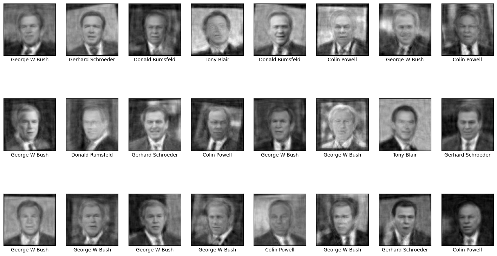
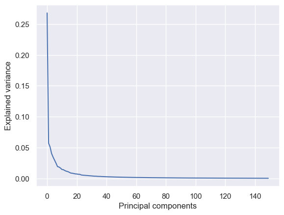
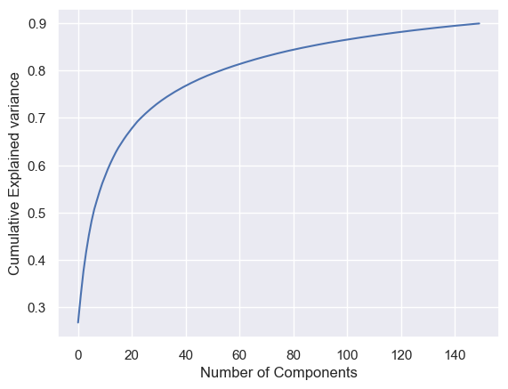
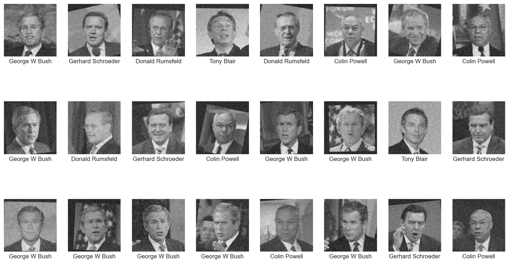
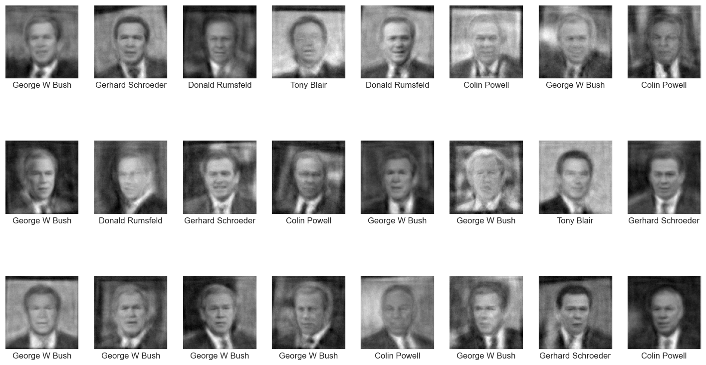

# Filtering noise

``` python
import numpy as np
import pandas as pd
from sklearn.datasets import fetch_lfw_people

faces = fetch_lfw_people(min_faces_per_person=100, slice_=None)
faces.image = faces.images[:, 35:97, 39:86]
faces.data = faces.images.reshape(
    faces.images.shape[0], faces.images.shape[1] * faces.images.shape[2]
)

print(faces.target_names)
print(faces.images.shape)
```

    ['Colin Powell' 'Donald Rumsfeld' 'George W Bush' 'Gerhard Schroeder'
     'Tony Blair']
    (1140, 125, 125)

``` python
import matplotlib.pyplot as plt

fig, ax = plt.subplots(3, 8, figsize=(18, 10))
for i, axi in enumerate(ax.flat):
    axi.imshow(faces.images[i], cmap="gist_gray")
    axi.set(xticks=[], yticks=[], xlabel=faces.target_names[faces.target[i]])
```


``` python
from sklearn.decomposition import PCA

pca = PCA(n_components=150, random_state=0)
pca_faces = pca.fit_transform(faces.data)

unpca_faces = pca.inverse_transform(pca_faces).reshape(1140, 125, 125)


fig, ax = plt.subplots(3, 8, figsize=(18, 10))
for i, axi in enumerate(ax.flat):
    axi.imshow(unpca_faces[i], cmap="gist_gray")
    axi.set(xticks=[], yticks=[], xlabel=faces.target_names[faces.target[i]])
```



``` python
pca.explained_variance_ratio_
```

    array([0.2678262 , 0.05725306, 0.05121637, 0.04065672, 0.03491619,
           0.02993002, 0.02493127, 0.0194527 , 0.01870102, 0.01703978,
           0.01473362, 0.01436939, 0.01290343, 0.0119282 , 0.01130237,
           0.01008703, 0.00891238, 0.00869186, 0.0081743 , 0.00762327,
           0.00745844, 0.00702986, 0.0068919 , 0.00589468, 0.00557054,
           0.00536163, 0.00512055, 0.00496145, 0.00477149, 0.00454371,
           0.0042985 , 0.00415858, 0.00390861, 0.00388612, 0.00362912,
           0.00357533, 0.00346416, 0.00328576, 0.00322169, 0.00311863,
           0.00297671, 0.00295249, 0.0028676 , 0.00276358, 0.00270941,
           0.00261227, 0.00253184, 0.00246873, 0.00242345, 0.00230984,
           0.0022524 , 0.00217772, 0.00211057, 0.00209594, 0.0020593 ,
           0.00202428, 0.00199986, 0.00192284, 0.00190987, 0.00184261,
           0.00180696, 0.00175553, 0.0017535 , 0.00173538, 0.00170231,
           0.00167856, 0.00164962, 0.00161319, 0.00156877, 0.0015428 ,
           0.00150172, 0.00147773, 0.00146898, 0.00144884, 0.00142076,
           0.00139745, 0.00138017, 0.00135252, 0.00132482, 0.00126265,
           0.00125254, 0.00123825, 0.00122546, 0.00118501, 0.00116313,
           0.00115595, 0.00113464, 0.00111504, 0.00110713, 0.00109292,
           0.00109099, 0.00106936, 0.0010373 , 0.00102809, 0.00100335,
           0.00098999, 0.00096371, 0.00095573, 0.00094641, 0.00092314,
           0.00091931, 0.00090651, 0.00089873, 0.00089018, 0.00087762,
           0.00086261, 0.00084783, 0.00084406, 0.00083115, 0.00082928,
           0.00081839, 0.00080877, 0.00079634, 0.00079346, 0.00078147,
           0.00077248, 0.00075976, 0.00074994, 0.00074547, 0.00073329,
           0.00071846, 0.00071737, 0.00070939, 0.00070594, 0.00068774,
           0.00067848, 0.00067368, 0.00066449, 0.00065972, 0.0006482 ,
           0.00064589, 0.0006397 , 0.0006339 , 0.00062713, 0.00062428,
           0.00061046, 0.0006042 , 0.00059908, 0.00059343, 0.00057879,
           0.00056973, 0.00056705, 0.00055901, 0.00055665, 0.00054227,
           0.00053503, 0.00052878, 0.0005212 , 0.00051955, 0.00051318],
          dtype=float32)

``` python
import seaborn as sns

sns.set()

plt.plot(pca.explained_variance_ratio_)
plt.xlabel("Principal components")
plt.ylabel("Explained variance");
```



``` python
plt.plot(np.cumsum(pca.explained_variance_ratio_))
plt.xlabel("Number of Components")
plt.ylabel("Cumulative Explained variance");
```



``` python
import matplotlib.pyplot as plt
import numpy as np
import pandas as pd
from sklearn.datasets import fetch_lfw_people

faces = fetch_lfw_people(min_faces_per_person=100, slice_=None)
faces.image = faces.images[:, 35:97, 39:86]
faces.data = faces.images.reshape(
    faces.images.shape[0], faces.images.shape[1] * faces.images.shape[2]
)

np.random.seed(0)
noisy_faces = np.random.normal(faces.data, 0.0765)


fig, ax = plt.subplots(3, 8, figsize=(18, 10))
for i, axi in enumerate(ax.flat):
    axi.imshow(noisy_faces[i].reshape(125, 125), cmap="gist_gray")
    axi.set(xticks=[], yticks=[], xlabel=faces.target_names[faces.target[i]])
```



``` python
from sklearn.decomposition import PCA

pca = PCA(0.8, random_state=0)
pca_faces = pca.fit_transform(noisy_faces)
pca.n_components_
```

    np.int64(106)

``` python
unpca_faces = pca.inverse_transform(pca_faces)

fig, ax = plt.subplots(3, 8, figsize=(18, 10))
for i, axi in enumerate(ax.flat):
    axi.imshow(unpca_faces[i].reshape(125, 125), cmap="gist_gray")
    axi.set(xticks=[], yticks=[], xlabel=faces.target_names[faces.target[i]])
```


