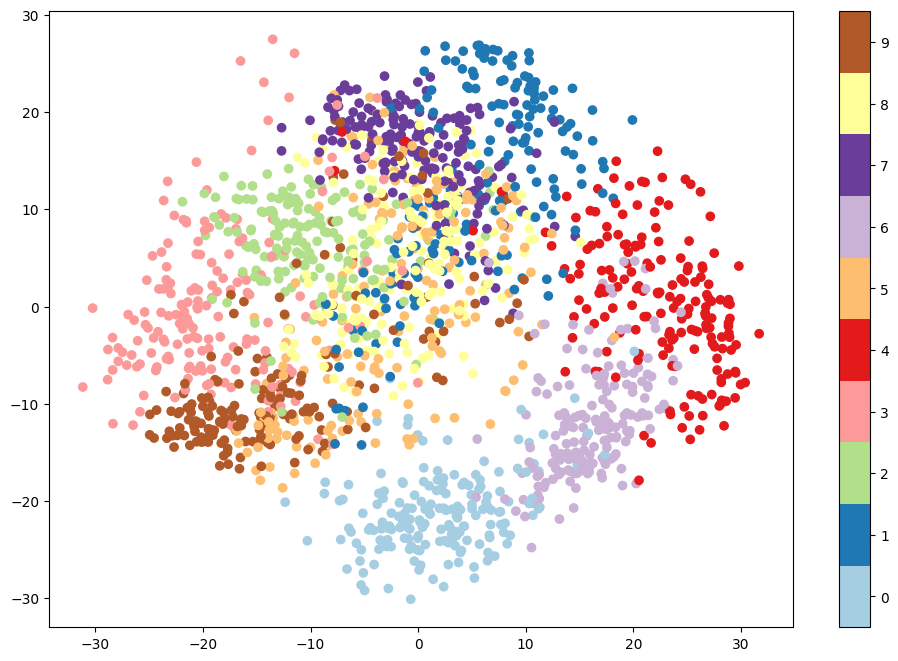
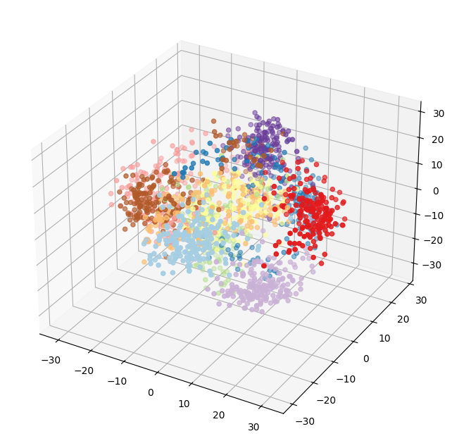
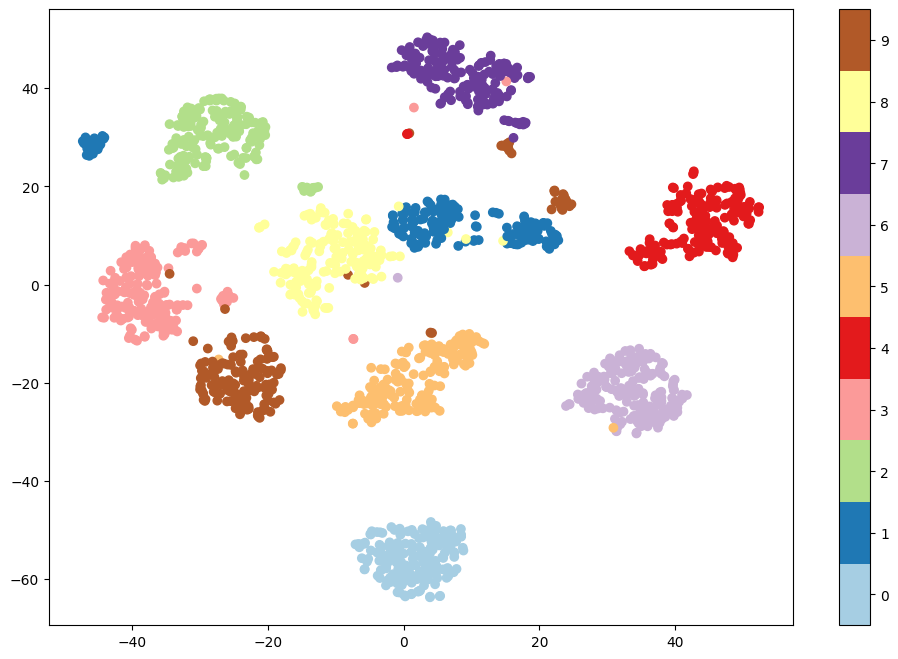

# Visualizing high dimensional data

``` python
import matplotlib.pyplot as plt
from sklearn.datasets import load_digits
from sklearn.decomposition import PCA

digits = load_digits()
pca = PCA(n_components=2, random_state=0)
pca_digits = pca.fit_transform(digits.data)


plt.figure(figsize=(12, 8))
plt.scatter(
    pca_digits[:, 0],
    pca_digits[:, 1],
    c=digits.target,
    cmap=plt.get_cmap("Paired", 10),
)
plt.colorbar(ticks=range(10))
plt.clim(-0.5, 9.5)
```



``` python
%matplotlib inline
from mpl_toolkits.mplot3d import Axes3D

digits = load_digits()
pca = PCA(n_components=3, random_state=0)
pca_digits = pca.fit_transform(digits.data)

ax = plt.figure(figsize=(12, 8)).add_subplot(111, projection="3d")
ax.scatter(
    xs=pca_digits[:, 0],
    ys=pca_digits[:, 1],
    zs=pca_digits[:, 2],
    c=digits.target,
    cmap=plt.get_cmap("Paired", 10),
);
```




``` python
from sklearn.manifold import TSNE

digits = load_digits()
tsne = TSNE(n_components=2, init="pca", learning_rate="auto", random_state=0)
tsne_digits = tsne.fit_transform(digits.data)

plt.figure(figsize=(12, 8))
plt.scatter(
    tsne_digits[:, 0],
    tsne_digits[:, 1],
    c=digits.target,
    cmap=plt.get_cmap("Paired", 10),
)
plt.colorbar(ticks=range(10))
plt.clim(-0.5, 9.5)
```


