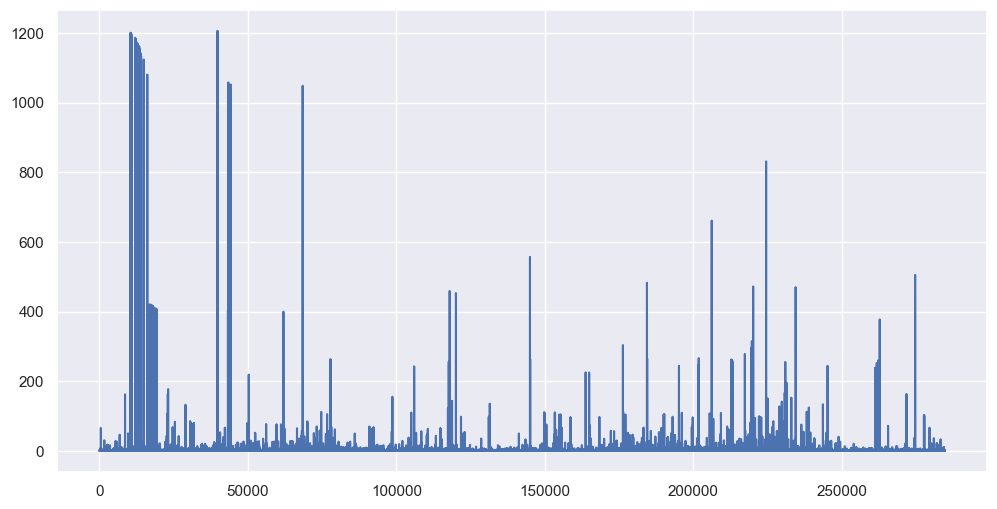
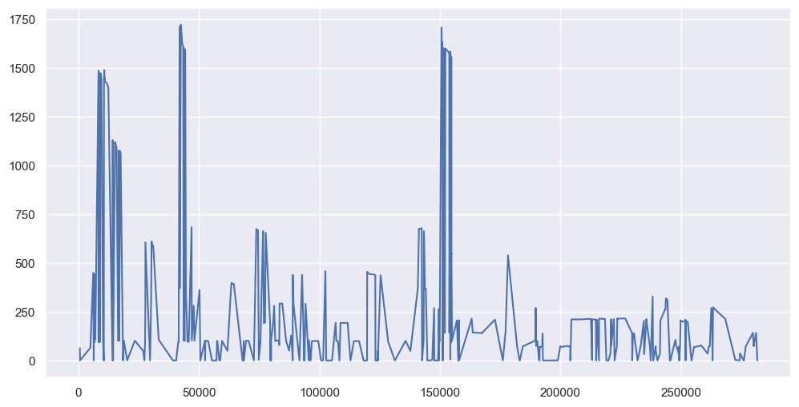
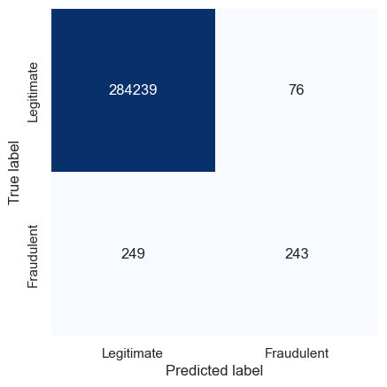

# Using PCA to detect credit card fraud

``` python
import pandas as pd

df = pd.read_csv("credit-cards.zip")
df.head()
```

<div>
<style scoped>
    .dataframe tbody tr th:only-of-type {
        vertical-align: middle;
    }
&#10;    .dataframe tbody tr th {
        vertical-align: top;
    }
&#10;    .dataframe thead th {
        text-align: right;
    }
</style>

|  | Time | V1 | V2 | V3 | V4 | V5 | V6 | V7 | V8 | V9 | ... | V21 | V22 | V23 | V24 | V25 | V26 | V27 | V28 | Amount | Class |
|----|----|----|----|----|----|----|----|----|----|----|----|----|----|----|----|----|----|----|----|----|----|
| 0 | 0.0 | -1.359807 | -0.072781 | 2.536347 | 1.378155 | -0.338321 | 0.462388 | 0.239599 | 0.098698 | 0.363787 | ... | -0.018307 | 0.277838 | -0.110474 | 0.066928 | 0.128539 | -0.189115 | 0.133558 | -0.021053 | 149.62 | 0 |
| 1 | 0.0 | 1.191857 | 0.266151 | 0.166480 | 0.448154 | 0.060018 | -0.082361 | -0.078803 | 0.085102 | -0.255425 | ... | -0.225775 | -0.638672 | 0.101288 | -0.339846 | 0.167170 | 0.125895 | -0.008983 | 0.014724 | 2.69 | 0 |
| 2 | 1.0 | -1.358354 | -1.340163 | 1.773209 | 0.379780 | -0.503198 | 1.800499 | 0.791461 | 0.247676 | -1.514654 | ... | 0.247998 | 0.771679 | 0.909412 | -0.689281 | -0.327642 | -0.139097 | -0.055353 | -0.059752 | 378.66 | 0 |
| 3 | 1.0 | -0.966272 | -0.185226 | 1.792993 | -0.863291 | -0.010309 | 1.247203 | 0.237609 | 0.377436 | -1.387024 | ... | -0.108300 | 0.005274 | -0.190321 | -1.175575 | 0.647376 | -0.221929 | 0.062723 | 0.061458 | 123.50 | 0 |
| 4 | 2.0 | -1.158233 | 0.877737 | 1.548718 | 0.403034 | -0.407193 | 0.095921 | 0.592941 | -0.270533 | 0.817739 | ... | -0.009431 | 0.798278 | -0.137458 | 0.141267 | -0.206010 | 0.502292 | 0.219422 | 0.215153 | 69.99 | 0 |

<p>5 rows × 31 columns</p>
</div>

``` python
# Separate the samples by class
legit = df[df["Class"] == 0]
fraud = df[df["Class"] == 1]
```

``` python
# Drop the "Time" and "Class" columns
legit = legit.drop(["Time", "Class"], axis=1)
fraud = fraud.drop(["Time", "Class"], axis=1)
```

``` python
from sklearn.decomposition import PCA

pca = PCA(n_components=26, random_state=0)
legit_pca = pd.DataFrame(pca.fit_transform(legit), index=legit.index)
fraud_pca = pd.DataFrame(pca.transform(fraud), index=fraud.index)

legit_restored = pd.DataFrame(pca.inverse_transform(legit_pca), index=legit_pca.index)
fraud_restored = pd.DataFrame(pca.inverse_transform(fraud_pca), index=fraud_pca.index)
```

``` python
import numpy as np


def get_anomaly_scores(df_original, df_restored):
    loss = np.sum((np.array(df_original) - np.array(df_restored)) ** 2, axis=1)
    loss = pd.Series(data=loss, index=df_original.index)
    return loss
```

``` python
legit_scores = get_anomaly_scores(legit, legit_restored)
fraud_scores = get_anomaly_scores(fraud, fraud_restored)
```

``` python
import matplotlib.pyplot as plt
import seaborn as sns

sns.set()

legit_scores.plot(figsize=(12, 6));
```



``` python
fraud_scores.plot(figsize=(12, 6));
```



``` python
threshold = 200

true_neg = legit_scores[legit_scores < threshold].count()
false_pos = legit_scores[legit_scores >= threshold].count()
true_pos = fraud_scores[fraud_scores >= threshold].count()
false_neg = fraud_scores[fraud_scores < threshold].count()

labels = ["Legitimate", "Fraudulent"]
mat = [[true_neg, false_pos], [false_neg, true_pos]]

sns.heatmap(
    mat,
    square=True,
    annot=True,
    fmt="d",
    cbar=False,
    cmap="Blues",
    xticklabels=labels,
    yticklabels=labels,
)

plt.xlabel("Predicted label")
plt.ylabel("True label")
```

    Text(110.44999999999997, 0.5, 'True label')


