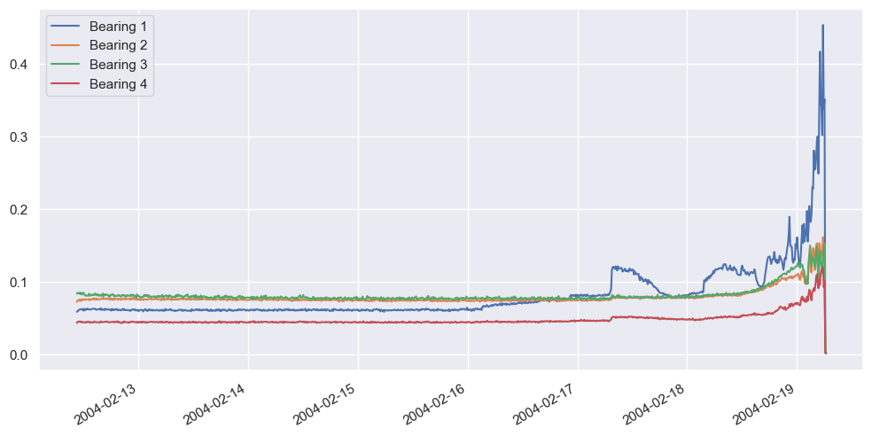
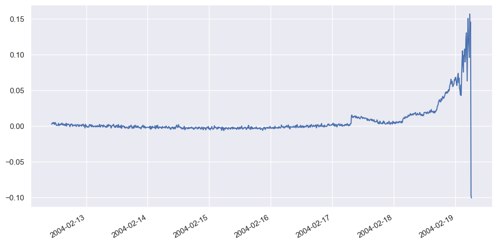
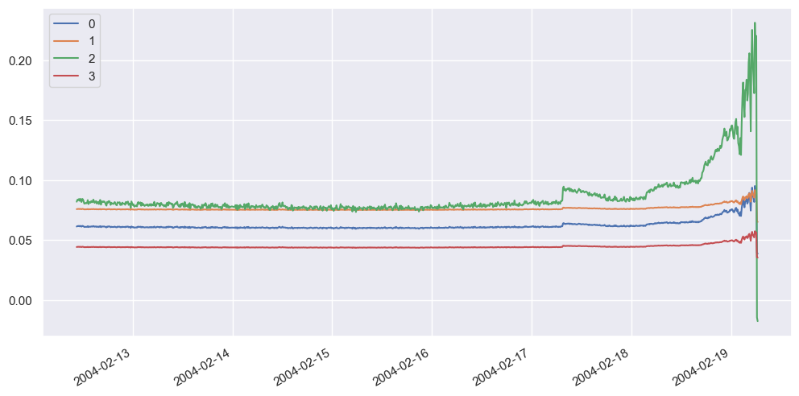
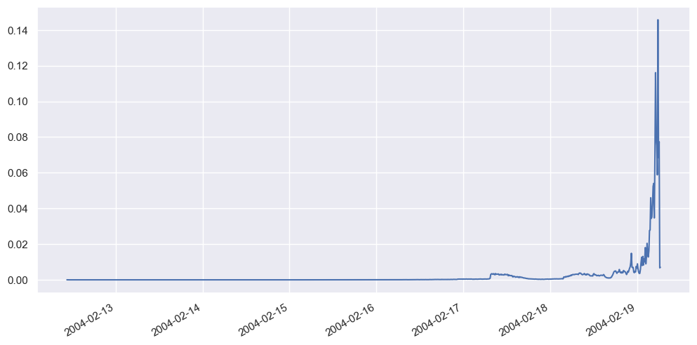
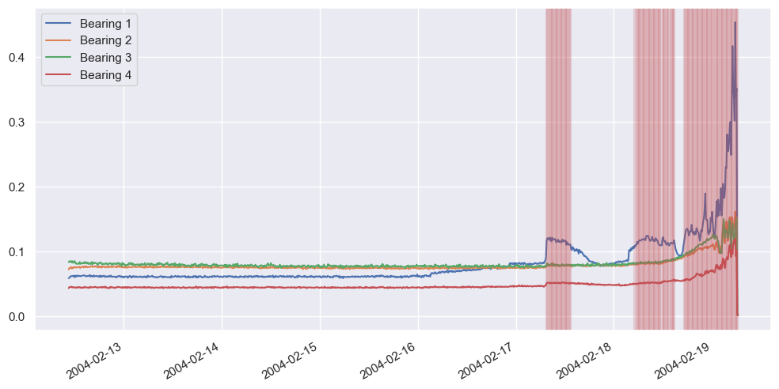
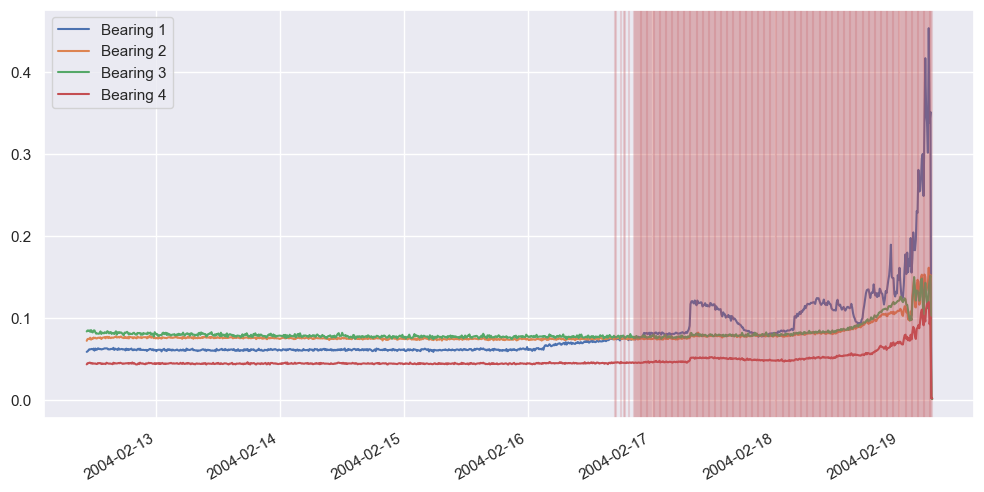

# Using PCA to predict Bearing Failure

``` python
import pandas as pd

df = pd.read_csv("bearings.csv", index_col=0, parse_dates=[0])
df.head()
```

<div>
<style scoped>
    .dataframe tbody tr th:only-of-type {
        vertical-align: middle;
    }
&#10;    .dataframe tbody tr th {
        vertical-align: top;
    }
&#10;    .dataframe thead th {
        text-align: right;
    }
</style>

|                     | Bearing 1 | Bearing 2 | Bearing 3 | Bearing 4 |
|---------------------|-----------|-----------|-----------|-----------|
| 2004-02-12 10:32:39 | 0.058333  | 0.071832  | 0.083242  | 0.043067  |
| 2004-02-12 10:42:39 | 0.058995  | 0.074006  | 0.084435  | 0.044541  |
| 2004-02-12 10:52:39 | 0.060236  | 0.074227  | 0.083926  | 0.044443  |
| 2004-02-12 11:02:39 | 0.061455  | 0.073844  | 0.084457  | 0.045081  |
| 2004-02-12 11:12:39 | 0.061361  | 0.075609  | 0.082837  | 0.045118  |

</div>

``` python
import matplotlib.pyplot as plt
import seaborn as sns

sns.set()

df.plot(figsize=(12, 6));
```



``` python
from sklearn.decomposition import PCA

X_train = df["2004-02-12 10:32:39":"2004-02-13 23:42:39"]
X_test = df["2004-02-13 23:52:39":]

pca = PCA(n_components=1, random_state=0)
X_train_pca = pd.DataFrame(pca.fit_transform(X_train), index=X_train.index)
X_test_pca = pd.DataFrame(pca.transform(X_test), index=X_test.index)

df_pca = pd.concat([X_train_pca, X_test_pca])
df_pca.plot(figsize=(12, 6))
plt.legend().remove();
```



``` python
df_restored = pd.DataFrame(pca.inverse_transform(df_pca), index=df_pca.index)
df_restored.plot(figsize=(12, 6));
```



``` python
import numpy as np


def get_anomaly_scores(df_original, df_restored):
    loss = np.sum((np.array(df_original) - np.array(df_restored)) ** 2, axis=1)
    loss = pd.Series(data=loss, index=df_original.index)
    return loss


scores = get_anomaly_scores(df, df_restored)
scores.plot(figsize=(12, 6))
```



``` python
def is_anomaly(row, pca, threshold):
    pca_row = pca.transform(row)
    restored_row = pca.inverse_transform(pca_row)
    losses = np.sum((row - restored_row) ** 2, axis=0)

    for loss in losses:
        if loss > threshold:
            return True

    return False
```

``` python
# Apply to a row early in the time series aathat represents normal behaviour.
x = df.loc[["2004-02-16 22:52:39"]]
is_anomaly(x, pca, 0.002)
```

    False

``` python
x = df.loc[["2004-02-18 22:52:39"]]
is_anomaly(x, pca, 0.002)
```

    True

``` python
df.plot(figsize=(12, 6))


for index, row in df.iterrows():
    if is_anomaly(pd.DataFrame([row]), pca, 0.002):
        plt.axvline(row.name, color="r", alpha=0.2)
```



``` python
df.plot(figsize=(12, 6))


for index, row in df.iterrows():
    if is_anomaly(pd.DataFrame([row]), pca, 0.0002):
        plt.axvline(row.name, color="r", alpha=0.2)
```


