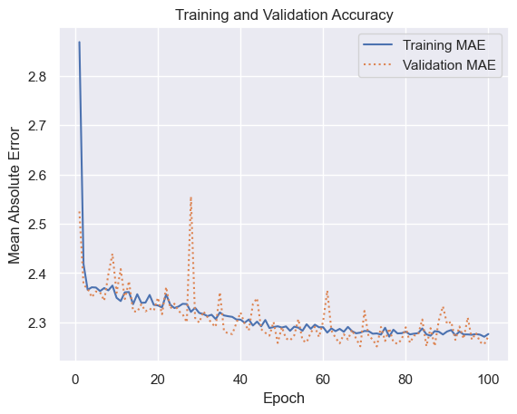
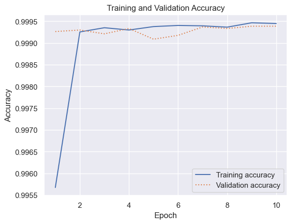
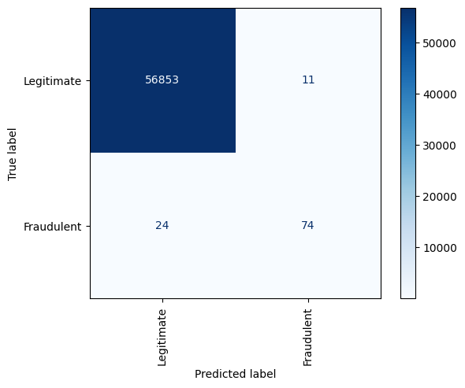
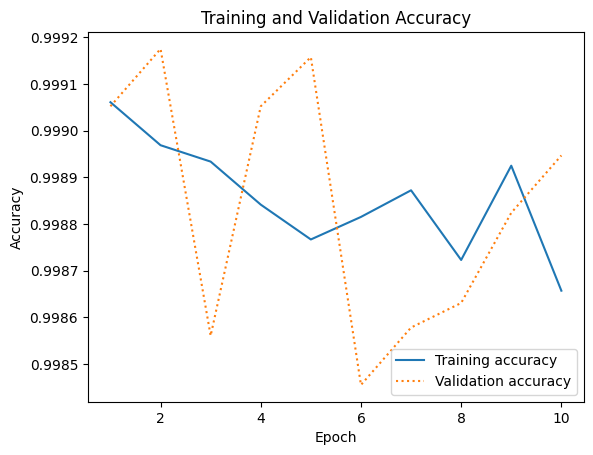

# Binary classification with Neural Networks


- [<span class="toc-section-number">1</span> Training a neural network
  to detect credit card
  fraud](#training-a-neural-network-to-detect-credit-card-fraud)
- [<span class="toc-section-number">2</span> Multiclass Classification
  with Neural Networks](#multiclass-classification-with-neural-networks)

``` python
import pandas as pd

df = pd.read_csv("taxi-fares.csv", parse_dates=["pickup_datetime"])
df.head()
```

<div>
<style scoped>
    .dataframe tbody tr th:only-of-type {
        vertical-align: middle;
    }
&#10;    .dataframe tbody tr th {
        vertical-align: top;
    }
&#10;    .dataframe thead th {
        text-align: right;
    }
</style>

|  | key | fare_amount | pickup_datetime | pickup_longitude | pickup_latitude | dropoff_longitude | dropoff_latitude | passenger_count |
|----|----|----|----|----|----|----|----|----|
| 0 | 2014-06-15 17:11:00.000000107 | 7.0 | 2014-06-15 17:11:00+00:00 | -73.995420 | 40.759662 | -73.987607 | 40.751247 | 1 |
| 1 | 2011-03-14 22:43:00.00000095 | 4.9 | 2011-03-14 22:43:00+00:00 | -73.993552 | 40.731110 | -73.998497 | 40.737200 | 5 |
| 2 | 2011-02-14 15:14:00.00000067 | 6.1 | 2011-02-14 15:14:00+00:00 | -73.972380 | 40.749527 | -73.990638 | 40.745328 | 1 |
| 3 | 2009-10-29 11:29:00.00000040 | 6.9 | 2009-10-29 11:29:00+00:00 | -73.973703 | 40.763542 | -73.984253 | 40.758603 | 5 |
| 4 | 2011-07-02 10:38:00.00000028 | 10.5 | 2011-07-02 10:38:00+00:00 | -73.921262 | 40.743615 | -73.967383 | 40.765162 | 1 |

</div>

``` python
from math import sqrt

df = df[df.passenger_count == 1]
df = df.drop(["key", "passenger_count"], axis=1)

for i, row in df.iterrows():
    dt = row.pickup_datetime
    df.at[i, "day_of_week"] = dt.weekday()
    df.at[i, "pickup_time"] = dt.hour
    x = (row.dropoff_longitude - row.pickup_longitude) * 54.6
    y = (row.dropoff_latitude - row.pickup_latitude) * 69.0
    distance = sqrt(x**2 + y**2)
    df.at[i, "distance"] = distance

df.drop(
    [
        "pickup_datetime",
        "pickup_longitude",
        "pickup_latitude",
        "dropoff_longitude",
        "dropoff_latitude",
    ],
    axis=1,
    inplace=True,
)
df = df[(df.distance > 1.0) & (df.distance < 10.0)]
df = df[(df.fare_amount > 0) & (df.fare_amount < 50)]
df.head()
```

<div>
<style scoped>
    .dataframe tbody tr th:only-of-type {
        vertical-align: middle;
    }
&#10;    .dataframe tbody tr th {
        vertical-align: top;
    }
&#10;    .dataframe thead th {
        text-align: right;
    }
</style>

|     | fare_amount | day_of_week | pickup_time | distance |
|-----|-------------|-------------|-------------|----------|
| 2   | 6.1         | 0.0         | 15.0        | 1.038136 |
| 4   | 10.5        | 5.0         | 10.0        | 2.924341 |
| 5   | 15.3        | 4.0         | 20.0        | 4.862893 |
| 8   | 7.7         | 5.0         | 1.0         | 2.603493 |
| 9   | 8.9         | 3.0         | 16.0        | 1.365739 |

</div>

``` python
from tensorflow.keras.layers import Dense
from tensorflow.keras.models import Sequential

model = Sequential()
model.add(Dense(512, activation="relu", input_dim=3))
model.add(Dense(512, activation="relu"))
model.add(Dense(1))
model.compile(optimizer="adam", loss="mae", metrics=["mae"])
model.summary()
```

    Model: "sequential_3"
    _________________________________________________________________
     Layer (type)                Output Shape              Param #   
    =================================================================
     dense_6 (Dense)             (None, 512)               2048      
                                                                     
     dense_7 (Dense)             (None, 512)               262656    
                                                                     
     dense_8 (Dense)             (None, 1)                 513       
                                                                     
    =================================================================
    Total params: 265217 (1.01 MB)
    Trainable params: 265217 (1.01 MB)
    Non-trainable params: 0 (0.00 Byte)
    _________________________________________________________________

``` python
X = df.drop("fare_amount", axis=1)
y = df.fare_amount

hist = model.fit(X, y, validation_split=0.2, epochs=100, batch_size=100)
```

    Epoch 1/100
    187/187 [==============================] - 0s 1ms/step - loss: 2.9113 - mae: 2.9113 - val_loss: 2.3993 - val_mae: 2.3993
    Epoch 2/100
    187/187 [==============================] - 0s 1ms/step - loss: 2.4111 - mae: 2.4111 - val_loss: 2.3591 - val_mae: 2.3591
    Epoch 3/100
    187/187 [==============================] - 0s 1ms/step - loss: 2.3766 - mae: 2.3766 - val_loss: 2.3708 - val_mae: 2.3708
    Epoch 4/100
    187/187 [==============================] - 0s 1ms/step - loss: 2.3661 - mae: 2.3661 - val_loss: 2.3667 - val_mae: 2.3667
    Epoch 5/100
    187/187 [==============================] - 0s 1ms/step - loss: 2.3642 - mae: 2.3642 - val_loss: 2.3572 - val_mae: 2.3572
    Epoch 6/100
    187/187 [==============================] - 0s 1ms/step - loss: 2.3741 - mae: 2.3741 - val_loss: 2.3392 - val_mae: 2.3392
    Epoch 7/100
    187/187 [==============================] - 0s 1ms/step - loss: 2.3579 - mae: 2.3579 - val_loss: 2.3430 - val_mae: 2.3430
    Epoch 8/100
    187/187 [==============================] - 0s 1ms/step - loss: 2.3580 - mae: 2.3580 - val_loss: 2.3383 - val_mae: 2.3383
    Epoch 9/100
    187/187 [==============================] - 0s 1ms/step - loss: 2.3598 - mae: 2.3598 - val_loss: 2.3402 - val_mae: 2.3402
    Epoch 10/100
    187/187 [==============================] - 0s 1ms/step - loss: 2.3436 - mae: 2.3436 - val_loss: 2.3583 - val_mae: 2.3583
    Epoch 11/100
    187/187 [==============================] - 0s 1ms/step - loss: 2.3491 - mae: 2.3491 - val_loss: 2.3577 - val_mae: 2.3577
    Epoch 12/100
    187/187 [==============================] - 0s 1ms/step - loss: 2.3496 - mae: 2.3496 - val_loss: 2.3437 - val_mae: 2.3437
    Epoch 13/100
    187/187 [==============================] - 0s 1ms/step - loss: 2.3779 - mae: 2.3779 - val_loss: 2.3309 - val_mae: 2.3309
    Epoch 14/100
    187/187 [==============================] - 0s 1ms/step - loss: 2.3440 - mae: 2.3440 - val_loss: 2.3676 - val_mae: 2.3676
    Epoch 15/100
    187/187 [==============================] - 0s 1ms/step - loss: 2.3401 - mae: 2.3401 - val_loss: 2.3711 - val_mae: 2.3711
    Epoch 16/100
    187/187 [==============================] - 0s 1ms/step - loss: 2.3388 - mae: 2.3388 - val_loss: 2.4147 - val_mae: 2.4147
    Epoch 17/100
    187/187 [==============================] - 0s 1ms/step - loss: 2.3508 - mae: 2.3508 - val_loss: 2.3992 - val_mae: 2.3992
    Epoch 18/100
    187/187 [==============================] - 0s 1ms/step - loss: 2.3581 - mae: 2.3581 - val_loss: 2.3919 - val_mae: 2.3919
    Epoch 19/100
    187/187 [==============================] - 0s 1ms/step - loss: 2.3464 - mae: 2.3464 - val_loss: 2.3212 - val_mae: 2.3212
    Epoch 20/100
    187/187 [==============================] - 0s 1ms/step - loss: 2.3309 - mae: 2.3309 - val_loss: 2.3389 - val_mae: 2.3389
    Epoch 21/100
    187/187 [==============================] - 0s 1ms/step - loss: 2.3318 - mae: 2.3318 - val_loss: 2.3206 - val_mae: 2.3206
    Epoch 22/100
    187/187 [==============================] - 0s 1ms/step - loss: 2.3386 - mae: 2.3386 - val_loss: 2.3155 - val_mae: 2.3155
    Epoch 23/100
    187/187 [==============================] - 0s 1ms/step - loss: 2.3344 - mae: 2.3344 - val_loss: 2.3206 - val_mae: 2.3206
    Epoch 24/100
    187/187 [==============================] - 0s 1ms/step - loss: 2.3267 - mae: 2.3267 - val_loss: 2.3530 - val_mae: 2.3530
    Epoch 25/100
    187/187 [==============================] - 0s 1ms/step - loss: 2.3377 - mae: 2.3377 - val_loss: 2.3404 - val_mae: 2.3404
    Epoch 26/100
    187/187 [==============================] - 0s 1ms/step - loss: 2.3228 - mae: 2.3228 - val_loss: 2.3209 - val_mae: 2.3209
    Epoch 27/100
    187/187 [==============================] - 0s 1ms/step - loss: 2.3210 - mae: 2.3210 - val_loss: 2.3021 - val_mae: 2.3021
    Epoch 28/100
    187/187 [==============================] - 0s 1ms/step - loss: 2.3358 - mae: 2.3358 - val_loss: 2.3307 - val_mae: 2.3307
    Epoch 29/100
    187/187 [==============================] - 0s 1ms/step - loss: 2.3229 - mae: 2.3229 - val_loss: 2.3675 - val_mae: 2.3675
    Epoch 30/100
    187/187 [==============================] - 0s 1ms/step - loss: 2.3198 - mae: 2.3198 - val_loss: 2.3178 - val_mae: 2.3178
    Epoch 31/100
    187/187 [==============================] - 0s 1ms/step - loss: 2.3162 - mae: 2.3162 - val_loss: 2.3015 - val_mae: 2.3015
    Epoch 32/100
    187/187 [==============================] - 0s 1ms/step - loss: 2.3156 - mae: 2.3156 - val_loss: 2.3095 - val_mae: 2.3095
    Epoch 33/100
    187/187 [==============================] - 0s 1ms/step - loss: 2.3159 - mae: 2.3159 - val_loss: 2.3138 - val_mae: 2.3138
    Epoch 34/100
    187/187 [==============================] - 0s 1ms/step - loss: 2.3139 - mae: 2.3139 - val_loss: 2.3644 - val_mae: 2.3644
    Epoch 35/100
    187/187 [==============================] - 0s 1ms/step - loss: 2.3091 - mae: 2.3091 - val_loss: 2.3040 - val_mae: 2.3040
    Epoch 36/100
    187/187 [==============================] - 0s 1ms/step - loss: 2.3129 - mae: 2.3129 - val_loss: 2.3344 - val_mae: 2.3344
    Epoch 37/100
    187/187 [==============================] - 0s 1ms/step - loss: 2.3129 - mae: 2.3129 - val_loss: 2.3048 - val_mae: 2.3048
    Epoch 38/100
    187/187 [==============================] - 0s 1ms/step - loss: 2.3113 - mae: 2.3113 - val_loss: 2.3429 - val_mae: 2.3429
    Epoch 39/100
    187/187 [==============================] - 0s 1ms/step - loss: 2.3125 - mae: 2.3125 - val_loss: 2.3313 - val_mae: 2.3313
    Epoch 40/100
    187/187 [==============================] - 0s 1ms/step - loss: 2.3160 - mae: 2.3160 - val_loss: 2.2932 - val_mae: 2.2932
    Epoch 41/100
    187/187 [==============================] - 0s 1ms/step - loss: 2.3183 - mae: 2.3183 - val_loss: 2.3341 - val_mae: 2.3341
    Epoch 42/100
    187/187 [==============================] - 0s 1ms/step - loss: 2.3089 - mae: 2.3089 - val_loss: 2.3388 - val_mae: 2.3388
    Epoch 43/100
    187/187 [==============================] - 0s 1ms/step - loss: 2.2964 - mae: 2.2964 - val_loss: 2.3766 - val_mae: 2.3766
    Epoch 44/100
    187/187 [==============================] - 0s 1ms/step - loss: 2.3044 - mae: 2.3044 - val_loss: 2.3064 - val_mae: 2.3064
    Epoch 45/100
    187/187 [==============================] - 0s 1ms/step - loss: 2.3144 - mae: 2.3144 - val_loss: 2.2959 - val_mae: 2.2959
    Epoch 46/100
    187/187 [==============================] - 0s 1ms/step - loss: 2.3044 - mae: 2.3044 - val_loss: 2.2990 - val_mae: 2.2990
    Epoch 47/100
    187/187 [==============================] - 0s 1ms/step - loss: 2.3008 - mae: 2.3008 - val_loss: 2.2819 - val_mae: 2.2819
    Epoch 48/100
    187/187 [==============================] - 0s 1ms/step - loss: 2.3049 - mae: 2.3049 - val_loss: 2.2880 - val_mae: 2.2880
    Epoch 49/100
    187/187 [==============================] - 0s 1ms/step - loss: 2.3060 - mae: 2.3060 - val_loss: 2.3173 - val_mae: 2.3173
    Epoch 50/100
    187/187 [==============================] - 0s 1ms/step - loss: 2.3027 - mae: 2.3027 - val_loss: 2.2853 - val_mae: 2.2853
    Epoch 51/100
    187/187 [==============================] - 0s 1ms/step - loss: 2.3055 - mae: 2.3055 - val_loss: 2.2914 - val_mae: 2.2914
    Epoch 52/100
    187/187 [==============================] - 0s 1ms/step - loss: 2.2957 - mae: 2.2957 - val_loss: 2.2706 - val_mae: 2.2706
    Epoch 53/100
    187/187 [==============================] - 0s 1ms/step - loss: 2.2969 - mae: 2.2969 - val_loss: 2.2780 - val_mae: 2.2780
    Epoch 54/100
    187/187 [==============================] - 0s 1ms/step - loss: 2.2900 - mae: 2.2900 - val_loss: 2.2775 - val_mae: 2.2775
    Epoch 55/100
    187/187 [==============================] - 0s 1ms/step - loss: 2.2977 - mae: 2.2977 - val_loss: 2.2715 - val_mae: 2.2715
    Epoch 56/100
    187/187 [==============================] - 0s 1ms/step - loss: 2.2893 - mae: 2.2893 - val_loss: 2.3283 - val_mae: 2.3283
    Epoch 57/100
    187/187 [==============================] - 0s 1ms/step - loss: 2.2966 - mae: 2.2966 - val_loss: 2.2739 - val_mae: 2.2739
    Epoch 58/100
    187/187 [==============================] - 0s 1ms/step - loss: 2.2896 - mae: 2.2896 - val_loss: 2.2730 - val_mae: 2.2730
    Epoch 59/100
    187/187 [==============================] - 0s 1ms/step - loss: 2.2965 - mae: 2.2965 - val_loss: 2.2790 - val_mae: 2.2790
    Epoch 60/100
    187/187 [==============================] - 0s 1ms/step - loss: 2.2931 - mae: 2.2931 - val_loss: 2.2851 - val_mae: 2.2851
    Epoch 61/100
    187/187 [==============================] - 0s 1ms/step - loss: 2.2942 - mae: 2.2942 - val_loss: 2.2717 - val_mae: 2.2717
    Epoch 62/100
    187/187 [==============================] - 0s 1ms/step - loss: 2.2819 - mae: 2.2819 - val_loss: 2.2767 - val_mae: 2.2767
    Epoch 63/100
    187/187 [==============================] - 0s 1ms/step - loss: 2.2825 - mae: 2.2825 - val_loss: 2.2856 - val_mae: 2.2856
    Epoch 64/100
    187/187 [==============================] - 0s 1ms/step - loss: 2.2953 - mae: 2.2953 - val_loss: 2.2733 - val_mae: 2.2733
    Epoch 65/100
    187/187 [==============================] - 0s 1ms/step - loss: 2.2959 - mae: 2.2959 - val_loss: 2.2848 - val_mae: 2.2848
    Epoch 66/100
    187/187 [==============================] - 0s 1ms/step - loss: 2.2914 - mae: 2.2914 - val_loss: 2.2775 - val_mae: 2.2775
    Epoch 67/100
    187/187 [==============================] - 0s 1ms/step - loss: 2.2871 - mae: 2.2871 - val_loss: 2.2686 - val_mae: 2.2686
    Epoch 68/100
    187/187 [==============================] - 0s 1ms/step - loss: 2.2831 - mae: 2.2831 - val_loss: 2.2735 - val_mae: 2.2735
    Epoch 69/100
    187/187 [==============================] - 0s 1ms/step - loss: 2.2883 - mae: 2.2883 - val_loss: 2.2989 - val_mae: 2.2989
    Epoch 70/100
    187/187 [==============================] - 0s 1ms/step - loss: 2.2948 - mae: 2.2948 - val_loss: 2.2726 - val_mae: 2.2726
    Epoch 71/100
    187/187 [==============================] - 0s 1ms/step - loss: 2.2893 - mae: 2.2893 - val_loss: 2.3036 - val_mae: 2.3036
    Epoch 72/100
    187/187 [==============================] - 0s 1ms/step - loss: 2.2842 - mae: 2.2842 - val_loss: 2.2624 - val_mae: 2.2624
    Epoch 73/100
    187/187 [==============================] - 0s 1ms/step - loss: 2.2830 - mae: 2.2830 - val_loss: 2.2829 - val_mae: 2.2829
    Epoch 74/100
    187/187 [==============================] - 0s 1ms/step - loss: 2.2802 - mae: 2.2802 - val_loss: 2.2856 - val_mae: 2.2856
    Epoch 75/100
    187/187 [==============================] - 0s 1ms/step - loss: 2.2797 - mae: 2.2797 - val_loss: 2.2582 - val_mae: 2.2582
    Epoch 76/100
    187/187 [==============================] - 0s 1ms/step - loss: 2.2894 - mae: 2.2894 - val_loss: 2.3341 - val_mae: 2.3341
    Epoch 77/100
    187/187 [==============================] - 0s 1ms/step - loss: 2.2867 - mae: 2.2867 - val_loss: 2.2738 - val_mae: 2.2738
    Epoch 78/100
    187/187 [==============================] - 0s 1ms/step - loss: 2.2888 - mae: 2.2888 - val_loss: 2.2924 - val_mae: 2.2924
    Epoch 79/100
    187/187 [==============================] - 0s 1ms/step - loss: 2.2793 - mae: 2.2793 - val_loss: 2.2539 - val_mae: 2.2539
    Epoch 80/100
    187/187 [==============================] - 0s 1ms/step - loss: 2.2910 - mae: 2.2910 - val_loss: 2.2625 - val_mae: 2.2625
    Epoch 81/100
    187/187 [==============================] - 0s 1ms/step - loss: 2.2907 - mae: 2.2907 - val_loss: 2.2703 - val_mae: 2.2703
    Epoch 82/100
    187/187 [==============================] - 0s 1ms/step - loss: 2.2743 - mae: 2.2743 - val_loss: 2.2581 - val_mae: 2.2581
    Epoch 83/100
    187/187 [==============================] - 0s 1ms/step - loss: 2.2817 - mae: 2.2817 - val_loss: 2.2794 - val_mae: 2.2794
    Epoch 84/100
    187/187 [==============================] - 0s 1ms/step - loss: 2.2803 - mae: 2.2803 - val_loss: 2.2702 - val_mae: 2.2702
    Epoch 85/100
    187/187 [==============================] - 0s 1ms/step - loss: 2.2836 - mae: 2.2836 - val_loss: 2.2536 - val_mae: 2.2536
    Epoch 86/100
    187/187 [==============================] - 0s 1ms/step - loss: 2.2882 - mae: 2.2882 - val_loss: 2.3163 - val_mae: 2.3163
    Epoch 87/100
    187/187 [==============================] - 0s 1ms/step - loss: 2.2875 - mae: 2.2875 - val_loss: 2.2563 - val_mae: 2.2563
    Epoch 88/100
    187/187 [==============================] - 0s 1ms/step - loss: 2.2747 - mae: 2.2747 - val_loss: 2.2946 - val_mae: 2.2946
    Epoch 89/100
    187/187 [==============================] - 0s 1ms/step - loss: 2.2830 - mae: 2.2830 - val_loss: 2.2622 - val_mae: 2.2622
    Epoch 90/100
    187/187 [==============================] - 0s 1ms/step - loss: 2.2771 - mae: 2.2771 - val_loss: 2.2694 - val_mae: 2.2694
    Epoch 91/100
    187/187 [==============================] - 0s 1ms/step - loss: 2.2890 - mae: 2.2890 - val_loss: 2.2702 - val_mae: 2.2702
    Epoch 92/100
    187/187 [==============================] - 0s 1ms/step - loss: 2.2809 - mae: 2.2809 - val_loss: 2.2812 - val_mae: 2.2812
    Epoch 93/100
    187/187 [==============================] - 0s 1ms/step - loss: 2.2849 - mae: 2.2849 - val_loss: 2.2622 - val_mae: 2.2622
    Epoch 94/100
    187/187 [==============================] - 0s 1ms/step - loss: 2.2771 - mae: 2.2771 - val_loss: 2.2590 - val_mae: 2.2590
    Epoch 95/100
    187/187 [==============================] - 0s 2ms/step - loss: 2.2714 - mae: 2.2714 - val_loss: 2.2718 - val_mae: 2.2718
    Epoch 96/100
    187/187 [==============================] - 0s 2ms/step - loss: 2.2804 - mae: 2.2804 - val_loss: 2.2770 - val_mae: 2.2770
    Epoch 97/100
    187/187 [==============================] - 0s 1ms/step - loss: 2.2813 - mae: 2.2813 - val_loss: 2.2673 - val_mae: 2.2673
    Epoch 98/100
    187/187 [==============================] - 0s 1ms/step - loss: 2.2883 - mae: 2.2883 - val_loss: 2.2646 - val_mae: 2.2646
    Epoch 99/100
    187/187 [==============================] - 0s 1ms/step - loss: 2.2777 - mae: 2.2777 - val_loss: 2.3086 - val_mae: 2.3086
    Epoch 100/100
    187/187 [==============================] - 0s 1ms/step - loss: 2.2747 - mae: 2.2747 - val_loss: 2.2635 - val_mae: 2.2635

``` python
import matplotlib.pyplot as plt
import seaborn as sns

sns.set()

err = hist.history["mae"]
val_err = hist.history["val_mae"]
epochs = range(1, len(err) + 1)

plt.plot(epochs, err, "-", label="Training MAE")
plt.plot(epochs, val_err, ":", label="Validation MAE")
plt.title("Training and Validation Accuracy")
plt.xlabel("Epoch")
plt.ylabel("Mean Absolute Error")
plt.legend(loc="upper right")
plt.plot()
```



``` python
from sklearn.metrics import r2_score

r2_score(y, model.predict(X))
```

    729/729 [==============================] - 0s 301us/step

    0.7388507832015594

``` python
import numpy as np

model.predict([[4, 17, 2.0]])
```

    1/1 [==============================] - 0s 31ms/step

    array([[10.212472]], dtype=float32)

``` python
model.predict([[5, 17, 2.0]])
```

    1/1 [==============================] - 0s 25ms/step

    array([[10.025325]], dtype=float32)

``` python
from tensorflow.keras.layers import Dense
from tensorflow.keras.models import Sequential

model = Sequential()
model.add(Dense(512, activation="relu", input_dim=3))
model.add(Dense(512, activation="relu"))
model.add(Dense(1, activation="sigmoid"))
model.compile(optimizer="adam", loss="binary_crossentropy", metrics=["accuracy"])
```

## Training a neural network to detect credit card fraud

``` python
import pandas as pd

df = pd.read_csv("credit-cards.zip")
df.head(10)
```

<div>
<style scoped>
    .dataframe tbody tr th:only-of-type {
        vertical-align: middle;
    }
&#10;    .dataframe tbody tr th {
        vertical-align: top;
    }
&#10;    .dataframe thead th {
        text-align: right;
    }
</style>

|  | Time | V1 | V2 | V3 | V4 | V5 | V6 | V7 | V8 | V9 | ... | V21 | V22 | V23 | V24 | V25 | V26 | V27 | V28 | Amount | Class |
|----|----|----|----|----|----|----|----|----|----|----|----|----|----|----|----|----|----|----|----|----|----|
| 0 | 0.0 | -1.359807 | -0.072781 | 2.536347 | 1.378155 | -0.338321 | 0.462388 | 0.239599 | 0.098698 | 0.363787 | ... | -0.018307 | 0.277838 | -0.110474 | 0.066928 | 0.128539 | -0.189115 | 0.133558 | -0.021053 | 149.62 | 0 |
| 1 | 0.0 | 1.191857 | 0.266151 | 0.166480 | 0.448154 | 0.060018 | -0.082361 | -0.078803 | 0.085102 | -0.255425 | ... | -0.225775 | -0.638672 | 0.101288 | -0.339846 | 0.167170 | 0.125895 | -0.008983 | 0.014724 | 2.69 | 0 |
| 2 | 1.0 | -1.358354 | -1.340163 | 1.773209 | 0.379780 | -0.503198 | 1.800499 | 0.791461 | 0.247676 | -1.514654 | ... | 0.247998 | 0.771679 | 0.909412 | -0.689281 | -0.327642 | -0.139097 | -0.055353 | -0.059752 | 378.66 | 0 |
| 3 | 1.0 | -0.966272 | -0.185226 | 1.792993 | -0.863291 | -0.010309 | 1.247203 | 0.237609 | 0.377436 | -1.387024 | ... | -0.108300 | 0.005274 | -0.190321 | -1.175575 | 0.647376 | -0.221929 | 0.062723 | 0.061458 | 123.50 | 0 |
| 4 | 2.0 | -1.158233 | 0.877737 | 1.548718 | 0.403034 | -0.407193 | 0.095921 | 0.592941 | -0.270533 | 0.817739 | ... | -0.009431 | 0.798278 | -0.137458 | 0.141267 | -0.206010 | 0.502292 | 0.219422 | 0.215153 | 69.99 | 0 |
| 5 | 2.0 | -0.425966 | 0.960523 | 1.141109 | -0.168252 | 0.420987 | -0.029728 | 0.476201 | 0.260314 | -0.568671 | ... | -0.208254 | -0.559825 | -0.026398 | -0.371427 | -0.232794 | 0.105915 | 0.253844 | 0.081080 | 3.67 | 0 |
| 6 | 4.0 | 1.229658 | 0.141004 | 0.045371 | 1.202613 | 0.191881 | 0.272708 | -0.005159 | 0.081213 | 0.464960 | ... | -0.167716 | -0.270710 | -0.154104 | -0.780055 | 0.750137 | -0.257237 | 0.034507 | 0.005168 | 4.99 | 0 |
| 7 | 7.0 | -0.644269 | 1.417964 | 1.074380 | -0.492199 | 0.948934 | 0.428118 | 1.120631 | -3.807864 | 0.615375 | ... | 1.943465 | -1.015455 | 0.057504 | -0.649709 | -0.415267 | -0.051634 | -1.206921 | -1.085339 | 40.80 | 0 |
| 8 | 7.0 | -0.894286 | 0.286157 | -0.113192 | -0.271526 | 2.669599 | 3.721818 | 0.370145 | 0.851084 | -0.392048 | ... | -0.073425 | -0.268092 | -0.204233 | 1.011592 | 0.373205 | -0.384157 | 0.011747 | 0.142404 | 93.20 | 0 |
| 9 | 9.0 | -0.338262 | 1.119593 | 1.044367 | -0.222187 | 0.499361 | -0.246761 | 0.651583 | 0.069539 | -0.736727 | ... | -0.246914 | -0.633753 | -0.120794 | -0.385050 | -0.069733 | 0.094199 | 0.246219 | 0.083076 | 3.68 | 0 |

<p>10 rows × 31 columns</p>
</div>

``` python
from sklearn.model_selection import train_test_split

X = df.drop(["Time", "Class"], axis=1)
y = df["Class"]

X_train, X_test, y_train, y_test = train_test_split(
    X, y, test_size=0.2, stratify=y, random_state=0
)
```

``` python
from tensorflow.keras.layers import Dense
from tensorflow.keras.models import Sequential

model = Sequential()
model.add(Dense(128, activation="relu", input_dim=29))
model.add(Dense(1, activation="sigmoid"))
model.compile(loss="binary_crossentropy", optimizer="adam", metrics=["accuracy"])
model.summary()
```

    Model: "sequential_6"
    _________________________________________________________________
     Layer (type)                Output Shape              Param #   
    =================================================================
     dense_15 (Dense)            (None, 128)               3840      
                                                                     
     dense_16 (Dense)            (None, 1)                 129       
                                                                     
    =================================================================
    Total params: 3969 (15.50 KB)
    Trainable params: 3969 (15.50 KB)
    Non-trainable params: 0 (0.00 Byte)
    _________________________________________________________________

``` python
hist = model.fit(
    X_train, y_train, validation_data=(X_test, y_test), epochs=10, batch_size=100
)
```

    Epoch 1/10
    2279/2279 [==============================] - 1s 369us/step - loss: 0.0379 - accuracy: 0.9957 - val_loss: 0.0063 - val_accuracy: 0.9993
    Epoch 2/10
    2279/2279 [==============================] - 1s 349us/step - loss: 0.0135 - accuracy: 0.9993 - val_loss: 0.0094 - val_accuracy: 0.9993
    Epoch 3/10
    2279/2279 [==============================] - 1s 349us/step - loss: 0.0112 - accuracy: 0.9994 - val_loss: 0.0047 - val_accuracy: 0.9992
    Epoch 4/10
    2279/2279 [==============================] - 1s 349us/step - loss: 0.0094 - accuracy: 0.9993 - val_loss: 0.0054 - val_accuracy: 0.9993
    Epoch 5/10
    2279/2279 [==============================] - 1s 354us/step - loss: 0.0086 - accuracy: 0.9994 - val_loss: 0.0222 - val_accuracy: 0.9991
    Epoch 6/10
    2279/2279 [==============================] - 1s 353us/step - loss: 0.0062 - accuracy: 0.9994 - val_loss: 0.0050 - val_accuracy: 0.9992
    Epoch 7/10
    2279/2279 [==============================] - 1s 349us/step - loss: 0.0078 - accuracy: 0.9994 - val_loss: 0.0057 - val_accuracy: 0.9994
    Epoch 8/10
    2279/2279 [==============================] - 1s 348us/step - loss: 0.0072 - accuracy: 0.9994 - val_loss: 0.0062 - val_accuracy: 0.9993
    Epoch 9/10
    2279/2279 [==============================] - 1s 351us/step - loss: 0.0052 - accuracy: 0.9995 - val_loss: 0.0050 - val_accuracy: 0.9994
    Epoch 10/10
    2279/2279 [==============================] - 1s 351us/step - loss: 0.0063 - accuracy: 0.9994 - val_loss: 0.0050 - val_accuracy: 0.9994

``` python
import matplotlib.pyplot as plt
import seaborn as sns

sns.set()

acc = hist.history["accuracy"]
val = hist.history["val_accuracy"]
epochs = range(1, len(acc) + 1)
```

``` python
plt.plot(epochs, acc, "-", label="Training accuracy")
plt.plot(epochs, val, ":", label="Validation accuracy")
plt.title("Training and Validation Accuracy")
plt.xlabel("Epoch")
plt.ylabel("Accuracy")
plt.legend(loc="lower right")
plt.plot();
```



``` python
from sklearn.metrics import ConfusionMatrixDisplay as cmd

sns.reset_orig()
y_predicted = model.predict(X_test) > 0.5

labels = ["Legitimate", "Fraudulent"]
cmd.from_predictions(
    y_test,
    y_predicted,
    display_labels=labels,
    cmap="Blues",
    xticks_rotation="vertical",
)
plt.show()
```

    1781/1781 [==============================] - 0s 196us/step



``` python
hist = model.fit(
    X_train,
    y_train,
    validation_data=(X_test, y_test),
    epochs=10,
    batch_size=100,
    class_weight={0: 1.0, 1: 0.01},
)
```

    Epoch 1/10
    2279/2279 [==============================] - 1s 383us/step - loss: 1.5296e-04 - accuracy: 0.9991 - val_loss: 0.0084 - val_accuracy: 0.9991
    Epoch 2/10
    2279/2279 [==============================] - 1s 384us/step - loss: 2.0585e-04 - accuracy: 0.9990 - val_loss: 0.0118 - val_accuracy: 0.9992
    Epoch 3/10
    2279/2279 [==============================] - 1s 376us/step - loss: 2.1320e-04 - accuracy: 0.9989 - val_loss: 0.0577 - val_accuracy: 0.9986
    Epoch 4/10
    2279/2279 [==============================] - 1s 375us/step - loss: 2.6607e-04 - accuracy: 0.9988 - val_loss: 0.0061 - val_accuracy: 0.9991
    Epoch 5/10
    2279/2279 [==============================] - 1s 375us/step - loss: 4.3738e-04 - accuracy: 0.9988 - val_loss: 0.0062 - val_accuracy: 0.9992
    Epoch 6/10
    2279/2279 [==============================] - 1s 376us/step - loss: 6.9845e-04 - accuracy: 0.9988 - val_loss: 0.0478 - val_accuracy: 0.9985
    Epoch 7/10
    2279/2279 [==============================] - 1s 373us/step - loss: 4.0771e-04 - accuracy: 0.9989 - val_loss: 0.0227 - val_accuracy: 0.9986
    Epoch 8/10
    2279/2279 [==============================] - 1s 384us/step - loss: 5.7992e-04 - accuracy: 0.9987 - val_loss: 0.0256 - val_accuracy: 0.9986
    Epoch 9/10
    2279/2279 [==============================] - 1s 373us/step - loss: 6.3993e-04 - accuracy: 0.9989 - val_loss: 0.0523 - val_accuracy: 0.9988
    Epoch 10/10
    2279/2279 [==============================] - 1s 375us/step - loss: 5.6793e-04 - accuracy: 0.9987 - val_loss: 0.0622 - val_accuracy: 0.9989

``` python
acc = hist.history["accuracy"]
val = hist.history["val_accuracy"]
epochs = range(1, len(acc) + 1)
```

``` python
plt.plot(epochs, acc, "-", label="Training accuracy")
plt.plot(epochs, val, ":", label="Validation accuracy")
plt.title("Training and Validation Accuracy")
plt.xlabel("Epoch")
plt.ylabel("Accuracy")
plt.legend(loc="lower right")
plt.plot();
```

``` python
sns.reset_orig()
y_predicted = model.predict(X_test) > 0.5

labels = ["Legitimate", "Fraudulent"]
cmd.from_predictions(
    y_test,
    y_predicted,
    display_labels=labels,
    cmap="Blues",
    xticks_rotation="vertical",
)
plt.show()
```

    1781/1781 [==============================] - 0s 198us/step




## Multiclass Classification with Neural Networks

Below is a simple binary classifier that accepts two inputs, has a
hidden layer with 128 neurons, and outputs a value from 0.0 to 1.0
representing the probability that the input belongs the positive class:

``` python
from tensorflow.keras.layers import Dense
from tensorflow.keras.models import Sequential

model = Sequential()
model.add(Dense(128, activation="relu", input_dim=2))
model.add(Dense(1, activation="sigmoid"))
model.compile(optimizer="adam", loss="binary_crossentropy", metrics=["accuracy"])
```

And below is the modification to repurpose the network to do multiclass
classification:

``` python
from tensorflow.keras.layers import Dense
from tensorflow.keras.models import Sequential

model = Sequential()
model.add(Dense(128, activation="relu", input_dim=2))
model.add(Dense(4, activation="softmax"))
model.compile(
    optimizer="adam", loss="sparse_categorical_crossentropy", metrics=["accuracy"]
)
```

``` python
from tensorflow.keras.layers import Dense
from tensorflow.keras.models import Sequential

model = Sequential()
model.add(Dense(128, activation="relu", input_dim=2))
model.add(Dense(4, activation="softmax"))
model.compile(
    optimizer="adam", loss="sparse_categorical_crossentropy", metrics=["accuracy"]
)

# hist = model.fit(X, y, epochs=40, batch_size=10, validation_split=0.2)
```
