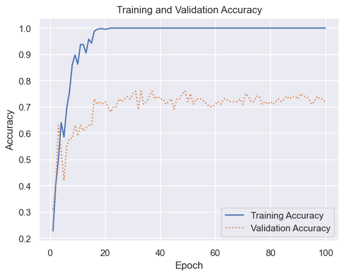
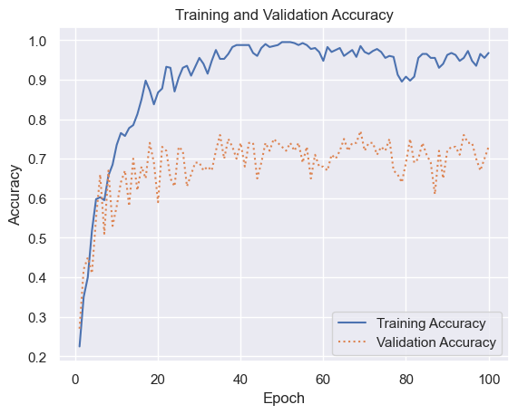

# Dropout


- [<span class="toc-section-number">1</span> Saving and loading
  models](#saving-and-loading-models)
- [<span class="toc-section-number">2</span> Keras
  Callbacks](#keras-callbacks)

``` python
import pandas as pd
from sklearn.datasets import fetch_lfw_people

faces = fetch_lfw_people(min_faces_per_person=100, slice_=None)
faces.image = faces.images[:, 35:97, 39:86]
faces.data = faces.images.reshape(
    faces.images.shape[0], faces.images.shape[1] * faces.images.shape[2]
)

image_count, image_height, image_width = faces.images.shape
class_count = len(faces.target_names)
```

``` python
image_count, image_height, image_width, class_count
```

    (1140, 125, 125, 5)

``` python
import matplotlib.pyplot as plt

fig, ax = plt.subplots(3, 8, figsize=(18, 10))
for i, axi in enumerate(ax.flat):
    axi.imshow(faces.images[i], cmap="gist_gray")
    axi.set(xticks=[], yticks=[], xlabel=faces.target_names[faces.target[i]])
```


``` python
from collections import Counter

import seaborn as sns

sns.set()

counts = Counter(faces.target)
names = {}

for key in counts.keys():
    names[faces.target_names[key]] = counts[key]

df = pd.DataFrame.from_dict(names, orient="index")
df.plot(kind="bar");
```


``` python
import numpy as np

mask = np.zeros(faces.target.shape, dtype=bool)

for target in np.unique(faces.target):
    mask[np.where(faces.target == target)[0][:100]] = 1

x_faces = faces.data[mask]
y_faces = faces.target[mask]
x_faces.shape
```

    (500, 15625)

``` python
from sklearn.model_selection import train_test_split

X_train, X_test, y_train, y_test = train_test_split(
    x_faces, y_faces, train_size=0.8, stratify=y_faces, random_state=0
)
```

``` python
from tensorflow.keras.layers import Dense
from tensorflow.keras.models import Sequential

model = Sequential()
model.add(Dense(512, activation="relu", input_shape=(image_width * image_height,)))
model.add(Dense(class_count, activation="softmax"))
model.compile(
    optimizer="adam", loss="sparse_categorical_crossentropy", metrics=["accuracy"]
)
```

``` python
hist = model.fit(
    X_train, y_train, validation_data=(X_test, y_test), epochs=100, batch_size=20
)
```

    Epoch 1/100
    20/20 [==============================] - 0s 9ms/step - loss: 7.2479 - accuracy: 0.2275 - val_loss: 1.9070 - val_accuracy: 0.3100
    Epoch 2/100
    20/20 [==============================] - 0s 6ms/step - loss: 1.7397 - accuracy: 0.4025 - val_loss: 1.5120 - val_accuracy: 0.4100
    Epoch 3/100
    20/20 [==============================] - 0s 6ms/step - loss: 1.2291 - accuracy: 0.5025 - val_loss: 1.0731 - val_accuracy: 0.6300
    Epoch 4/100
    20/20 [==============================] - 0s 5ms/step - loss: 0.9655 - accuracy: 0.6400 - val_loss: 1.2662 - val_accuracy: 0.5300
    Epoch 5/100
    20/20 [==============================] - 0s 6ms/step - loss: 1.0577 - accuracy: 0.5850 - val_loss: 1.7121 - val_accuracy: 0.4200
    Epoch 6/100
    20/20 [==============================] - 0s 6ms/step - loss: 0.8689 - accuracy: 0.6950 - val_loss: 1.1685 - val_accuracy: 0.5500
    Epoch 7/100
    20/20 [==============================] - 0s 6ms/step - loss: 0.6932 - accuracy: 0.7575 - val_loss: 1.0486 - val_accuracy: 0.5800
    Epoch 8/100
    20/20 [==============================] - 0s 6ms/step - loss: 0.4213 - accuracy: 0.8600 - val_loss: 1.1075 - val_accuracy: 0.5800
    Epoch 9/100
    20/20 [==============================] - 0s 6ms/step - loss: 0.3502 - accuracy: 0.8975 - val_loss: 0.9860 - val_accuracy: 0.6300
    Epoch 10/100
    20/20 [==============================] - 0s 6ms/step - loss: 0.3891 - accuracy: 0.8625 - val_loss: 1.1748 - val_accuracy: 0.5900
    Epoch 11/100
    20/20 [==============================] - 0s 6ms/step - loss: 0.2902 - accuracy: 0.9375 - val_loss: 0.9381 - val_accuracy: 0.6300
    Epoch 12/100
    20/20 [==============================] - 0s 6ms/step - loss: 0.2574 - accuracy: 0.9375 - val_loss: 1.1281 - val_accuracy: 0.6100
    Epoch 13/100
    20/20 [==============================] - 0s 6ms/step - loss: 0.3202 - accuracy: 0.9050 - val_loss: 1.0585 - val_accuracy: 0.6200
    Epoch 14/100
    20/20 [==============================] - 0s 6ms/step - loss: 0.2309 - accuracy: 0.9575 - val_loss: 0.9862 - val_accuracy: 0.6300
    Epoch 15/100
    20/20 [==============================] - 0s 5ms/step - loss: 0.2201 - accuracy: 0.9425 - val_loss: 0.9992 - val_accuracy: 0.6300
    Epoch 16/100
    20/20 [==============================] - 0s 5ms/step - loss: 0.1348 - accuracy: 0.9875 - val_loss: 0.8508 - val_accuracy: 0.7300
    Epoch 17/100
    20/20 [==============================] - 0s 6ms/step - loss: 0.1165 - accuracy: 0.9950 - val_loss: 0.8482 - val_accuracy: 0.7100
    Epoch 18/100
    20/20 [==============================] - 0s 5ms/step - loss: 0.1046 - accuracy: 0.9975 - val_loss: 0.8463 - val_accuracy: 0.7200
    Epoch 19/100
    20/20 [==============================] - 0s 6ms/step - loss: 0.0810 - accuracy: 0.9975 - val_loss: 0.8742 - val_accuracy: 0.7100
    Epoch 20/100
    20/20 [==============================] - 0s 5ms/step - loss: 0.0831 - accuracy: 0.9950 - val_loss: 0.8147 - val_accuracy: 0.7200
    Epoch 21/100
    20/20 [==============================] - 0s 5ms/step - loss: 0.0724 - accuracy: 0.9975 - val_loss: 0.8667 - val_accuracy: 0.7000
    Epoch 22/100
    20/20 [==============================] - 0s 5ms/step - loss: 0.0643 - accuracy: 1.0000 - val_loss: 0.9715 - val_accuracy: 0.6800
    Epoch 23/100
    20/20 [==============================] - 0s 5ms/step - loss: 0.0630 - accuracy: 1.0000 - val_loss: 0.8294 - val_accuracy: 0.7000
    Epoch 24/100
    20/20 [==============================] - 0s 5ms/step - loss: 0.0515 - accuracy: 1.0000 - val_loss: 0.8692 - val_accuracy: 0.7000
    Epoch 25/100
    20/20 [==============================] - 0s 5ms/step - loss: 0.0480 - accuracy: 1.0000 - val_loss: 0.8257 - val_accuracy: 0.7300
    Epoch 26/100
    20/20 [==============================] - 0s 5ms/step - loss: 0.0442 - accuracy: 1.0000 - val_loss: 0.8486 - val_accuracy: 0.7200
    Epoch 27/100
    20/20 [==============================] - 0s 5ms/step - loss: 0.0398 - accuracy: 1.0000 - val_loss: 0.9058 - val_accuracy: 0.7300
    Epoch 28/100
    20/20 [==============================] - 0s 6ms/step - loss: 0.0350 - accuracy: 1.0000 - val_loss: 0.8484 - val_accuracy: 0.7400
    Epoch 29/100
    20/20 [==============================] - 0s 6ms/step - loss: 0.0332 - accuracy: 1.0000 - val_loss: 0.8672 - val_accuracy: 0.7300
    Epoch 30/100
    20/20 [==============================] - 0s 5ms/step - loss: 0.0313 - accuracy: 1.0000 - val_loss: 0.8547 - val_accuracy: 0.7500
    Epoch 31/100
    20/20 [==============================] - 0s 5ms/step - loss: 0.0282 - accuracy: 1.0000 - val_loss: 0.8390 - val_accuracy: 0.7600
    Epoch 32/100
    20/20 [==============================] - 0s 5ms/step - loss: 0.0268 - accuracy: 1.0000 - val_loss: 0.9514 - val_accuracy: 0.6900
    Epoch 33/100
    20/20 [==============================] - 0s 5ms/step - loss: 0.0281 - accuracy: 1.0000 - val_loss: 0.8662 - val_accuracy: 0.7600
    Epoch 34/100
    20/20 [==============================] - 0s 5ms/step - loss: 0.0263 - accuracy: 1.0000 - val_loss: 0.8815 - val_accuracy: 0.7100
    Epoch 35/100
    20/20 [==============================] - 0s 5ms/step - loss: 0.0223 - accuracy: 1.0000 - val_loss: 0.8945 - val_accuracy: 0.7200
    Epoch 36/100
    20/20 [==============================] - 0s 5ms/step - loss: 0.0208 - accuracy: 1.0000 - val_loss: 0.8904 - val_accuracy: 0.7400
    Epoch 37/100
    20/20 [==============================] - 0s 6ms/step - loss: 0.0223 - accuracy: 1.0000 - val_loss: 0.8731 - val_accuracy: 0.7600
    Epoch 38/100
    20/20 [==============================] - 0s 6ms/step - loss: 0.0185 - accuracy: 1.0000 - val_loss: 0.9056 - val_accuracy: 0.7300
    Epoch 39/100
    20/20 [==============================] - 0s 6ms/step - loss: 0.0179 - accuracy: 1.0000 - val_loss: 0.8974 - val_accuracy: 0.7400
    Epoch 40/100
    20/20 [==============================] - 0s 5ms/step - loss: 0.0172 - accuracy: 1.0000 - val_loss: 0.9410 - val_accuracy: 0.7300
    Epoch 41/100
    20/20 [==============================] - 0s 5ms/step - loss: 0.0167 - accuracy: 1.0000 - val_loss: 0.9043 - val_accuracy: 0.7300
    Epoch 42/100
    20/20 [==============================] - 0s 5ms/step - loss: 0.0150 - accuracy: 1.0000 - val_loss: 0.9135 - val_accuracy: 0.7100
    Epoch 43/100
    20/20 [==============================] - 0s 6ms/step - loss: 0.0145 - accuracy: 1.0000 - val_loss: 0.8946 - val_accuracy: 0.7200
    Epoch 44/100
    20/20 [==============================] - 0s 5ms/step - loss: 0.0148 - accuracy: 1.0000 - val_loss: 0.9419 - val_accuracy: 0.7300
    Epoch 45/100
    20/20 [==============================] - 0s 6ms/step - loss: 0.0133 - accuracy: 1.0000 - val_loss: 0.9670 - val_accuracy: 0.6900
    Epoch 46/100
    20/20 [==============================] - 0s 6ms/step - loss: 0.0131 - accuracy: 1.0000 - val_loss: 0.9023 - val_accuracy: 0.7300
    Epoch 47/100
    20/20 [==============================] - 0s 6ms/step - loss: 0.0126 - accuracy: 1.0000 - val_loss: 0.8917 - val_accuracy: 0.7300
    Epoch 48/100
    20/20 [==============================] - 0s 5ms/step - loss: 0.0120 - accuracy: 1.0000 - val_loss: 0.9085 - val_accuracy: 0.7500
    Epoch 49/100
    20/20 [==============================] - 0s 5ms/step - loss: 0.0111 - accuracy: 1.0000 - val_loss: 0.9024 - val_accuracy: 0.7600
    Epoch 50/100
    20/20 [==============================] - 0s 5ms/step - loss: 0.0109 - accuracy: 1.0000 - val_loss: 0.9444 - val_accuracy: 0.7200
    Epoch 51/100
    20/20 [==============================] - 0s 5ms/step - loss: 0.0107 - accuracy: 1.0000 - val_loss: 0.9297 - val_accuracy: 0.7500
    Epoch 52/100
    20/20 [==============================] - 0s 6ms/step - loss: 0.0101 - accuracy: 1.0000 - val_loss: 0.9682 - val_accuracy: 0.7100
    Epoch 53/100
    20/20 [==============================] - 0s 6ms/step - loss: 0.0096 - accuracy: 1.0000 - val_loss: 0.9101 - val_accuracy: 0.7300
    Epoch 54/100
    20/20 [==============================] - 0s 5ms/step - loss: 0.0093 - accuracy: 1.0000 - val_loss: 0.9275 - val_accuracy: 0.7300
    Epoch 55/100
    20/20 [==============================] - 0s 6ms/step - loss: 0.0088 - accuracy: 1.0000 - val_loss: 0.9308 - val_accuracy: 0.7300
    Epoch 56/100
    20/20 [==============================] - 0s 6ms/step - loss: 0.0084 - accuracy: 1.0000 - val_loss: 0.9474 - val_accuracy: 0.7200
    Epoch 57/100
    20/20 [==============================] - 0s 5ms/step - loss: 0.0084 - accuracy: 1.0000 - val_loss: 0.9564 - val_accuracy: 0.7100
    Epoch 58/100
    20/20 [==============================] - 0s 5ms/step - loss: 0.0092 - accuracy: 1.0000 - val_loss: 0.9518 - val_accuracy: 0.7000
    Epoch 59/100
    20/20 [==============================] - 0s 6ms/step - loss: 0.0082 - accuracy: 1.0000 - val_loss: 0.9545 - val_accuracy: 0.7000
    Epoch 60/100
    20/20 [==============================] - 0s 6ms/step - loss: 0.0076 - accuracy: 1.0000 - val_loss: 1.0013 - val_accuracy: 0.7100
    Epoch 61/100
    20/20 [==============================] - 0s 6ms/step - loss: 0.0073 - accuracy: 1.0000 - val_loss: 0.9661 - val_accuracy: 0.7200
    Epoch 62/100
    20/20 [==============================] - 0s 6ms/step - loss: 0.0070 - accuracy: 1.0000 - val_loss: 0.9843 - val_accuracy: 0.7100
    Epoch 63/100
    20/20 [==============================] - 0s 6ms/step - loss: 0.0069 - accuracy: 1.0000 - val_loss: 0.9574 - val_accuracy: 0.7300
    Epoch 64/100
    20/20 [==============================] - 0s 5ms/step - loss: 0.0065 - accuracy: 1.0000 - val_loss: 0.9587 - val_accuracy: 0.7300
    Epoch 65/100
    20/20 [==============================] - 0s 6ms/step - loss: 0.0063 - accuracy: 1.0000 - val_loss: 0.9664 - val_accuracy: 0.7200
    Epoch 66/100
    20/20 [==============================] - 0s 6ms/step - loss: 0.0062 - accuracy: 1.0000 - val_loss: 0.9812 - val_accuracy: 0.7200
    Epoch 67/100
    20/20 [==============================] - 0s 5ms/step - loss: 0.0059 - accuracy: 1.0000 - val_loss: 0.9434 - val_accuracy: 0.7200
    Epoch 68/100
    20/20 [==============================] - 0s 5ms/step - loss: 0.0057 - accuracy: 1.0000 - val_loss: 0.9674 - val_accuracy: 0.7200
    Epoch 69/100
    20/20 [==============================] - 0s 7ms/step - loss: 0.0058 - accuracy: 1.0000 - val_loss: 0.9725 - val_accuracy: 0.7300
    Epoch 70/100
    20/20 [==============================] - 0s 6ms/step - loss: 0.0054 - accuracy: 1.0000 - val_loss: 0.9813 - val_accuracy: 0.7100
    Epoch 71/100
    20/20 [==============================] - 0s 6ms/step - loss: 0.0051 - accuracy: 1.0000 - val_loss: 0.9772 - val_accuracy: 0.7500
    Epoch 72/100
    20/20 [==============================] - 0s 6ms/step - loss: 0.0052 - accuracy: 1.0000 - val_loss: 0.9663 - val_accuracy: 0.7400
    Epoch 73/100
    20/20 [==============================] - 0s 6ms/step - loss: 0.0050 - accuracy: 1.0000 - val_loss: 0.9832 - val_accuracy: 0.7200
    Epoch 74/100
    20/20 [==============================] - 0s 6ms/step - loss: 0.0049 - accuracy: 1.0000 - val_loss: 0.9767 - val_accuracy: 0.7200
    Epoch 75/100
    20/20 [==============================] - 0s 6ms/step - loss: 0.0049 - accuracy: 1.0000 - val_loss: 0.9664 - val_accuracy: 0.7400
    Epoch 76/100
    20/20 [==============================] - 0s 6ms/step - loss: 0.0046 - accuracy: 1.0000 - val_loss: 0.9820 - val_accuracy: 0.7400
    Epoch 77/100
    20/20 [==============================] - 0s 6ms/step - loss: 0.0044 - accuracy: 1.0000 - val_loss: 1.0111 - val_accuracy: 0.7100
    Epoch 78/100
    20/20 [==============================] - 0s 6ms/step - loss: 0.0042 - accuracy: 1.0000 - val_loss: 1.0147 - val_accuracy: 0.7200
    Epoch 79/100
    20/20 [==============================] - 0s 6ms/step - loss: 0.0042 - accuracy: 1.0000 - val_loss: 1.0164 - val_accuracy: 0.7100
    Epoch 80/100
    20/20 [==============================] - 0s 6ms/step - loss: 0.0040 - accuracy: 1.0000 - val_loss: 1.0132 - val_accuracy: 0.7200
    Epoch 81/100
    20/20 [==============================] - 0s 6ms/step - loss: 0.0039 - accuracy: 1.0000 - val_loss: 1.0222 - val_accuracy: 0.7100
    Epoch 82/100
    20/20 [==============================] - 0s 6ms/step - loss: 0.0040 - accuracy: 1.0000 - val_loss: 0.9929 - val_accuracy: 0.7200
    Epoch 83/100
    20/20 [==============================] - 0s 5ms/step - loss: 0.0038 - accuracy: 1.0000 - val_loss: 0.9927 - val_accuracy: 0.7300
    Epoch 84/100
    20/20 [==============================] - 0s 6ms/step - loss: 0.0036 - accuracy: 1.0000 - val_loss: 1.0262 - val_accuracy: 0.7200
    Epoch 85/100
    20/20 [==============================] - 0s 6ms/step - loss: 0.0035 - accuracy: 1.0000 - val_loss: 1.0046 - val_accuracy: 0.7300
    Epoch 86/100
    20/20 [==============================] - 0s 5ms/step - loss: 0.0036 - accuracy: 1.0000 - val_loss: 1.0070 - val_accuracy: 0.7400
    Epoch 87/100
    20/20 [==============================] - 0s 5ms/step - loss: 0.0034 - accuracy: 1.0000 - val_loss: 1.0128 - val_accuracy: 0.7300
    Epoch 88/100
    20/20 [==============================] - 0s 5ms/step - loss: 0.0033 - accuracy: 1.0000 - val_loss: 0.9880 - val_accuracy: 0.7400
    Epoch 89/100
    20/20 [==============================] - 0s 5ms/step - loss: 0.0033 - accuracy: 1.0000 - val_loss: 1.0004 - val_accuracy: 0.7400
    Epoch 90/100
    20/20 [==============================] - 0s 6ms/step - loss: 0.0032 - accuracy: 1.0000 - val_loss: 1.0152 - val_accuracy: 0.7300
    Epoch 91/100
    20/20 [==============================] - 0s 5ms/step - loss: 0.0031 - accuracy: 1.0000 - val_loss: 1.0013 - val_accuracy: 0.7500
    Epoch 92/100
    20/20 [==============================] - 0s 6ms/step - loss: 0.0030 - accuracy: 1.0000 - val_loss: 1.0099 - val_accuracy: 0.7400
    Epoch 93/100
    20/20 [==============================] - 0s 6ms/step - loss: 0.0029 - accuracy: 1.0000 - val_loss: 1.0058 - val_accuracy: 0.7400
    Epoch 94/100
    20/20 [==============================] - 0s 5ms/step - loss: 0.0028 - accuracy: 1.0000 - val_loss: 1.0195 - val_accuracy: 0.7300
    Epoch 95/100
    20/20 [==============================] - 0s 5ms/step - loss: 0.0028 - accuracy: 1.0000 - val_loss: 1.0481 - val_accuracy: 0.7100
    Epoch 96/100
    20/20 [==============================] - 0s 5ms/step - loss: 0.0027 - accuracy: 1.0000 - val_loss: 1.0226 - val_accuracy: 0.7200
    Epoch 97/100
    20/20 [==============================] - 0s 5ms/step - loss: 0.0027 - accuracy: 1.0000 - val_loss: 1.0388 - val_accuracy: 0.7400
    Epoch 98/100
    20/20 [==============================] - 0s 6ms/step - loss: 0.0026 - accuracy: 1.0000 - val_loss: 1.0176 - val_accuracy: 0.7300
    Epoch 99/100
    20/20 [==============================] - 0s 5ms/step - loss: 0.0026 - accuracy: 1.0000 - val_loss: 1.0370 - val_accuracy: 0.7300
    Epoch 100/100
    20/20 [==============================] - 0s 6ms/step - loss: 0.0026 - accuracy: 1.0000 - val_loss: 1.0575 - val_accuracy: 0.7200

``` python
# hist.history.keys()
acc = hist.history["accuracy"]
val_acc = hist.history["val_accuracy"]

epochs = range(1, len(acc) + 1)
plt.plot(epochs, acc, "-", label="Training Accuracy")
plt.plot(epochs, val_acc, ":", label="Validation Accuracy")
plt.title("Training and Validation Accuracy")
plt.xlabel("Epoch")
plt.ylabel("Accuracy")
plt.legend(loc="lower right");
```



``` python
from sklearn.metrics import ConfusionMatrixDisplay as cmd

sns.reset_orig()
y_pred = model.predict(X_test)
fig, ax = plt.subplots()
ax.grid(False)
cmd.from_predictions(
    y_test,
    y_pred.argmax(axis=1),
    display_labels=faces.target_names,
    colorbar=False,
    cmap="Blues",
    xticks_rotation="vertical",
    ax=ax,
);
```

    4/4 [==============================] - 0s 4ms/step


``` python
from tensorflow.keras.layers import Dense, Dropout
from tensorflow.keras.models import Sequential

model = Sequential()
model.add(Dense(512, activation="relu", input_shape=(image_width * image_height,)))
model.add(Dropout(0.2))
model.add(Dense(class_count, activation="softmax"))
model.compile(
    optimizer="adam", loss="sparse_categorical_crossentropy", metrics=["accuracy"]
)
```

``` python
hist = model.fit(
    X_train, y_train, validation_data=(X_test, y_test), epochs=100, batch_size=20
)
```

    Epoch 1/100
    20/20 [==============================] - 0s 7ms/step - loss: 8.7039 - accuracy: 0.2250 - val_loss: 4.1621 - val_accuracy: 0.2700
    Epoch 2/100
    20/20 [==============================] - 0s 5ms/step - loss: 2.6368 - accuracy: 0.3500 - val_loss: 2.0344 - val_accuracy: 0.4200
    Epoch 3/100
    20/20 [==============================] - 0s 6ms/step - loss: 1.4767 - accuracy: 0.4000 - val_loss: 1.2996 - val_accuracy: 0.4500
    Epoch 4/100
    20/20 [==============================] - 0s 6ms/step - loss: 1.2131 - accuracy: 0.5175 - val_loss: 1.3360 - val_accuracy: 0.4100
    Epoch 5/100
    20/20 [==============================] - 0s 6ms/step - loss: 1.0640 - accuracy: 0.5975 - val_loss: 1.1628 - val_accuracy: 0.5500
    Epoch 6/100
    20/20 [==============================] - 0s 5ms/step - loss: 1.0087 - accuracy: 0.6025 - val_loss: 1.0850 - val_accuracy: 0.6600
    Epoch 7/100
    20/20 [==============================] - 0s 6ms/step - loss: 1.0501 - accuracy: 0.5950 - val_loss: 1.3018 - val_accuracy: 0.5100
    Epoch 8/100
    20/20 [==============================] - 0s 5ms/step - loss: 0.8895 - accuracy: 0.6575 - val_loss: 1.0012 - val_accuracy: 0.6700
    Epoch 9/100
    20/20 [==============================] - 0s 5ms/step - loss: 0.8226 - accuracy: 0.6850 - val_loss: 1.1615 - val_accuracy: 0.5300
    Epoch 10/100
    20/20 [==============================] - 0s 5ms/step - loss: 0.7788 - accuracy: 0.7350 - val_loss: 1.0132 - val_accuracy: 0.5800
    Epoch 11/100
    20/20 [==============================] - 0s 6ms/step - loss: 0.7287 - accuracy: 0.7650 - val_loss: 1.0158 - val_accuracy: 0.6400
    Epoch 12/100
    20/20 [==============================] - 0s 6ms/step - loss: 0.6760 - accuracy: 0.7575 - val_loss: 1.0419 - val_accuracy: 0.6700
    Epoch 13/100
    20/20 [==============================] - 0s 6ms/step - loss: 0.6442 - accuracy: 0.7775 - val_loss: 1.0714 - val_accuracy: 0.5800
    Epoch 14/100
    20/20 [==============================] - 0s 6ms/step - loss: 0.6186 - accuracy: 0.7850 - val_loss: 0.9088 - val_accuracy: 0.7000
    Epoch 15/100
    20/20 [==============================] - 0s 6ms/step - loss: 0.5466 - accuracy: 0.8125 - val_loss: 0.9574 - val_accuracy: 0.6200
    Epoch 16/100
    20/20 [==============================] - 0s 5ms/step - loss: 0.4928 - accuracy: 0.8500 - val_loss: 0.8920 - val_accuracy: 0.6800
    Epoch 17/100
    20/20 [==============================] - 0s 6ms/step - loss: 0.4170 - accuracy: 0.8975 - val_loss: 0.8799 - val_accuracy: 0.6500
    Epoch 18/100
    20/20 [==============================] - 0s 6ms/step - loss: 0.4221 - accuracy: 0.8725 - val_loss: 0.8395 - val_accuracy: 0.7400
    Epoch 19/100
    20/20 [==============================] - 0s 5ms/step - loss: 0.4470 - accuracy: 0.8375 - val_loss: 0.8784 - val_accuracy: 0.6900
    Epoch 20/100
    20/20 [==============================] - 0s 6ms/step - loss: 0.3987 - accuracy: 0.8675 - val_loss: 1.1261 - val_accuracy: 0.5900
    Epoch 21/100
    20/20 [==============================] - 0s 5ms/step - loss: 0.3807 - accuracy: 0.8775 - val_loss: 0.8548 - val_accuracy: 0.7300
    Epoch 22/100
    20/20 [==============================] - 0s 5ms/step - loss: 0.3081 - accuracy: 0.9325 - val_loss: 0.8131 - val_accuracy: 0.7200
    Epoch 23/100
    20/20 [==============================] - 0s 5ms/step - loss: 0.2832 - accuracy: 0.9300 - val_loss: 0.9782 - val_accuracy: 0.6500
    Epoch 24/100
    20/20 [==============================] - 0s 6ms/step - loss: 0.3544 - accuracy: 0.8700 - val_loss: 0.9411 - val_accuracy: 0.6300
    Epoch 25/100
    20/20 [==============================] - 0s 7ms/step - loss: 0.2804 - accuracy: 0.9050 - val_loss: 0.8078 - val_accuracy: 0.7300
    Epoch 26/100
    20/20 [==============================] - 0s 6ms/step - loss: 0.2572 - accuracy: 0.9300 - val_loss: 0.9197 - val_accuracy: 0.7200
    Epoch 27/100
    20/20 [==============================] - 0s 6ms/step - loss: 0.2423 - accuracy: 0.9350 - val_loss: 0.9170 - val_accuracy: 0.6300
    Epoch 28/100
    20/20 [==============================] - 0s 6ms/step - loss: 0.2718 - accuracy: 0.9100 - val_loss: 1.0103 - val_accuracy: 0.6600
    Epoch 29/100
    20/20 [==============================] - 0s 6ms/step - loss: 0.2340 - accuracy: 0.9325 - val_loss: 0.8796 - val_accuracy: 0.6900
    Epoch 30/100
    20/20 [==============================] - 0s 6ms/step - loss: 0.1902 - accuracy: 0.9550 - val_loss: 0.8937 - val_accuracy: 0.6900
    Epoch 31/100
    20/20 [==============================] - 0s 6ms/step - loss: 0.2153 - accuracy: 0.9400 - val_loss: 0.9746 - val_accuracy: 0.6700
    Epoch 32/100
    20/20 [==============================] - 0s 6ms/step - loss: 0.2465 - accuracy: 0.9150 - val_loss: 1.0576 - val_accuracy: 0.6800
    Epoch 33/100
    20/20 [==============================] - 0s 6ms/step - loss: 0.1700 - accuracy: 0.9475 - val_loss: 0.9952 - val_accuracy: 0.6700
    Epoch 34/100
    20/20 [==============================] - 0s 6ms/step - loss: 0.1272 - accuracy: 0.9750 - val_loss: 0.9360 - val_accuracy: 0.7200
    Epoch 35/100
    20/20 [==============================] - 0s 6ms/step - loss: 0.1696 - accuracy: 0.9525 - val_loss: 0.8408 - val_accuracy: 0.7600
    Epoch 36/100
    20/20 [==============================] - 0s 6ms/step - loss: 0.1815 - accuracy: 0.9525 - val_loss: 0.8839 - val_accuracy: 0.7000
    Epoch 37/100
    20/20 [==============================] - 0s 6ms/step - loss: 0.1403 - accuracy: 0.9650 - val_loss: 0.8626 - val_accuracy: 0.7500
    Epoch 38/100
    20/20 [==============================] - 0s 6ms/step - loss: 0.1069 - accuracy: 0.9825 - val_loss: 0.8197 - val_accuracy: 0.7300
    Epoch 39/100
    20/20 [==============================] - 0s 6ms/step - loss: 0.0757 - accuracy: 0.9875 - val_loss: 0.9371 - val_accuracy: 0.7000
    Epoch 40/100
    20/20 [==============================] - 0s 6ms/step - loss: 0.0875 - accuracy: 0.9875 - val_loss: 0.9387 - val_accuracy: 0.7400
    Epoch 41/100
    20/20 [==============================] - 0s 6ms/step - loss: 0.0799 - accuracy: 0.9875 - val_loss: 1.0898 - val_accuracy: 0.6800
    Epoch 42/100
    20/20 [==============================] - 0s 6ms/step - loss: 0.0850 - accuracy: 0.9875 - val_loss: 0.9340 - val_accuracy: 0.7400
    Epoch 43/100
    20/20 [==============================] - 0s 6ms/step - loss: 0.1314 - accuracy: 0.9675 - val_loss: 0.8472 - val_accuracy: 0.7400
    Epoch 44/100
    20/20 [==============================] - 0s 6ms/step - loss: 0.1316 - accuracy: 0.9600 - val_loss: 1.0675 - val_accuracy: 0.6500
    Epoch 45/100
    20/20 [==============================] - 0s 6ms/step - loss: 0.0870 - accuracy: 0.9800 - val_loss: 0.9852 - val_accuracy: 0.6900
    Epoch 46/100
    20/20 [==============================] - 0s 6ms/step - loss: 0.0708 - accuracy: 0.9900 - val_loss: 0.8276 - val_accuracy: 0.7400
    Epoch 47/100
    20/20 [==============================] - 0s 6ms/step - loss: 0.0729 - accuracy: 0.9825 - val_loss: 0.9234 - val_accuracy: 0.7200
    Epoch 48/100
    20/20 [==============================] - 0s 6ms/step - loss: 0.0790 - accuracy: 0.9850 - val_loss: 0.8299 - val_accuracy: 0.7500
    Epoch 49/100
    20/20 [==============================] - 0s 5ms/step - loss: 0.0566 - accuracy: 0.9875 - val_loss: 0.8398 - val_accuracy: 0.7400
    Epoch 50/100
    20/20 [==============================] - 0s 6ms/step - loss: 0.0513 - accuracy: 0.9950 - val_loss: 0.8196 - val_accuracy: 0.7300
    Epoch 51/100
    20/20 [==============================] - 0s 6ms/step - loss: 0.0432 - accuracy: 0.9950 - val_loss: 0.9220 - val_accuracy: 0.7200
    Epoch 52/100
    20/20 [==============================] - 0s 6ms/step - loss: 0.0509 - accuracy: 0.9950 - val_loss: 0.8782 - val_accuracy: 0.7400
    Epoch 53/100
    20/20 [==============================] - 0s 5ms/step - loss: 0.0537 - accuracy: 0.9925 - val_loss: 0.9305 - val_accuracy: 0.7200
    Epoch 54/100
    20/20 [==============================] - 0s 5ms/step - loss: 0.0526 - accuracy: 0.9875 - val_loss: 0.9489 - val_accuracy: 0.7400
    Epoch 55/100
    20/20 [==============================] - 0s 5ms/step - loss: 0.0485 - accuracy: 0.9925 - val_loss: 0.8966 - val_accuracy: 0.6900
    Epoch 56/100
    20/20 [==============================] - 0s 5ms/step - loss: 0.0567 - accuracy: 0.9875 - val_loss: 0.9788 - val_accuracy: 0.7300
    Epoch 57/100
    20/20 [==============================] - 0s 6ms/step - loss: 0.0747 - accuracy: 0.9775 - val_loss: 1.1747 - val_accuracy: 0.6500
    Epoch 58/100
    20/20 [==============================] - 0s 6ms/step - loss: 0.0969 - accuracy: 0.9800 - val_loss: 1.0497 - val_accuracy: 0.7100
    Epoch 59/100
    20/20 [==============================] - 0s 5ms/step - loss: 0.1101 - accuracy: 0.9700 - val_loss: 1.1932 - val_accuracy: 0.6800
    Epoch 60/100
    20/20 [==============================] - 0s 6ms/step - loss: 0.1409 - accuracy: 0.9475 - val_loss: 1.0059 - val_accuracy: 0.6800
    Epoch 61/100
    20/20 [==============================] - 0s 6ms/step - loss: 0.0748 - accuracy: 0.9825 - val_loss: 1.0555 - val_accuracy: 0.6700
    Epoch 62/100
    20/20 [==============================] - 0s 6ms/step - loss: 0.0944 - accuracy: 0.9700 - val_loss: 1.0303 - val_accuracy: 0.7100
    Epoch 63/100
    20/20 [==============================] - 0s 6ms/step - loss: 0.0906 - accuracy: 0.9750 - val_loss: 1.0265 - val_accuracy: 0.7000
    Epoch 64/100
    20/20 [==============================] - 0s 6ms/step - loss: 0.0775 - accuracy: 0.9800 - val_loss: 0.9041 - val_accuracy: 0.7200
    Epoch 65/100
    20/20 [==============================] - 0s 6ms/step - loss: 0.1095 - accuracy: 0.9600 - val_loss: 1.0229 - val_accuracy: 0.7500
    Epoch 66/100
    20/20 [==============================] - 0s 6ms/step - loss: 0.0951 - accuracy: 0.9675 - val_loss: 0.9143 - val_accuracy: 0.7200
    Epoch 67/100
    20/20 [==============================] - 0s 6ms/step - loss: 0.0836 - accuracy: 0.9750 - val_loss: 0.9906 - val_accuracy: 0.7400
    Epoch 68/100
    20/20 [==============================] - 0s 6ms/step - loss: 0.1418 - accuracy: 0.9575 - val_loss: 0.8678 - val_accuracy: 0.7400
    Epoch 69/100
    20/20 [==============================] - 0s 6ms/step - loss: 0.0881 - accuracy: 0.9850 - val_loss: 0.8274 - val_accuracy: 0.7700
    Epoch 70/100
    20/20 [==============================] - 0s 5ms/step - loss: 0.1165 - accuracy: 0.9700 - val_loss: 0.8286 - val_accuracy: 0.7200
    Epoch 71/100
    20/20 [==============================] - 0s 5ms/step - loss: 0.1005 - accuracy: 0.9650 - val_loss: 0.9440 - val_accuracy: 0.7400
    Epoch 72/100
    20/20 [==============================] - 0s 5ms/step - loss: 0.0711 - accuracy: 0.9725 - val_loss: 0.8421 - val_accuracy: 0.7400
    Epoch 73/100
    20/20 [==============================] - 0s 6ms/step - loss: 0.0890 - accuracy: 0.9775 - val_loss: 0.9886 - val_accuracy: 0.7100
    Epoch 74/100
    20/20 [==============================] - 0s 6ms/step - loss: 0.1059 - accuracy: 0.9700 - val_loss: 0.8727 - val_accuracy: 0.7300
    Epoch 75/100
    20/20 [==============================] - 0s 6ms/step - loss: 0.1608 - accuracy: 0.9550 - val_loss: 0.8570 - val_accuracy: 0.7200
    Epoch 76/100
    20/20 [==============================] - 0s 5ms/step - loss: 0.1266 - accuracy: 0.9600 - val_loss: 0.8926 - val_accuracy: 0.7500
    Epoch 77/100
    20/20 [==============================] - 0s 5ms/step - loss: 0.1458 - accuracy: 0.9575 - val_loss: 0.9942 - val_accuracy: 0.6700
    Epoch 78/100
    20/20 [==============================] - 0s 5ms/step - loss: 0.2178 - accuracy: 0.9125 - val_loss: 0.9504 - val_accuracy: 0.6600
    Epoch 79/100
    20/20 [==============================] - 0s 6ms/step - loss: 0.3221 - accuracy: 0.8950 - val_loss: 1.1645 - val_accuracy: 0.6400
    Epoch 80/100
    20/20 [==============================] - 0s 7ms/step - loss: 0.2353 - accuracy: 0.9075 - val_loss: 1.1430 - val_accuracy: 0.6900
    Epoch 81/100
    20/20 [==============================] - 0s 6ms/step - loss: 0.2614 - accuracy: 0.8975 - val_loss: 0.8770 - val_accuracy: 0.7500
    Epoch 82/100
    20/20 [==============================] - 0s 6ms/step - loss: 0.2403 - accuracy: 0.9075 - val_loss: 0.8370 - val_accuracy: 0.6900
    Epoch 83/100
    20/20 [==============================] - 0s 5ms/step - loss: 0.1619 - accuracy: 0.9550 - val_loss: 0.8597 - val_accuracy: 0.7000
    Epoch 84/100
    20/20 [==============================] - 0s 5ms/step - loss: 0.1171 - accuracy: 0.9650 - val_loss: 0.9578 - val_accuracy: 0.7400
    Epoch 85/100
    20/20 [==============================] - 0s 6ms/step - loss: 0.1194 - accuracy: 0.9650 - val_loss: 0.8455 - val_accuracy: 0.7100
    Epoch 86/100
    20/20 [==============================] - 0s 6ms/step - loss: 0.1299 - accuracy: 0.9550 - val_loss: 0.9475 - val_accuracy: 0.6900
    Epoch 87/100
    20/20 [==============================] - 0s 6ms/step - loss: 0.1259 - accuracy: 0.9550 - val_loss: 1.4394 - val_accuracy: 0.6100
    Epoch 88/100
    20/20 [==============================] - 0s 6ms/step - loss: 0.1929 - accuracy: 0.9300 - val_loss: 0.9527 - val_accuracy: 0.7200
    Epoch 89/100
    20/20 [==============================] - 0s 6ms/step - loss: 0.1677 - accuracy: 0.9400 - val_loss: 1.1518 - val_accuracy: 0.6500
    Epoch 90/100
    20/20 [==============================] - 0s 6ms/step - loss: 0.1329 - accuracy: 0.9625 - val_loss: 0.8931 - val_accuracy: 0.7200
    Epoch 91/100
    20/20 [==============================] - 0s 6ms/step - loss: 0.1332 - accuracy: 0.9675 - val_loss: 1.0475 - val_accuracy: 0.7300
    Epoch 92/100
    20/20 [==============================] - 0s 6ms/step - loss: 0.1225 - accuracy: 0.9625 - val_loss: 0.8514 - val_accuracy: 0.7300
    Epoch 93/100
    20/20 [==============================] - 0s 6ms/step - loss: 0.1555 - accuracy: 0.9475 - val_loss: 0.9085 - val_accuracy: 0.7100
    Epoch 94/100
    20/20 [==============================] - 0s 5ms/step - loss: 0.1232 - accuracy: 0.9550 - val_loss: 0.8528 - val_accuracy: 0.7600
    Epoch 95/100
    20/20 [==============================] - 0s 6ms/step - loss: 0.1014 - accuracy: 0.9725 - val_loss: 0.8754 - val_accuracy: 0.7400
    Epoch 96/100
    20/20 [==============================] - 0s 6ms/step - loss: 0.1491 - accuracy: 0.9475 - val_loss: 0.8635 - val_accuracy: 0.7400
    Epoch 97/100
    20/20 [==============================] - 0s 6ms/step - loss: 0.1733 - accuracy: 0.9350 - val_loss: 0.9777 - val_accuracy: 0.7000
    Epoch 98/100
    20/20 [==============================] - 0s 6ms/step - loss: 0.1286 - accuracy: 0.9650 - val_loss: 0.9756 - val_accuracy: 0.6700
    Epoch 99/100
    20/20 [==============================] - 0s 5ms/step - loss: 0.1299 - accuracy: 0.9550 - val_loss: 0.9916 - val_accuracy: 0.7000
    Epoch 100/100
    20/20 [==============================] - 0s 6ms/step - loss: 0.1041 - accuracy: 0.9675 - val_loss: 0.9704 - val_accuracy: 0.7300

``` python
sns.set()

acc = hist.history["accuracy"]
val_acc = hist.history["val_accuracy"]

epochs = range(1, len(acc) + 1)
plt.plot(epochs, acc, "-", label="Training Accuracy")
plt.plot(epochs, val_acc, ":", label="Validation Accuracy")
plt.title("Training and Validation Accuracy")
plt.xlabel("Epoch")
plt.ylabel("Accuracy")
plt.legend(loc="lower right");
```



## Saving and loading models

``` python
model.save("my_model.h5")  # Save the model in Keras's H5 format.
model.save("my_model")  # Save the model in Tensorflow's native format.
# model.save("my_model.keras")  # Can't load?
```

    INFO:tensorflow:Assets written to: my_model/assets

    /Users/alextanhongpin/Documents/go/python-applied-machine-learning/.venv/lib/python3.11/site-packages/keras/src/engine/training.py:3079: UserWarning: You are saving your model as an HDF5 file via `model.save()`. This file format is considered legacy. We recommend using instead the native Keras format, e.g. `model.save('my_model.keras')`.
      saving_api.save_model(
    INFO:tensorflow:Assets written to: my_model/assets

``` python
from tensorflow.keras.models import load_model

# model = load_model("my_model.keras")
model = load_model("my_model.h5")
model = load_model("my_model")
```

## Keras Callbacks

``` python
from tensorflow.keras.callbacks import Callback


class StopCallback(Callback):
    def __init__(self, threshold):
        self.accuracy_threshold = threshold

    def on_epoch_end(self, epoch, logs=None):
        if logs.get("val_accuracy") >= self.accuracy_threshold:
            self.model.stop_training = True


callback = StopCallback(0.95)
# model.fit(X, y, validation_split=0.2, epochs=100, batch_size=20, callbacks=[callback])
# model.save('best_model.h5')
```

``` python
from tensorflow.keras.callbacks import EarlyStopping, ModelCheckpoint, TensorBoard

callback = EarlyStopping(monitor="val_accuracy", patience=5, restore_best_weights=True)

# Stopping the training based on rising training loss rather than decreasing validation accuracy.
callback = EarlyStopping(monitor="loss", patience=5, restore_best_weights=True)

# Saves a model at specified intervals during training.
callback = ModelCheckpoint(
    filepath="best_model.h5", monitor="val_accuracy", save_best_only=True
)

callback = TensorBoard(log_dir="logs", histogram_freq=1)
# %tensorboard --logdir logs
```
