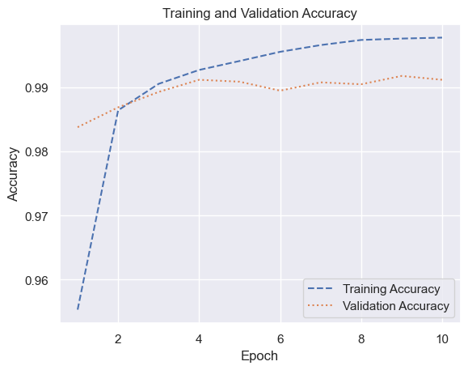
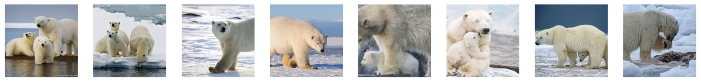
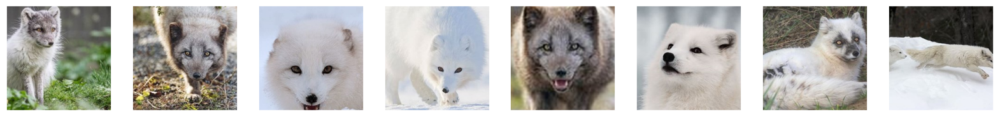
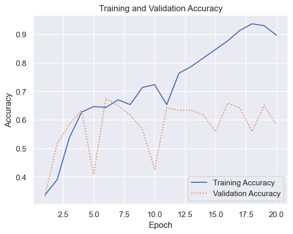

# Image Classification with Convolutional Neural Networks


- [<span class="toc-section-number">1</span> Using Keras and TensorFlow
  to Build CNNs](#using-keras-and-tensorflow-to-build-cnns)
- [<span class="toc-section-number">2</span> Training a CNN to Recognize
  Arctic Wildlife](#training-a-cnn-to-recognize-arctic-wildlife)

## Using Keras and TensorFlow to Build CNNs

``` python
from tensorflow.keras.layers import Conv2D, Dense, Flatten, MaxPooling2D
from tensorflow.keras.models import Sequential
```

``` python
model = Sequential()
model.add(Conv2D(32, (3, 3), activation="relu", input_shape=(28, 28, 1)))
model.add(MaxPooling2D(2, 2))
model.add(Conv2D(64, (3, 3), activation="relu"))
model.add(MaxPooling2D(2, 2))
model.add(Flatten())
model.add(Dense(128, activation="relu"))
model.add(Dense(10, activation="softmax"))
model.summary()
```

    Model: "sequential"
    _________________________________________________________________
     Layer (type)                Output Shape              Param #   
    =================================================================
     conv2d (Conv2D)             (None, 26, 26, 32)        320       
                                                                     
     max_pooling2d (MaxPooling2  (None, 13, 13, 32)        0         
     D)                                                              
                                                                     
     conv2d_1 (Conv2D)           (None, 11, 11, 64)        18496     
                                                                     
     max_pooling2d_1 (MaxPoolin  (None, 5, 5, 64)          0         
     g2D)                                                            
                                                                     
     flatten (Flatten)           (None, 1600)              0         
                                                                     
     dense (Dense)               (None, 128)               204928    
                                                                     
     dense_1 (Dense)             (None, 10)                1290      
                                                                     
    =================================================================
    Total params: 225034 (879.04 KB)
    Trainable params: 225034 (879.04 KB)
    Non-trainable params: 0 (0.00 Byte)
    _________________________________________________________________

``` python
from tensorflow.keras.datasets import mnist

(train_images, y_train), (test_images, y_test) = mnist.load_data()
X_train = train_images.reshape(60000, 28, 28, 1) / 255
X_test = test_images.reshape(10000, 28, 28, 1) / 255
```

    Downloading data from https://storage.googleapis.com/tensorflow/tf-keras-datasets/mnist.npz
    11490434/11490434 [==============================] - 2s 0us/step

``` python
from tensorflow.keras.layers import Conv2D, Dense, Flatten, MaxPooling2D
from tensorflow.keras.models import Sequential

model = Sequential()
model.add(Conv2D(32, (3, 3), activation="relu", input_shape=(28, 28, 1)))
model.add(MaxPooling2D(2, 2))
model.add(Conv2D(64, (3, 3), activation="relu"))
model.add(MaxPooling2D(2, 2))
model.add(Flatten())
model.add(Dense(128, activation="relu"))
model.add(Dense(10, activation="softmax"))
model.compile(
    optimizer="adam", loss="sparse_categorical_crossentropy", metrics=["accuracy"]
)
model.summary(line_length=80)
```

    Model: "sequential_1"
    ________________________________________________________________________________
     Layer (type)                       Output Shape                    Param #     
    ================================================================================
     conv2d_2 (Conv2D)                  (None, 26, 26, 32)              320         
                                                                                    
     max_pooling2d_2 (MaxPooling2D)     (None, 13, 13, 32)              0           
                                                                                    
     conv2d_3 (Conv2D)                  (None, 11, 11, 64)              18496       
                                                                                    
     max_pooling2d_3 (MaxPooling2D)     (None, 5, 5, 64)                0           
                                                                                    
     flatten_1 (Flatten)                (None, 1600)                    0           
                                                                                    
     dense_2 (Dense)                    (None, 128)                     204928      
                                                                                    
     dense_3 (Dense)                    (None, 10)                      1290        
                                                                                    
    ================================================================================
    Total params: 225034 (879.04 KB)
    Trainable params: 225034 (879.04 KB)
    Non-trainable params: 0 (0.00 Byte)
    ________________________________________________________________________________

``` python
hist = model.fit(
    X_train, y_train, validation_data=(X_test, y_test), epochs=10, batch_size=50
)
```

    Epoch 1/10
    1200/1200 [==============================] - 6s 5ms/step - loss: 0.1487 - accuracy: 0.9553 - val_loss: 0.0480 - val_accuracy: 0.9838
    Epoch 2/10
    1200/1200 [==============================] - 6s 5ms/step - loss: 0.0455 - accuracy: 0.9864 - val_loss: 0.0385 - val_accuracy: 0.9869
    Epoch 3/10
    1200/1200 [==============================] - 6s 5ms/step - loss: 0.0308 - accuracy: 0.9906 - val_loss: 0.0321 - val_accuracy: 0.9893
    Epoch 4/10
    1200/1200 [==============================] - 6s 5ms/step - loss: 0.0227 - accuracy: 0.9927 - val_loss: 0.0292 - val_accuracy: 0.9912
    Epoch 5/10
    1200/1200 [==============================] - 6s 5ms/step - loss: 0.0183 - accuracy: 0.9941 - val_loss: 0.0276 - val_accuracy: 0.9909
    Epoch 6/10
    1200/1200 [==============================] - 6s 5ms/step - loss: 0.0137 - accuracy: 0.9956 - val_loss: 0.0349 - val_accuracy: 0.9895
    Epoch 7/10
    1200/1200 [==============================] - 6s 5ms/step - loss: 0.0107 - accuracy: 0.9966 - val_loss: 0.0311 - val_accuracy: 0.9908
    Epoch 8/10
    1200/1200 [==============================] - 6s 5ms/step - loss: 0.0084 - accuracy: 0.9974 - val_loss: 0.0340 - val_accuracy: 0.9905
    Epoch 9/10
    1200/1200 [==============================] - 6s 5ms/step - loss: 0.0068 - accuracy: 0.9976 - val_loss: 0.0350 - val_accuracy: 0.9918
    Epoch 10/10
    1200/1200 [==============================] - 6s 5ms/step - loss: 0.0069 - accuracy: 0.9978 - val_loss: 0.0334 - val_accuracy: 0.9912

``` python
import matplotlib.pyplot as plt
import seaborn as sns

sns.set_theme()
```

``` python
acc = hist.history["accuracy"]
val_acc = hist.history["val_accuracy"]
epochs = range(1, len(acc) + 1)

plt.plot(epochs, acc, "--", label="Training Accuracy")
plt.plot(epochs, val_acc, ":", label="Validation Accuracy")
plt.title("Training and Validation Accuracy")
plt.xlabel("Epoch")
plt.ylabel("Accuracy")
plt.legend(loc="lower right");
```



## Training a CNN to Recognize Arctic Wildlife

``` python
from pathlib import Path

import matplotlib.pyplot as plt
from tensorflow.keras.preprocessing import image
```

``` python
def load_images_from_path(path, label):
    images, labels = [], []

    for file in os.listdir(path):
        img = image.load_img(Path(path) / file, target_size=(224, 224, 3))
        images.append(image.img_to_array(img))
        labels.append((label))

    return images, labels


def show_images(images):
    fig, axes = plt.subplots(
        1, 8, figsize=(20, 20), subplot_kw={"xticks": [], "yticks": []}
    )

    for i, ax in enumerate(axes.flat):
        ax.imshow(images[i] / 255)


X_train, y_train, X_test, y_test = [], [], [], []
```

``` python
for i, animal in enumerate(["arctic_fox", "polar_bear", "walrus"]):
    images, labels = load_images_from_path(Path("Wildlife/train") / animal, i)
    X_train += images
    y_train += labels

    show_images(images)
```





``` python
for i, animal in enumerate(["arctic_fox", "polar_bear", "walrus"]):
    images, labels = load_images_from_path(Path("Wildlife/test") / animal, i)
    X_test += images
    y_test += labels

    show_images(images)
```




``` python
import numpy as np

X_train = np.array(X_train) / 255
X_test = np.array(X_test) / 255

y_train = np.array(y_train)
y_test = np.array(y_test)
```

``` python
from tensorflow.keras.layers import Conv2D, Dense, Flatten, MaxPooling2D
from tensorflow.keras.models import Sequential

model = Sequential()
model.add(Conv2D(32, (3, 3), activation="relu", input_shape=(224, 224, 3)))
model.add(MaxPooling2D(2, 2))
model.add(Conv2D(64, (3, 3), activation="relu"))
model.add(MaxPooling2D(2, 2))
model.add(Conv2D(64, (3, 3), activation="relu"))
model.add(MaxPooling2D(2, 2))
model.add(Conv2D(128, (3, 3), activation="relu"))
model.add(MaxPooling2D(2, 2))
model.add(Conv2D(128, (3, 3), activation="relu"))
model.add(MaxPooling2D(2, 2))
model.add(Flatten())
model.add(Dense(1024, activation="relu"))
model.add(Dense(3, activation="softmax"))
model.compile(
    optimizer="adam", loss="sparse_categorical_crossentropy", metrics=["accuracy"]
)
model.summary(line_length=80)
```

    Model: "sequential_2"
    ________________________________________________________________________________
     Layer (type)                       Output Shape                    Param #     
    ================================================================================
     conv2d_4 (Conv2D)                  (None, 222, 222, 32)            896         
                                                                                    
     max_pooling2d_4 (MaxPooling2D)     (None, 111, 111, 32)            0           
                                                                                    
     conv2d_5 (Conv2D)                  (None, 109, 109, 64)            18496       
                                                                                    
     max_pooling2d_5 (MaxPooling2D)     (None, 54, 54, 64)              0           
                                                                                    
     conv2d_6 (Conv2D)                  (None, 52, 52, 64)              36928       
                                                                                    
     max_pooling2d_6 (MaxPooling2D)     (None, 26, 26, 64)              0           
                                                                                    
     conv2d_7 (Conv2D)                  (None, 24, 24, 128)             73856       
                                                                                    
     max_pooling2d_7 (MaxPooling2D)     (None, 12, 12, 128)             0           
                                                                                    
     conv2d_8 (Conv2D)                  (None, 10, 10, 128)             147584      
                                                                                    
     max_pooling2d_8 (MaxPooling2D)     (None, 5, 5, 128)               0           
                                                                                    
     flatten_2 (Flatten)                (None, 3200)                    0           
                                                                                    
     dense_4 (Dense)                    (None, 1024)                    3277824     
                                                                                    
     dense_5 (Dense)                    (None, 3)                       3075        
                                                                                    
    ================================================================================
    Total params: 3558659 (13.58 MB)
    Trainable params: 3558659 (13.58 MB)
    Non-trainable params: 0 (0.00 Byte)
    ________________________________________________________________________________

``` python
hist = model.fit(
    X_train, y_train, validation_data=(X_test, y_test), batch_size=10, epochs=20
)
```

    Epoch 1/20
    30/30 [==============================] - 3s 105ms/step - loss: 1.1083 - accuracy: 0.3367 - val_loss: 1.0959 - val_accuracy: 0.3333
    Epoch 2/20
    30/30 [==============================] - 3s 103ms/step - loss: 1.0399 - accuracy: 0.3900 - val_loss: 0.9290 - val_accuracy: 0.5167
    Epoch 3/20
    30/30 [==============================] - 3s 103ms/step - loss: 0.9856 - accuracy: 0.5367 - val_loss: 0.8883 - val_accuracy: 0.5833
    Epoch 4/20
    30/30 [==============================] - 3s 103ms/step - loss: 0.7790 - accuracy: 0.6267 - val_loss: 0.7932 - val_accuracy: 0.6333
    Epoch 5/20
    30/30 [==============================] - 3s 104ms/step - loss: 0.7221 - accuracy: 0.6467 - val_loss: 1.2548 - val_accuracy: 0.4083
    Epoch 6/20
    30/30 [==============================] - 3s 102ms/step - loss: 0.7762 - accuracy: 0.6433 - val_loss: 0.7859 - val_accuracy: 0.6750
    Epoch 7/20
    30/30 [==============================] - 3s 102ms/step - loss: 0.6523 - accuracy: 0.6700 - val_loss: 0.8244 - val_accuracy: 0.6500
    Epoch 8/20
    30/30 [==============================] - 3s 103ms/step - loss: 0.6911 - accuracy: 0.6533 - val_loss: 0.7779 - val_accuracy: 0.6167
    Epoch 9/20
    30/30 [==============================] - 3s 103ms/step - loss: 0.6311 - accuracy: 0.7133 - val_loss: 0.8698 - val_accuracy: 0.5667
    Epoch 10/20
    30/30 [==============================] - 3s 103ms/step - loss: 0.5372 - accuracy: 0.7233 - val_loss: 1.2756 - val_accuracy: 0.4250
    Epoch 11/20
    30/30 [==============================] - 3s 102ms/step - loss: 0.7075 - accuracy: 0.6533 - val_loss: 0.8730 - val_accuracy: 0.6417
    Epoch 12/20
    30/30 [==============================] - 3s 105ms/step - loss: 0.4969 - accuracy: 0.7633 - val_loss: 0.9217 - val_accuracy: 0.6333
    Epoch 13/20
    30/30 [==============================] - 3s 103ms/step - loss: 0.4482 - accuracy: 0.7867 - val_loss: 1.1038 - val_accuracy: 0.6333
    Epoch 14/20
    30/30 [==============================] - 3s 102ms/step - loss: 0.4107 - accuracy: 0.8167 - val_loss: 1.1047 - val_accuracy: 0.6167
    Epoch 15/20
    30/30 [==============================] - 3s 103ms/step - loss: 0.3242 - accuracy: 0.8467 - val_loss: 1.2276 - val_accuracy: 0.5583
    Epoch 16/20
    30/30 [==============================] - 3s 105ms/step - loss: 0.2446 - accuracy: 0.8767 - val_loss: 1.9264 - val_accuracy: 0.6583
    Epoch 17/20
    30/30 [==============================] - 3s 104ms/step - loss: 0.2000 - accuracy: 0.9133 - val_loss: 2.3409 - val_accuracy: 0.6417
    Epoch 18/20
    30/30 [==============================] - 3s 105ms/step - loss: 0.1650 - accuracy: 0.9367 - val_loss: 1.9264 - val_accuracy: 0.5583
    Epoch 19/20
    30/30 [==============================] - 3s 104ms/step - loss: 0.1957 - accuracy: 0.9300 - val_loss: 2.7184 - val_accuracy: 0.6500
    Epoch 20/20
    30/30 [==============================] - 3s 105ms/step - loss: 0.2581 - accuracy: 0.8967 - val_loss: 2.1146 - val_accuracy: 0.5833

``` python
import seaborn as sns

sns.set_theme()
```

``` python
acc = hist.history["accuracy"]
val_acc = hist.history["val_accuracy"]
epochs = range(1, len(acc) + 1)

plt.plot(epochs, acc, "-", label="Training Accuracy")
plt.plot(epochs, val_acc, ":", label="Validation Accuracy")
plt.title("Training and Validation Accuracy")
plt.xlabel("Epoch")
plt.ylabel("Accuracy")
plt.legend(loc="lower right");
```


