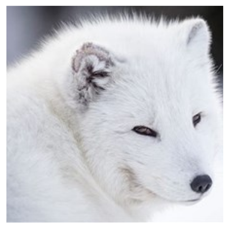

- [<span class="toc-section-number">1</span> Pretrained
  CNNs](#pretrained-cnns)

## Pretrained CNNs

``` python
from tensorflow.keras.applications import MobileNetV2

model = MobileNetV2(weights="imagenet")
```

    Downloading data from https://storage.googleapis.com/tensorflow/keras-applications/mobilenet_v2/mobilenet_v2_weights_tf_dim_ordering_tf_kernels_1.0_224.h5
    14536120/14536120 [==============================] - 2s 0us/step

``` python
import numpy as np
from tensorflow.keras.applications.mobilenet import decode_predictions, preprocess_input
from tensorflow.keras.preprocessing import image

x = image.load_img(
    "./Wildlife/samples/arctic_fox/arctic_fox_140.jpeg", target_size=(224, 224)
)

plt.xticks([])
plt.yticks([])
plt.imshow(x)

x = image.img_to_array(x)
x = np.expand_dims(x, axis=0)
x = preprocess_input(x)
```



``` python
y = model.predict(x)
decode_predictions(y)
```

    1/1 [==============================] - 0s 29ms/step
    Downloading data from https://storage.googleapis.com/download.tensorflow.org/data/imagenet_class_index.json
    35363/35363 [==============================] - 0s 1us/step

    [[('n02120079', 'Arctic_fox', 0.9436149),
      ('n02114548', 'white_wolf', 0.014366244),
      ('n02110185', 'Siberian_husky', 0.0009070922),
      ('n02441942', 'weasel', 0.0008691346),
      ('n02109961', 'Eskimo_dog', 0.0008643622)]]
