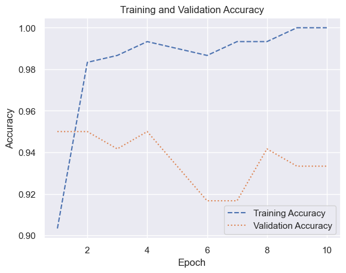
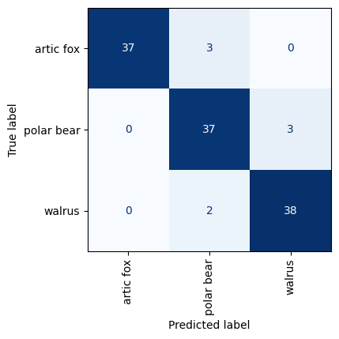

# Transfer Learning


- [<span class="toc-section-number">1</span> Using Transfer Learning to
  Identify Artic
  Wildlife](#using-transfer-learning-to-identify-artic-wildlife)

``` python
from tensorflow.keras.applications import ResNet50V2

model = ResNet50V2(weights="imagenet")
model.summary()
```

    Model: "resnet50v2"
    __________________________________________________________________________________________________
     Layer (type)                Output Shape                 Param #   Connected to                  
    ==================================================================================================
     input_1 (InputLayer)        [(None, 224, 224, 3)]        0         []                            
                                                                                                      
     conv1_pad (ZeroPadding2D)   (None, 230, 230, 3)          0         ['input_1[0][0]']             
                                                                                                      
     conv1_conv (Conv2D)         (None, 112, 112, 64)         9472      ['conv1_pad[0][0]']           
                                                                                                      
     pool1_pad (ZeroPadding2D)   (None, 114, 114, 64)         0         ['conv1_conv[0][0]']          
                                                                                                      
     pool1_pool (MaxPooling2D)   (None, 56, 56, 64)           0         ['pool1_pad[0][0]']           
                                                                                                      
     conv2_block1_preact_bn (Ba  (None, 56, 56, 64)           256       ['pool1_pool[0][0]']          
     tchNormalization)                                                                                
                                                                                                      
     conv2_block1_preact_relu (  (None, 56, 56, 64)           0         ['conv2_block1_preact_bn[0][0]
     Activation)                                                        ']                            
                                                                                                      
     conv2_block1_1_conv (Conv2  (None, 56, 56, 64)           4096      ['conv2_block1_preact_relu[0][
     D)                                                                 0]']                          
                                                                                                      
     conv2_block1_1_bn (BatchNo  (None, 56, 56, 64)           256       ['conv2_block1_1_conv[0][0]'] 
     rmalization)                                                                                     
                                                                                                      
     conv2_block1_1_relu (Activ  (None, 56, 56, 64)           0         ['conv2_block1_1_bn[0][0]']   
     ation)                                                                                           
                                                                                                      
     conv2_block1_2_pad (ZeroPa  (None, 58, 58, 64)           0         ['conv2_block1_1_relu[0][0]'] 
     dding2D)                                                                                         
                                                                                                      
     conv2_block1_2_conv (Conv2  (None, 56, 56, 64)           36864     ['conv2_block1_2_pad[0][0]']  
     D)                                                                                               
                                                                                                      
     conv2_block1_2_bn (BatchNo  (None, 56, 56, 64)           256       ['conv2_block1_2_conv[0][0]'] 
     rmalization)                                                                                     
                                                                                                      
     conv2_block1_2_relu (Activ  (None, 56, 56, 64)           0         ['conv2_block1_2_bn[0][0]']   
     ation)                                                                                           
                                                                                                      
     conv2_block1_0_conv (Conv2  (None, 56, 56, 256)          16640     ['conv2_block1_preact_relu[0][
     D)                                                                 0]']                          
                                                                                                      
     conv2_block1_3_conv (Conv2  (None, 56, 56, 256)          16640     ['conv2_block1_2_relu[0][0]'] 
     D)                                                                                               
                                                                                                      
     conv2_block1_out (Add)      (None, 56, 56, 256)          0         ['conv2_block1_0_conv[0][0]', 
                                                                         'conv2_block1_3_conv[0][0]'] 
                                                                                                      
     conv2_block2_preact_bn (Ba  (None, 56, 56, 256)          1024      ['conv2_block1_out[0][0]']    
     tchNormalization)                                                                                
                                                                                                      
     conv2_block2_preact_relu (  (None, 56, 56, 256)          0         ['conv2_block2_preact_bn[0][0]
     Activation)                                                        ']                            
                                                                                                      
     conv2_block2_1_conv (Conv2  (None, 56, 56, 64)           16384     ['conv2_block2_preact_relu[0][
     D)                                                                 0]']                          
                                                                                                      
     conv2_block2_1_bn (BatchNo  (None, 56, 56, 64)           256       ['conv2_block2_1_conv[0][0]'] 
     rmalization)                                                                                     
                                                                                                      
     conv2_block2_1_relu (Activ  (None, 56, 56, 64)           0         ['conv2_block2_1_bn[0][0]']   
     ation)                                                                                           
                                                                                                      
     conv2_block2_2_pad (ZeroPa  (None, 58, 58, 64)           0         ['conv2_block2_1_relu[0][0]'] 
     dding2D)                                                                                         
                                                                                                      
     conv2_block2_2_conv (Conv2  (None, 56, 56, 64)           36864     ['conv2_block2_2_pad[0][0]']  
     D)                                                                                               
                                                                                                      
     conv2_block2_2_bn (BatchNo  (None, 56, 56, 64)           256       ['conv2_block2_2_conv[0][0]'] 
     rmalization)                                                                                     
                                                                                                      
     conv2_block2_2_relu (Activ  (None, 56, 56, 64)           0         ['conv2_block2_2_bn[0][0]']   
     ation)                                                                                           
                                                                                                      
     conv2_block2_3_conv (Conv2  (None, 56, 56, 256)          16640     ['conv2_block2_2_relu[0][0]'] 
     D)                                                                                               
                                                                                                      
     conv2_block2_out (Add)      (None, 56, 56, 256)          0         ['conv2_block1_out[0][0]',    
                                                                         'conv2_block2_3_conv[0][0]'] 
                                                                                                      
     conv2_block3_preact_bn (Ba  (None, 56, 56, 256)          1024      ['conv2_block2_out[0][0]']    
     tchNormalization)                                                                                
                                                                                                      
     conv2_block3_preact_relu (  (None, 56, 56, 256)          0         ['conv2_block3_preact_bn[0][0]
     Activation)                                                        ']                            
                                                                                                      
     conv2_block3_1_conv (Conv2  (None, 56, 56, 64)           16384     ['conv2_block3_preact_relu[0][
     D)                                                                 0]']                          
                                                                                                      
     conv2_block3_1_bn (BatchNo  (None, 56, 56, 64)           256       ['conv2_block3_1_conv[0][0]'] 
     rmalization)                                                                                     
                                                                                                      
     conv2_block3_1_relu (Activ  (None, 56, 56, 64)           0         ['conv2_block3_1_bn[0][0]']   
     ation)                                                                                           
                                                                                                      
     conv2_block3_2_pad (ZeroPa  (None, 58, 58, 64)           0         ['conv2_block3_1_relu[0][0]'] 
     dding2D)                                                                                         
                                                                                                      
     conv2_block3_2_conv (Conv2  (None, 28, 28, 64)           36864     ['conv2_block3_2_pad[0][0]']  
     D)                                                                                               
                                                                                                      
     conv2_block3_2_bn (BatchNo  (None, 28, 28, 64)           256       ['conv2_block3_2_conv[0][0]'] 
     rmalization)                                                                                     
                                                                                                      
     conv2_block3_2_relu (Activ  (None, 28, 28, 64)           0         ['conv2_block3_2_bn[0][0]']   
     ation)                                                                                           
                                                                                                      
     max_pooling2d (MaxPooling2  (None, 28, 28, 256)          0         ['conv2_block2_out[0][0]']    
     D)                                                                                               
                                                                                                      
     conv2_block3_3_conv (Conv2  (None, 28, 28, 256)          16640     ['conv2_block3_2_relu[0][0]'] 
     D)                                                                                               
                                                                                                      
     conv2_block3_out (Add)      (None, 28, 28, 256)          0         ['max_pooling2d[0][0]',       
                                                                         'conv2_block3_3_conv[0][0]'] 
                                                                                                      
     conv3_block1_preact_bn (Ba  (None, 28, 28, 256)          1024      ['conv2_block3_out[0][0]']    
     tchNormalization)                                                                                
                                                                                                      
     conv3_block1_preact_relu (  (None, 28, 28, 256)          0         ['conv3_block1_preact_bn[0][0]
     Activation)                                                        ']                            
                                                                                                      
     conv3_block1_1_conv (Conv2  (None, 28, 28, 128)          32768     ['conv3_block1_preact_relu[0][
     D)                                                                 0]']                          
                                                                                                      
     conv3_block1_1_bn (BatchNo  (None, 28, 28, 128)          512       ['conv3_block1_1_conv[0][0]'] 
     rmalization)                                                                                     
                                                                                                      
     conv3_block1_1_relu (Activ  (None, 28, 28, 128)          0         ['conv3_block1_1_bn[0][0]']   
     ation)                                                                                           
                                                                                                      
     conv3_block1_2_pad (ZeroPa  (None, 30, 30, 128)          0         ['conv3_block1_1_relu[0][0]'] 
     dding2D)                                                                                         
                                                                                                      
     conv3_block1_2_conv (Conv2  (None, 28, 28, 128)          147456    ['conv3_block1_2_pad[0][0]']  
     D)                                                                                               
                                                                                                      
     conv3_block1_2_bn (BatchNo  (None, 28, 28, 128)          512       ['conv3_block1_2_conv[0][0]'] 
     rmalization)                                                                                     
                                                                                                      
     conv3_block1_2_relu (Activ  (None, 28, 28, 128)          0         ['conv3_block1_2_bn[0][0]']   
     ation)                                                                                           
                                                                                                      
     conv3_block1_0_conv (Conv2  (None, 28, 28, 512)          131584    ['conv3_block1_preact_relu[0][
     D)                                                                 0]']                          
                                                                                                      
     conv3_block1_3_conv (Conv2  (None, 28, 28, 512)          66048     ['conv3_block1_2_relu[0][0]'] 
     D)                                                                                               
                                                                                                      
     conv3_block1_out (Add)      (None, 28, 28, 512)          0         ['conv3_block1_0_conv[0][0]', 
                                                                         'conv3_block1_3_conv[0][0]'] 
                                                                                                      
     conv3_block2_preact_bn (Ba  (None, 28, 28, 512)          2048      ['conv3_block1_out[0][0]']    
     tchNormalization)                                                                                
                                                                                                      
     conv3_block2_preact_relu (  (None, 28, 28, 512)          0         ['conv3_block2_preact_bn[0][0]
     Activation)                                                        ']                            
                                                                                                      
     conv3_block2_1_conv (Conv2  (None, 28, 28, 128)          65536     ['conv3_block2_preact_relu[0][
     D)                                                                 0]']                          
                                                                                                      
     conv3_block2_1_bn (BatchNo  (None, 28, 28, 128)          512       ['conv3_block2_1_conv[0][0]'] 
     rmalization)                                                                                     
                                                                                                      
     conv3_block2_1_relu (Activ  (None, 28, 28, 128)          0         ['conv3_block2_1_bn[0][0]']   
     ation)                                                                                           
                                                                                                      
     conv3_block2_2_pad (ZeroPa  (None, 30, 30, 128)          0         ['conv3_block2_1_relu[0][0]'] 
     dding2D)                                                                                         
                                                                                                      
     conv3_block2_2_conv (Conv2  (None, 28, 28, 128)          147456    ['conv3_block2_2_pad[0][0]']  
     D)                                                                                               
                                                                                                      
     conv3_block2_2_bn (BatchNo  (None, 28, 28, 128)          512       ['conv3_block2_2_conv[0][0]'] 
     rmalization)                                                                                     
                                                                                                      
     conv3_block2_2_relu (Activ  (None, 28, 28, 128)          0         ['conv3_block2_2_bn[0][0]']   
     ation)                                                                                           
                                                                                                      
     conv3_block2_3_conv (Conv2  (None, 28, 28, 512)          66048     ['conv3_block2_2_relu[0][0]'] 
     D)                                                                                               
                                                                                                      
     conv3_block2_out (Add)      (None, 28, 28, 512)          0         ['conv3_block1_out[0][0]',    
                                                                         'conv3_block2_3_conv[0][0]'] 
                                                                                                      
     conv3_block3_preact_bn (Ba  (None, 28, 28, 512)          2048      ['conv3_block2_out[0][0]']    
     tchNormalization)                                                                                
                                                                                                      
     conv3_block3_preact_relu (  (None, 28, 28, 512)          0         ['conv3_block3_preact_bn[0][0]
     Activation)                                                        ']                            
                                                                                                      
     conv3_block3_1_conv (Conv2  (None, 28, 28, 128)          65536     ['conv3_block3_preact_relu[0][
     D)                                                                 0]']                          
                                                                                                      
     conv3_block3_1_bn (BatchNo  (None, 28, 28, 128)          512       ['conv3_block3_1_conv[0][0]'] 
     rmalization)                                                                                     
                                                                                                      
     conv3_block3_1_relu (Activ  (None, 28, 28, 128)          0         ['conv3_block3_1_bn[0][0]']   
     ation)                                                                                           
                                                                                                      
     conv3_block3_2_pad (ZeroPa  (None, 30, 30, 128)          0         ['conv3_block3_1_relu[0][0]'] 
     dding2D)                                                                                         
                                                                                                      
     conv3_block3_2_conv (Conv2  (None, 28, 28, 128)          147456    ['conv3_block3_2_pad[0][0]']  
     D)                                                                                               
                                                                                                      
     conv3_block3_2_bn (BatchNo  (None, 28, 28, 128)          512       ['conv3_block3_2_conv[0][0]'] 
     rmalization)                                                                                     
                                                                                                      
     conv3_block3_2_relu (Activ  (None, 28, 28, 128)          0         ['conv3_block3_2_bn[0][0]']   
     ation)                                                                                           
                                                                                                      
     conv3_block3_3_conv (Conv2  (None, 28, 28, 512)          66048     ['conv3_block3_2_relu[0][0]'] 
     D)                                                                                               
                                                                                                      
     conv3_block3_out (Add)      (None, 28, 28, 512)          0         ['conv3_block2_out[0][0]',    
                                                                         'conv3_block3_3_conv[0][0]'] 
                                                                                                      
     conv3_block4_preact_bn (Ba  (None, 28, 28, 512)          2048      ['conv3_block3_out[0][0]']    
     tchNormalization)                                                                                
                                                                                                      
     conv3_block4_preact_relu (  (None, 28, 28, 512)          0         ['conv3_block4_preact_bn[0][0]
     Activation)                                                        ']                            
                                                                                                      
     conv3_block4_1_conv (Conv2  (None, 28, 28, 128)          65536     ['conv3_block4_preact_relu[0][
     D)                                                                 0]']                          
                                                                                                      
     conv3_block4_1_bn (BatchNo  (None, 28, 28, 128)          512       ['conv3_block4_1_conv[0][0]'] 
     rmalization)                                                                                     
                                                                                                      
     conv3_block4_1_relu (Activ  (None, 28, 28, 128)          0         ['conv3_block4_1_bn[0][0]']   
     ation)                                                                                           
                                                                                                      
     conv3_block4_2_pad (ZeroPa  (None, 30, 30, 128)          0         ['conv3_block4_1_relu[0][0]'] 
     dding2D)                                                                                         
                                                                                                      
     conv3_block4_2_conv (Conv2  (None, 14, 14, 128)          147456    ['conv3_block4_2_pad[0][0]']  
     D)                                                                                               
                                                                                                      
     conv3_block4_2_bn (BatchNo  (None, 14, 14, 128)          512       ['conv3_block4_2_conv[0][0]'] 
     rmalization)                                                                                     
                                                                                                      
     conv3_block4_2_relu (Activ  (None, 14, 14, 128)          0         ['conv3_block4_2_bn[0][0]']   
     ation)                                                                                           
                                                                                                      
     max_pooling2d_1 (MaxPoolin  (None, 14, 14, 512)          0         ['conv3_block3_out[0][0]']    
     g2D)                                                                                             
                                                                                                      
     conv3_block4_3_conv (Conv2  (None, 14, 14, 512)          66048     ['conv3_block4_2_relu[0][0]'] 
     D)                                                                                               
                                                                                                      
     conv3_block4_out (Add)      (None, 14, 14, 512)          0         ['max_pooling2d_1[0][0]',     
                                                                         'conv3_block4_3_conv[0][0]'] 
                                                                                                      
     conv4_block1_preact_bn (Ba  (None, 14, 14, 512)          2048      ['conv3_block4_out[0][0]']    
     tchNormalization)                                                                                
                                                                                                      
     conv4_block1_preact_relu (  (None, 14, 14, 512)          0         ['conv4_block1_preact_bn[0][0]
     Activation)                                                        ']                            
                                                                                                      
     conv4_block1_1_conv (Conv2  (None, 14, 14, 256)          131072    ['conv4_block1_preact_relu[0][
     D)                                                                 0]']                          
                                                                                                      
     conv4_block1_1_bn (BatchNo  (None, 14, 14, 256)          1024      ['conv4_block1_1_conv[0][0]'] 
     rmalization)                                                                                     
                                                                                                      
     conv4_block1_1_relu (Activ  (None, 14, 14, 256)          0         ['conv4_block1_1_bn[0][0]']   
     ation)                                                                                           
                                                                                                      
     conv4_block1_2_pad (ZeroPa  (None, 16, 16, 256)          0         ['conv4_block1_1_relu[0][0]'] 
     dding2D)                                                                                         
                                                                                                      
     conv4_block1_2_conv (Conv2  (None, 14, 14, 256)          589824    ['conv4_block1_2_pad[0][0]']  
     D)                                                                                               
                                                                                                      
     conv4_block1_2_bn (BatchNo  (None, 14, 14, 256)          1024      ['conv4_block1_2_conv[0][0]'] 
     rmalization)                                                                                     
                                                                                                      
     conv4_block1_2_relu (Activ  (None, 14, 14, 256)          0         ['conv4_block1_2_bn[0][0]']   
     ation)                                                                                           
                                                                                                      
     conv4_block1_0_conv (Conv2  (None, 14, 14, 1024)         525312    ['conv4_block1_preact_relu[0][
     D)                                                                 0]']                          
                                                                                                      
     conv4_block1_3_conv (Conv2  (None, 14, 14, 1024)         263168    ['conv4_block1_2_relu[0][0]'] 
     D)                                                                                               
                                                                                                      
     conv4_block1_out (Add)      (None, 14, 14, 1024)         0         ['conv4_block1_0_conv[0][0]', 
                                                                         'conv4_block1_3_conv[0][0]'] 
                                                                                                      
     conv4_block2_preact_bn (Ba  (None, 14, 14, 1024)         4096      ['conv4_block1_out[0][0]']    
     tchNormalization)                                                                                
                                                                                                      
     conv4_block2_preact_relu (  (None, 14, 14, 1024)         0         ['conv4_block2_preact_bn[0][0]
     Activation)                                                        ']                            
                                                                                                      
     conv4_block2_1_conv (Conv2  (None, 14, 14, 256)          262144    ['conv4_block2_preact_relu[0][
     D)                                                                 0]']                          
                                                                                                      
     conv4_block2_1_bn (BatchNo  (None, 14, 14, 256)          1024      ['conv4_block2_1_conv[0][0]'] 
     rmalization)                                                                                     
                                                                                                      
     conv4_block2_1_relu (Activ  (None, 14, 14, 256)          0         ['conv4_block2_1_bn[0][0]']   
     ation)                                                                                           
                                                                                                      
     conv4_block2_2_pad (ZeroPa  (None, 16, 16, 256)          0         ['conv4_block2_1_relu[0][0]'] 
     dding2D)                                                                                         
                                                                                                      
     conv4_block2_2_conv (Conv2  (None, 14, 14, 256)          589824    ['conv4_block2_2_pad[0][0]']  
     D)                                                                                               
                                                                                                      
     conv4_block2_2_bn (BatchNo  (None, 14, 14, 256)          1024      ['conv4_block2_2_conv[0][0]'] 
     rmalization)                                                                                     
                                                                                                      
     conv4_block2_2_relu (Activ  (None, 14, 14, 256)          0         ['conv4_block2_2_bn[0][0]']   
     ation)                                                                                           
                                                                                                      
     conv4_block2_3_conv (Conv2  (None, 14, 14, 1024)         263168    ['conv4_block2_2_relu[0][0]'] 
     D)                                                                                               
                                                                                                      
     conv4_block2_out (Add)      (None, 14, 14, 1024)         0         ['conv4_block1_out[0][0]',    
                                                                         'conv4_block2_3_conv[0][0]'] 
                                                                                                      
     conv4_block3_preact_bn (Ba  (None, 14, 14, 1024)         4096      ['conv4_block2_out[0][0]']    
     tchNormalization)                                                                                
                                                                                                      
     conv4_block3_preact_relu (  (None, 14, 14, 1024)         0         ['conv4_block3_preact_bn[0][0]
     Activation)                                                        ']                            
                                                                                                      
     conv4_block3_1_conv (Conv2  (None, 14, 14, 256)          262144    ['conv4_block3_preact_relu[0][
     D)                                                                 0]']                          
                                                                                                      
     conv4_block3_1_bn (BatchNo  (None, 14, 14, 256)          1024      ['conv4_block3_1_conv[0][0]'] 
     rmalization)                                                                                     
                                                                                                      
     conv4_block3_1_relu (Activ  (None, 14, 14, 256)          0         ['conv4_block3_1_bn[0][0]']   
     ation)                                                                                           
                                                                                                      
     conv4_block3_2_pad (ZeroPa  (None, 16, 16, 256)          0         ['conv4_block3_1_relu[0][0]'] 
     dding2D)                                                                                         
                                                                                                      
     conv4_block3_2_conv (Conv2  (None, 14, 14, 256)          589824    ['conv4_block3_2_pad[0][0]']  
     D)                                                                                               
                                                                                                      
     conv4_block3_2_bn (BatchNo  (None, 14, 14, 256)          1024      ['conv4_block3_2_conv[0][0]'] 
     rmalization)                                                                                     
                                                                                                      
     conv4_block3_2_relu (Activ  (None, 14, 14, 256)          0         ['conv4_block3_2_bn[0][0]']   
     ation)                                                                                           
                                                                                                      
     conv4_block3_3_conv (Conv2  (None, 14, 14, 1024)         263168    ['conv4_block3_2_relu[0][0]'] 
     D)                                                                                               
                                                                                                      
     conv4_block3_out (Add)      (None, 14, 14, 1024)         0         ['conv4_block2_out[0][0]',    
                                                                         'conv4_block3_3_conv[0][0]'] 
                                                                                                      
     conv4_block4_preact_bn (Ba  (None, 14, 14, 1024)         4096      ['conv4_block3_out[0][0]']    
     tchNormalization)                                                                                
                                                                                                      
     conv4_block4_preact_relu (  (None, 14, 14, 1024)         0         ['conv4_block4_preact_bn[0][0]
     Activation)                                                        ']                            
                                                                                                      
     conv4_block4_1_conv (Conv2  (None, 14, 14, 256)          262144    ['conv4_block4_preact_relu[0][
     D)                                                                 0]']                          
                                                                                                      
     conv4_block4_1_bn (BatchNo  (None, 14, 14, 256)          1024      ['conv4_block4_1_conv[0][0]'] 
     rmalization)                                                                                     
                                                                                                      
     conv4_block4_1_relu (Activ  (None, 14, 14, 256)          0         ['conv4_block4_1_bn[0][0]']   
     ation)                                                                                           
                                                                                                      
     conv4_block4_2_pad (ZeroPa  (None, 16, 16, 256)          0         ['conv4_block4_1_relu[0][0]'] 
     dding2D)                                                                                         
                                                                                                      
     conv4_block4_2_conv (Conv2  (None, 14, 14, 256)          589824    ['conv4_block4_2_pad[0][0]']  
     D)                                                                                               
                                                                                                      
     conv4_block4_2_bn (BatchNo  (None, 14, 14, 256)          1024      ['conv4_block4_2_conv[0][0]'] 
     rmalization)                                                                                     
                                                                                                      
     conv4_block4_2_relu (Activ  (None, 14, 14, 256)          0         ['conv4_block4_2_bn[0][0]']   
     ation)                                                                                           
                                                                                                      
     conv4_block4_3_conv (Conv2  (None, 14, 14, 1024)         263168    ['conv4_block4_2_relu[0][0]'] 
     D)                                                                                               
                                                                                                      
     conv4_block4_out (Add)      (None, 14, 14, 1024)         0         ['conv4_block3_out[0][0]',    
                                                                         'conv4_block4_3_conv[0][0]'] 
                                                                                                      
     conv4_block5_preact_bn (Ba  (None, 14, 14, 1024)         4096      ['conv4_block4_out[0][0]']    
     tchNormalization)                                                                                
                                                                                                      
     conv4_block5_preact_relu (  (None, 14, 14, 1024)         0         ['conv4_block5_preact_bn[0][0]
     Activation)                                                        ']                            
                                                                                                      
     conv4_block5_1_conv (Conv2  (None, 14, 14, 256)          262144    ['conv4_block5_preact_relu[0][
     D)                                                                 0]']                          
                                                                                                      
     conv4_block5_1_bn (BatchNo  (None, 14, 14, 256)          1024      ['conv4_block5_1_conv[0][0]'] 
     rmalization)                                                                                     
                                                                                                      
     conv4_block5_1_relu (Activ  (None, 14, 14, 256)          0         ['conv4_block5_1_bn[0][0]']   
     ation)                                                                                           
                                                                                                      
     conv4_block5_2_pad (ZeroPa  (None, 16, 16, 256)          0         ['conv4_block5_1_relu[0][0]'] 
     dding2D)                                                                                         
                                                                                                      
     conv4_block5_2_conv (Conv2  (None, 14, 14, 256)          589824    ['conv4_block5_2_pad[0][0]']  
     D)                                                                                               
                                                                                                      
     conv4_block5_2_bn (BatchNo  (None, 14, 14, 256)          1024      ['conv4_block5_2_conv[0][0]'] 
     rmalization)                                                                                     
                                                                                                      
     conv4_block5_2_relu (Activ  (None, 14, 14, 256)          0         ['conv4_block5_2_bn[0][0]']   
     ation)                                                                                           
                                                                                                      
     conv4_block5_3_conv (Conv2  (None, 14, 14, 1024)         263168    ['conv4_block5_2_relu[0][0]'] 
     D)                                                                                               
                                                                                                      
     conv4_block5_out (Add)      (None, 14, 14, 1024)         0         ['conv4_block4_out[0][0]',    
                                                                         'conv4_block5_3_conv[0][0]'] 
                                                                                                      
     conv4_block6_preact_bn (Ba  (None, 14, 14, 1024)         4096      ['conv4_block5_out[0][0]']    
     tchNormalization)                                                                                
                                                                                                      
     conv4_block6_preact_relu (  (None, 14, 14, 1024)         0         ['conv4_block6_preact_bn[0][0]
     Activation)                                                        ']                            
                                                                                                      
     conv4_block6_1_conv (Conv2  (None, 14, 14, 256)          262144    ['conv4_block6_preact_relu[0][
     D)                                                                 0]']                          
                                                                                                      
     conv4_block6_1_bn (BatchNo  (None, 14, 14, 256)          1024      ['conv4_block6_1_conv[0][0]'] 
     rmalization)                                                                                     
                                                                                                      
     conv4_block6_1_relu (Activ  (None, 14, 14, 256)          0         ['conv4_block6_1_bn[0][0]']   
     ation)                                                                                           
                                                                                                      
     conv4_block6_2_pad (ZeroPa  (None, 16, 16, 256)          0         ['conv4_block6_1_relu[0][0]'] 
     dding2D)                                                                                         
                                                                                                      
     conv4_block6_2_conv (Conv2  (None, 7, 7, 256)            589824    ['conv4_block6_2_pad[0][0]']  
     D)                                                                                               
                                                                                                      
     conv4_block6_2_bn (BatchNo  (None, 7, 7, 256)            1024      ['conv4_block6_2_conv[0][0]'] 
     rmalization)                                                                                     
                                                                                                      
     conv4_block6_2_relu (Activ  (None, 7, 7, 256)            0         ['conv4_block6_2_bn[0][0]']   
     ation)                                                                                           
                                                                                                      
     max_pooling2d_2 (MaxPoolin  (None, 7, 7, 1024)           0         ['conv4_block5_out[0][0]']    
     g2D)                                                                                             
                                                                                                      
     conv4_block6_3_conv (Conv2  (None, 7, 7, 1024)           263168    ['conv4_block6_2_relu[0][0]'] 
     D)                                                                                               
                                                                                                      
     conv4_block6_out (Add)      (None, 7, 7, 1024)           0         ['max_pooling2d_2[0][0]',     
                                                                         'conv4_block6_3_conv[0][0]'] 
                                                                                                      
     conv5_block1_preact_bn (Ba  (None, 7, 7, 1024)           4096      ['conv4_block6_out[0][0]']    
     tchNormalization)                                                                                
                                                                                                      
     conv5_block1_preact_relu (  (None, 7, 7, 1024)           0         ['conv5_block1_preact_bn[0][0]
     Activation)                                                        ']                            
                                                                                                      
     conv5_block1_1_conv (Conv2  (None, 7, 7, 512)            524288    ['conv5_block1_preact_relu[0][
     D)                                                                 0]']                          
                                                                                                      
     conv5_block1_1_bn (BatchNo  (None, 7, 7, 512)            2048      ['conv5_block1_1_conv[0][0]'] 
     rmalization)                                                                                     
                                                                                                      
     conv5_block1_1_relu (Activ  (None, 7, 7, 512)            0         ['conv5_block1_1_bn[0][0]']   
     ation)                                                                                           
                                                                                                      
     conv5_block1_2_pad (ZeroPa  (None, 9, 9, 512)            0         ['conv5_block1_1_relu[0][0]'] 
     dding2D)                                                                                         
                                                                                                      
     conv5_block1_2_conv (Conv2  (None, 7, 7, 512)            2359296   ['conv5_block1_2_pad[0][0]']  
     D)                                                                                               
                                                                                                      
     conv5_block1_2_bn (BatchNo  (None, 7, 7, 512)            2048      ['conv5_block1_2_conv[0][0]'] 
     rmalization)                                                                                     
                                                                                                      
     conv5_block1_2_relu (Activ  (None, 7, 7, 512)            0         ['conv5_block1_2_bn[0][0]']   
     ation)                                                                                           
                                                                                                      
     conv5_block1_0_conv (Conv2  (None, 7, 7, 2048)           2099200   ['conv5_block1_preact_relu[0][
     D)                                                                 0]']                          
                                                                                                      
     conv5_block1_3_conv (Conv2  (None, 7, 7, 2048)           1050624   ['conv5_block1_2_relu[0][0]'] 
     D)                                                                                               
                                                                                                      
     conv5_block1_out (Add)      (None, 7, 7, 2048)           0         ['conv5_block1_0_conv[0][0]', 
                                                                         'conv5_block1_3_conv[0][0]'] 
                                                                                                      
     conv5_block2_preact_bn (Ba  (None, 7, 7, 2048)           8192      ['conv5_block1_out[0][0]']    
     tchNormalization)                                                                                
                                                                                                      
     conv5_block2_preact_relu (  (None, 7, 7, 2048)           0         ['conv5_block2_preact_bn[0][0]
     Activation)                                                        ']                            
                                                                                                      
     conv5_block2_1_conv (Conv2  (None, 7, 7, 512)            1048576   ['conv5_block2_preact_relu[0][
     D)                                                                 0]']                          
                                                                                                      
     conv5_block2_1_bn (BatchNo  (None, 7, 7, 512)            2048      ['conv5_block2_1_conv[0][0]'] 
     rmalization)                                                                                     
                                                                                                      
     conv5_block2_1_relu (Activ  (None, 7, 7, 512)            0         ['conv5_block2_1_bn[0][0]']   
     ation)                                                                                           
                                                                                                      
     conv5_block2_2_pad (ZeroPa  (None, 9, 9, 512)            0         ['conv5_block2_1_relu[0][0]'] 
     dding2D)                                                                                         
                                                                                                      
     conv5_block2_2_conv (Conv2  (None, 7, 7, 512)            2359296   ['conv5_block2_2_pad[0][0]']  
     D)                                                                                               
                                                                                                      
     conv5_block2_2_bn (BatchNo  (None, 7, 7, 512)            2048      ['conv5_block2_2_conv[0][0]'] 
     rmalization)                                                                                     
                                                                                                      
     conv5_block2_2_relu (Activ  (None, 7, 7, 512)            0         ['conv5_block2_2_bn[0][0]']   
     ation)                                                                                           
                                                                                                      
     conv5_block2_3_conv (Conv2  (None, 7, 7, 2048)           1050624   ['conv5_block2_2_relu[0][0]'] 
     D)                                                                                               
                                                                                                      
     conv5_block2_out (Add)      (None, 7, 7, 2048)           0         ['conv5_block1_out[0][0]',    
                                                                         'conv5_block2_3_conv[0][0]'] 
                                                                                                      
     conv5_block3_preact_bn (Ba  (None, 7, 7, 2048)           8192      ['conv5_block2_out[0][0]']    
     tchNormalization)                                                                                
                                                                                                      
     conv5_block3_preact_relu (  (None, 7, 7, 2048)           0         ['conv5_block3_preact_bn[0][0]
     Activation)                                                        ']                            
                                                                                                      
     conv5_block3_1_conv (Conv2  (None, 7, 7, 512)            1048576   ['conv5_block3_preact_relu[0][
     D)                                                                 0]']                          
                                                                                                      
     conv5_block3_1_bn (BatchNo  (None, 7, 7, 512)            2048      ['conv5_block3_1_conv[0][0]'] 
     rmalization)                                                                                     
                                                                                                      
     conv5_block3_1_relu (Activ  (None, 7, 7, 512)            0         ['conv5_block3_1_bn[0][0]']   
     ation)                                                                                           
                                                                                                      
     conv5_block3_2_pad (ZeroPa  (None, 9, 9, 512)            0         ['conv5_block3_1_relu[0][0]'] 
     dding2D)                                                                                         
                                                                                                      
     conv5_block3_2_conv (Conv2  (None, 7, 7, 512)            2359296   ['conv5_block3_2_pad[0][0]']  
     D)                                                                                               
                                                                                                      
     conv5_block3_2_bn (BatchNo  (None, 7, 7, 512)            2048      ['conv5_block3_2_conv[0][0]'] 
     rmalization)                                                                                     
                                                                                                      
     conv5_block3_2_relu (Activ  (None, 7, 7, 512)            0         ['conv5_block3_2_bn[0][0]']   
     ation)                                                                                           
                                                                                                      
     conv5_block3_3_conv (Conv2  (None, 7, 7, 2048)           1050624   ['conv5_block3_2_relu[0][0]'] 
     D)                                                                                               
                                                                                                      
     conv5_block3_out (Add)      (None, 7, 7, 2048)           0         ['conv5_block2_out[0][0]',    
                                                                         'conv5_block3_3_conv[0][0]'] 
                                                                                                      
     post_bn (BatchNormalizatio  (None, 7, 7, 2048)           8192      ['conv5_block3_out[0][0]']    
     n)                                                                                               
                                                                                                      
     post_relu (Activation)      (None, 7, 7, 2048)           0         ['post_bn[0][0]']             
                                                                                                      
     avg_pool (GlobalAveragePoo  (None, 2048)                 0         ['post_relu[0][0]']           
     ling2D)                                                                                          
                                                                                                      
     predictions (Dense)         (None, 1000)                 2049000   ['avg_pool[0][0]']            
                                                                                                      
    ==================================================================================================
    Total params: 25613800 (97.71 MB)
    Trainable params: 25568360 (97.54 MB)
    Non-trainable params: 45440 (177.50 KB)
    __________________________________________________________________________________________________

``` python
# With clasification layer.
base_model = ResNet50V2(weights="imagenet")

# Without classification layer.
base_model = ResNet50V2(weights="imagenet", include_top=False)
```

Appending classification layers to the base model’s bottleneck layers
and setting each base layer’s trainable attribute to `False` so that the
weights, biases and convolution kernels won’t be updated:

``` python
# Train.
for layer in base_model.layers:
    layer.trainable = False

model = Sequential()
model.add(base_model)
model.add(Flatten())
model.add(Dense(1024, activation="relu"))
model.add(Dense(3, activation="softmax"))
model.compile(
    optimizer="adam", loss="sparse_categorical_crossentropy", metrics=["accuracy"]
)
model.fit(x, y, validation_split=0.2, epochs=10, batch_size=10)

# Predict.
x = image.load_img(
    "./Wildlife/samples/arctic_fox/arctic_fox_140.jpeg", target_size=(224, 224)
)
x = image.img_to_array(x)
x = np.expand_dims(x, axis=0)
x = preprocess_input(x)
y_pred = base_model.predict(x)
```

Run all the training images through the base model for feature
extraction, and then run the features through a separate network
containing your classification layer:

``` python
# Train.
features = base_model.predict(x)

model = Sequential()
model.add(Flatten())
model.add(Dense(128, activation="relu"))
model.add(Dense(3, activation="softmax"))
model.compile(
    optimizer="adam", loss="sparse_categorical_crossentropy", metrics=["accuracy"]
)
model.fit(features, y, validation_split=0.2, epochs=10, batch_size=10)

# Predict.
x = image.load_img(
    "./Wildlife/samples/arctic_fox/arctic_fox_140.jpeg", target_size=(224, 224)
)
x = image.img_to_array(x)
x = np.expand_dims(x, axis=0)
x = preprocess_input(x)
features = base_model.predict(x)
predictions = model.predict(features)
```

## Using Transfer Learning to Identify Artic Wildlife

``` python
import numpy as np
from tensorflow.keras.applications import ResNet50V2
from tensorflow.keras.applications.resnet50 import decode_predictions, preprocess_input
from tensorflow.keras.preprocessing import image

model = ResNet50V2(weights="imagenet")
x = image.load_img("./Wildlife/samples/walrus/walrus_143.png", target_size=(224, 224))
x = image.img_to_array(x)
x = np.expand_dims(x, axis=0)
x = preprocess_input(x) / 255

y = model.predict(x)
decode_predictions(y)
```

    1/1 [==============================] - 0s 283ms/step

    [[('n02454379', 'armadillo', 0.63758284),
      ('n01704323', 'triceratops', 0.1605702),
      ('n02113978', 'Mexican_hairless', 0.07795028),
      ('n02398521', 'hippopotamus', 0.022283815),
      ('n01817953', 'African_grey', 0.016944066)]]

We are unable to predict `walrus`, because the model is not trained on
that data.

``` python
import os
from pathlib import Path

import matplotlib.pyplot as plt
from tensorflow.keras.preprocessing import image


def load_images_from_path(path, label):
    images, labels = [], []

    for file in os.listdir(path):
        img = image.load_img(Path(path) / file, target_size=(224, 224, 3))
        images.append(image.img_to_array(img))
        labels.append((label))

    return images, labels


def show_images(images):
    fig, axes = plt.subplots(
        1, 8, figsize=(20, 20), subplot_kw={"xticks": [], "yticks": []}
    )

    for i, ax in enumerate(axes.flat):
        ax.imshow(images[i] / 255)


X_train, y_train, X_test, y_test = [], [], [], []

for i, animal in enumerate(["arctic_fox", "polar_bear", "walrus"]):
    images, labels = load_images_from_path(Path("Wildlife/train") / animal, i)
    X_train += images
    y_train += labels

    show_images(images)


for i, animal in enumerate(["arctic_fox", "polar_bear", "walrus"]):
    images, labels = load_images_from_path(Path("Wildlife/test") / animal, i)
    X_test += images
    y_test += labels

    show_images(images)
```


``` python
X_train = preprocess_input(np.array(X_train)) / 255
X_test = preprocess_input(np.array(X_test)) / 255

y_train = np.array(y_train)
y_test = np.array(y_test)
```

``` python
base_model = ResNet50V2(weights="imagenet", include_top=False)

X_train = base_model.predict(X_train)
X_test = base_model.predict(X_test)
```

    10/10 [==============================] - 5s 437ms/step
    4/4 [==============================] - 2s 424ms/step

``` python
from tensorflow.keras.layers import Dense, Flatten
from tensorflow.keras.models import Sequential

model = Sequential()
model.add(Flatten())
model.add(Dense(1024, activation="relu"))
model.add(Dense(3, activation="softmax"))
model.compile(
    optimizer="adam", loss="sparse_categorical_crossentropy", metrics=["accuracy"]
)

hist = model.fit(
    X_train, y_train, validation_data=(X_test, y_test), batch_size=10, epochs=10
)
```

    Epoch 1/10
    30/30 [==============================] - 3s 83ms/step - loss: 6.5649 - accuracy: 0.9033 - val_loss: 6.8962 - val_accuracy: 0.9500
    Epoch 2/10
    30/30 [==============================] - 3s 85ms/step - loss: 1.2793 - accuracy: 0.9833 - val_loss: 11.2166 - val_accuracy: 0.9500
    Epoch 3/10
    30/30 [==============================] - 2s 83ms/step - loss: 0.8801 - accuracy: 0.9867 - val_loss: 10.1669 - val_accuracy: 0.9417
    Epoch 4/10
    30/30 [==============================] - 2s 83ms/step - loss: 0.1847 - accuracy: 0.9933 - val_loss: 11.1786 - val_accuracy: 0.9500
    Epoch 5/10
    30/30 [==============================] - 2s 83ms/step - loss: 0.5548 - accuracy: 0.9900 - val_loss: 22.9178 - val_accuracy: 0.9333
    Epoch 6/10
    30/30 [==============================] - 2s 83ms/step - loss: 2.3207 - accuracy: 0.9867 - val_loss: 21.1920 - val_accuracy: 0.9167
    Epoch 7/10
    30/30 [==============================] - 2s 81ms/step - loss: 0.4504 - accuracy: 0.9933 - val_loss: 18.9513 - val_accuracy: 0.9167
    Epoch 8/10
    30/30 [==============================] - 2s 82ms/step - loss: 0.7607 - accuracy: 0.9933 - val_loss: 12.6264 - val_accuracy: 0.9417
    Epoch 9/10
    30/30 [==============================] - 2s 82ms/step - loss: 0.0000e+00 - accuracy: 1.0000 - val_loss: 19.9462 - val_accuracy: 0.9333
    Epoch 10/10
    30/30 [==============================] - 2s 83ms/step - loss: 0.0000e+00 - accuracy: 1.0000 - val_loss: 20.2834 - val_accuracy: 0.9333

``` python
import seaborn as sns

sns.set_theme()

acc = hist.history["accuracy"]
val_acc = hist.history["val_accuracy"]
epochs = range(1, len(acc) + 1)

plt.plot(epochs, acc, "--", label="Training Accuracy")
plt.plot(epochs, val_acc, ":", label="Validation Accuracy")
plt.title("Training and Validation Accuracy")
plt.xlabel("Epoch")
plt.ylabel("Accuracy")
plt.legend(loc="lower right");
```



``` python
from sklearn.metrics import ConfusionMatrixDisplay as cmd

sns.reset_orig()

fig, ax = plt.subplots(figsize=(4, 4))
ax.grid(False)

y_pred = model.predict(X_test)
class_labels = ["artic fox", "polar bear", "walrus"]
cmd.from_predictions(
    y_test,
    y_pred.argmax(axis=1),
    display_labels=class_labels,
    colorbar=False,
    cmap="Blues",
    xticks_rotation="vertical",
    ax=ax,
)
plt.show()
```

    4/4 [==============================] - 0s 29ms/step



``` python
x = image.load_img(
    "./Wildlife/samples/arctic_fox/arctic_fox_140.jpeg", target_size=(224, 224)
)

plt.xticks([])
plt.yticks([])
plt.imshow(x)


x = image.img_to_array(x)
x = np.expand_dims(x, axis=0)
x = preprocess_input(x) / 255

y = base_model.predict(x)
predictions = model.predict(y)

for i, label in enumerate(class_labels):
    print(f"{label}: {predictions[0][i]}")
```

    1/1 [==============================] - 0s 45ms/step
    1/1 [==============================] - 0s 21ms/step
    artic fox: 1.0
    polar bear: 0.0
    walrus: 0.0


``` python
x = image.load_img("./Wildlife/samples/walrus/walrus_143.png", target_size=(224, 224))

plt.xticks([])
plt.yticks([])
plt.imshow(x)


x = image.img_to_array(x)
x = np.expand_dims(x, axis=0)
x = preprocess_input(x) / 255

y = base_model.predict(x)
predictions = model.predict(y)

for i, label in enumerate(class_labels):
    print(f"{label}: {predictions[0][i]}")
```

    1/1 [==============================] - 0s 46ms/step
    1/1 [==============================] - 0s 21ms/step
    artic fox: 0.0
    polar bear: 0.0
    walrus: 1.0


