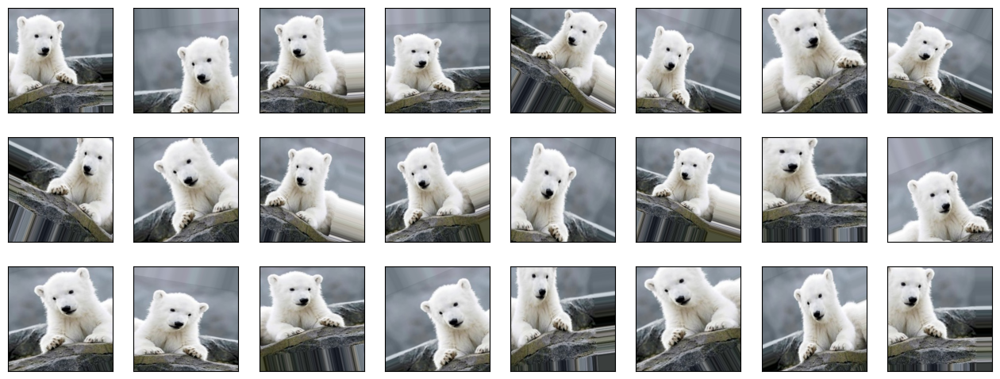
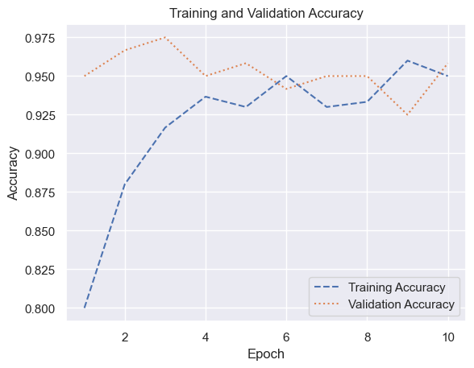
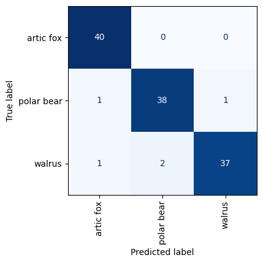

# Data Augmentation


- [<span class="toc-section-number">1</span> Image Augmentation with
  ImageDataGenerator](#image-augmentation-with-imagedatagenerator)
- [<span class="toc-section-number">2</span> Applying Image Augmentation
  to Arctic Wildlife](#applying-image-augmentation-to-arctic-wildlife)

## Image Augmentation with ImageDataGenerator

``` python
import matplotlib.pyplot as plt
import numpy as np
from tensorflow.keras.preprocessing import image
from tensorflow.keras.preprocessing.image import ImageDataGenerator
```

``` python
x = image.load_img("Wildlife/train/polar_bear/polar_bear_010.jpeg")
plt.xticks([])
plt.yticks([])
plt.imshow(x)


x = image.img_to_array(x)
x = np.expand_dims(x, axis=0)
```


``` python
# Wrap an ImageDataGenerator around it
idg = ImageDataGenerator(
    rescale=1.0 / 255,
    horizontal_flip=True,
    rotation_range=30,
    width_shift_range=0.2,
    height_shift_range=0.2,
    zoom_range=0.2,
)
idg.fit(x)

# Generate 24 versions of the image.
generator = idg.flow(x, [0], batch_size=1, seed=0)
fig, axes = plt.subplots(3, 8, figsize=(16, 6), subplot_kw={"xticks": [], "yticks": []})

for i, ax in enumerate(axes.flat):
    img, label = generator.next()
    ax.imshow(img[0])
```



``` python
# NOT EXECUTABLE
idg = ImageDataGenerator(
    rescale=1.0 / 255,
    horizontal_flip=True,
    rotation_range=30,
    width_shift_range=0.2,
    height_shift_range=0.2,
    zoom_range=0.2,
)
idg.fit(x_train)
image_batch_size = 10

generator = idg.flow(x_train, y_train, batch_size=image_batch_size, seed=0)
model.fit(
    generator,
    steps_per_epoch=len(x_train) // image_batch_size,
    validation_data=(x_test, y_test),
    batch_size=20,
    epochs=10,
)
```

## Applying Image Augmentation to Arctic Wildlife

``` python
import os
from pathlib import Path

import matplotlib.pyplot as plt
from tensorflow.keras.preprocessing import image


def load_images_from_path(path, label):
    images, labels = [], []

    for file in os.listdir(path):
        img = image.load_img(Path(path) / file, target_size=(224, 224, 3))
        images.append(image.img_to_array(img))
        labels.append((label))

    return images, labels


def show_images(images):
    fig, axes = plt.subplots(
        1, 8, figsize=(20, 20), subplot_kw={"xticks": [], "yticks": []}
    )

    for i, ax in enumerate(axes.flat):
        ax.imshow(images[i] / 255)


X_train, y_train, X_test, y_test = [], [], [], []

for i, animal in enumerate(["arctic_fox", "polar_bear", "walrus"]):
    images, labels = load_images_from_path(Path("Wildlife/train") / animal, i)
    X_train += images
    y_train += labels

    show_images(images)


for i, animal in enumerate(["arctic_fox", "polar_bear", "walrus"]):
    images, labels = load_images_from_path(Path("Wildlife/test") / animal, i)
    X_test += images
    y_test += labels

    show_images(images)
```


``` python
import numpy as np
from tensorflow.keras.applications.resnet50 import preprocess_input

X_train = preprocess_input(np.array(X_train))
X_test = preprocess_input(np.array(X_test))

y_train = np.array(y_train)
y_test = np.array(y_test)
```

``` python
from tensorflow.keras.applications import ResNet50V2

base_model = ResNet50V2(weights="imagenet", include_top=False)
base_model.trainable = False
```

``` python
from tensorflow.keras.layers import (
    Dense,
    Flatten,
    RandomFlip,
    RandomRotation,
    RandomTranslation,
    RandomZoom,
    Rescaling,
)
from tensorflow.keras.models import Sequential

model = Sequential()
model.add(Rescaling(1.0 / 255))
model.add(RandomFlip(mode="horizontal"))
model.add(RandomTranslation(0.2, 0.2))
model.add(RandomRotation(0.2))
model.add(RandomZoom(0.2))
model.add(base_model)
model.add(Flatten())
model.add(Dense(1024, activation="relu"))
model.add(Dense(3, activation="softmax"))
model.compile(
    optimizer="adam", loss="sparse_categorical_crossentropy", metrics=["accuracy"]
)
```

``` python
hist = model.fit(
    X_train, y_train, validation_data=(X_test, y_test), batch_size=10, epochs=10
)
```

    Epoch 1/10
    30/30 [==============================] - 10s 314ms/step - loss: 12.8202 - accuracy: 0.8000 - val_loss: 2.3591 - val_accuracy: 0.9500
    Epoch 2/10
    30/30 [==============================] - 9s 308ms/step - loss: 5.7685 - accuracy: 0.8800 - val_loss: 1.3120 - val_accuracy: 0.9667
    Epoch 3/10
    30/30 [==============================] - 9s 311ms/step - loss: 2.7003 - accuracy: 0.9167 - val_loss: 1.0863 - val_accuracy: 0.9750
    Epoch 4/10
    30/30 [==============================] - 9s 315ms/step - loss: 1.9399 - accuracy: 0.9367 - val_loss: 2.1233 - val_accuracy: 0.9500
    Epoch 5/10
    30/30 [==============================] - 9s 313ms/step - loss: 2.2115 - accuracy: 0.9300 - val_loss: 0.5145 - val_accuracy: 0.9583
    Epoch 6/10
    30/30 [==============================] - 9s 314ms/step - loss: 0.8182 - accuracy: 0.9500 - val_loss: 0.9523 - val_accuracy: 0.9417
    Epoch 7/10
    30/30 [==============================] - 9s 314ms/step - loss: 0.8655 - accuracy: 0.9300 - val_loss: 0.9813 - val_accuracy: 0.9500
    Epoch 8/10
    30/30 [==============================] - 9s 316ms/step - loss: 0.7587 - accuracy: 0.9333 - val_loss: 0.7151 - val_accuracy: 0.9500
    Epoch 9/10
    30/30 [==============================] - 9s 315ms/step - loss: 0.2052 - accuracy: 0.9600 - val_loss: 0.8391 - val_accuracy: 0.9250
    Epoch 10/10
    30/30 [==============================] - 10s 320ms/step - loss: 0.3012 - accuracy: 0.9500 - val_loss: 0.6535 - val_accuracy: 0.9583

``` python
import seaborn as sns

sns.set_theme()

acc = hist.history["accuracy"]
val_acc = hist.history["val_accuracy"]
epochs = range(1, len(acc) + 1)

plt.plot(epochs, acc, "--", label="Training Accuracy")
plt.plot(epochs, val_acc, ":", label="Validation Accuracy")
plt.title("Training and Validation Accuracy")
plt.xlabel("Epoch")
plt.ylabel("Accuracy")
plt.legend(loc="lower right");
```



``` python
from sklearn.metrics import ConfusionMatrixDisplay as cmd

sns.reset_orig()

fig, ax = plt.subplots(figsize=(4, 4))
ax.grid(False)

y_pred = model.predict(X_test)
class_labels = ["artic fox", "polar bear", "walrus"]
cmd.from_predictions(
    y_test,
    y_pred.argmax(axis=1),
    display_labels=class_labels,
    colorbar=False,
    cmap="Blues",
    xticks_rotation="vertical",
    ax=ax,
)
plt.show()
```

    4/4 [==============================] - 2s 460ms/step


