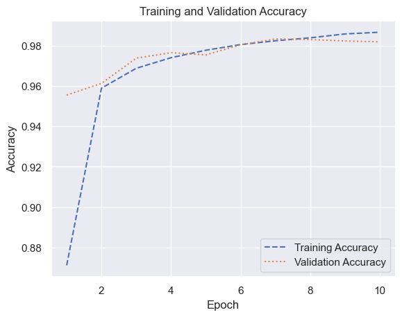

``` python
from tensorflow.keras.datasets import mnist

(train_images, y_train), (test_images, y_test) = mnist.load_data()
X_train = train_images.reshape(60000, 28, 28, 1) / 255
X_test = test_images.reshape(10000, 28, 28, 1) / 255
```

``` python
from tensorflow.keras.layers import (
    Conv2D,
    Dense,
    Flatten,
    GlobalMaxPooling2D,
    MaxPooling2D,
)
from tensorflow.keras.models import Sequential

model = Sequential()
model.add(Conv2D(32, (3, 3), activation="relu", input_shape=(28, 28, 1)))
model.add(MaxPooling2D(2, 2))
model.add(Conv2D(64, (3, 3), activation="relu"))
model.add(MaxPooling2D(2, 2))
model.add(GlobalMaxPooling2D())  # In lieu of Flatten()
model.add(Dense(128, activation="relu"))
model.add(Dense(10, activation="softmax"))
model.compile(
    optimizer="adam", loss="sparse_categorical_crossentropy", metrics=["accuracy"]
)
model.summary(line_length=80)
```

    Model: "sequential_1"
    ________________________________________________________________________________
     Layer (type)                       Output Shape                    Param #     
    ================================================================================
     conv2d_2 (Conv2D)                  (None, 26, 26, 32)              320         
                                                                                    
     max_pooling2d_2 (MaxPooling2D)     (None, 13, 13, 32)              0           
                                                                                    
     conv2d_3 (Conv2D)                  (None, 11, 11, 64)              18496       
                                                                                    
     max_pooling2d_3 (MaxPooling2D)     (None, 5, 5, 64)                0           
                                                                                    
     global_max_pooling2d_1 (GlobalMax  (None, 64)                      0           
     Pooling2D)                                                                     
                                                                                    
     dense_2 (Dense)                    (None, 128)                     8320        
                                                                                    
     dense_3 (Dense)                    (None, 10)                      1290        
                                                                                    
    ================================================================================
    Total params: 28426 (111.04 KB)
    Trainable params: 28426 (111.04 KB)
    Non-trainable params: 0 (0.00 Byte)
    ________________________________________________________________________________

``` python
hist = model.fit(
    X_train, y_train, validation_data=(X_test, y_test), epochs=10, batch_size=50
)
```

    Epoch 1/10
    1200/1200 [==============================] - 6s 5ms/step - loss: 0.4210 - accuracy: 0.8712 - val_loss: 0.1444 - val_accuracy: 0.9555
    Epoch 2/10
    1200/1200 [==============================] - 6s 5ms/step - loss: 0.1305 - accuracy: 0.9589 - val_loss: 0.1135 - val_accuracy: 0.9613
    Epoch 3/10
    1200/1200 [==============================] - 6s 5ms/step - loss: 0.0987 - accuracy: 0.9688 - val_loss: 0.0804 - val_accuracy: 0.9738
    Epoch 4/10
    1200/1200 [==============================] - 6s 5ms/step - loss: 0.0815 - accuracy: 0.9740 - val_loss: 0.0769 - val_accuracy: 0.9765
    Epoch 5/10
    1200/1200 [==============================] - 5s 5ms/step - loss: 0.0695 - accuracy: 0.9777 - val_loss: 0.0742 - val_accuracy: 0.9754
    Epoch 6/10
    1200/1200 [==============================] - 5s 5ms/step - loss: 0.0630 - accuracy: 0.9805 - val_loss: 0.0624 - val_accuracy: 0.9804
    Epoch 7/10
    1200/1200 [==============================] - 6s 5ms/step - loss: 0.0548 - accuracy: 0.9824 - val_loss: 0.0546 - val_accuracy: 0.9833
    Epoch 8/10
    1200/1200 [==============================] - 6s 5ms/step - loss: 0.0496 - accuracy: 0.9839 - val_loss: 0.0532 - val_accuracy: 0.9830
    Epoch 9/10
    1200/1200 [==============================] - 6s 5ms/step - loss: 0.0446 - accuracy: 0.9858 - val_loss: 0.0580 - val_accuracy: 0.9823
    Epoch 10/10
    1200/1200 [==============================] - 6s 5ms/step - loss: 0.0406 - accuracy: 0.9866 - val_loss: 0.0608 - val_accuracy: 0.9819

``` python
import matplotlib.pyplot as plt
import seaborn as sns

sns.set_theme()
```

``` python
acc = hist.history["accuracy"]
val_acc = hist.history["val_accuracy"]
epochs = range(1, len(acc) + 1)

plt.plot(epochs, acc, "--", label="Training Accuracy")
plt.plot(epochs, val_acc, ":", label="Validation Accuracy")
plt.title("Training and Validation Accuracy")
plt.xlabel("Epoch")
plt.ylabel("Accuracy")
plt.legend(loc="lower right");
```


