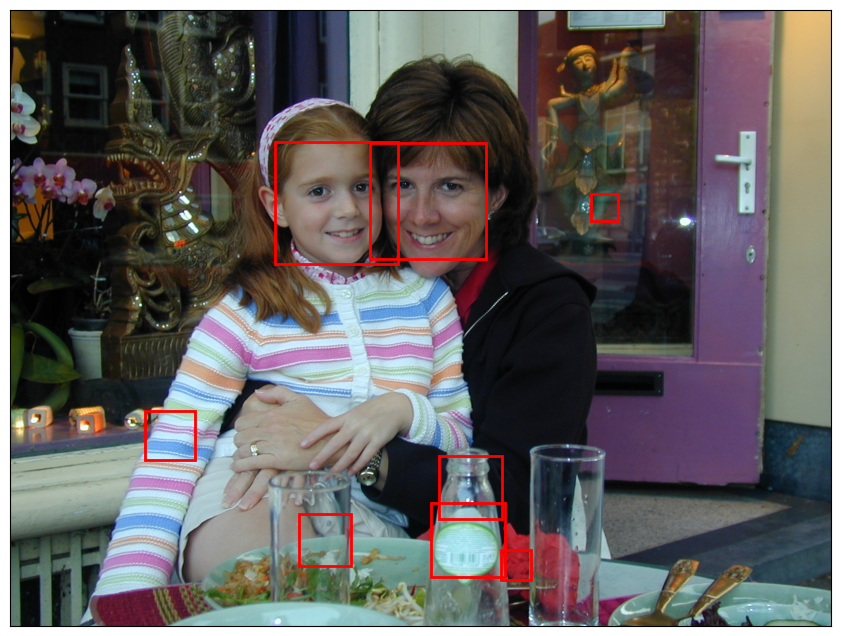
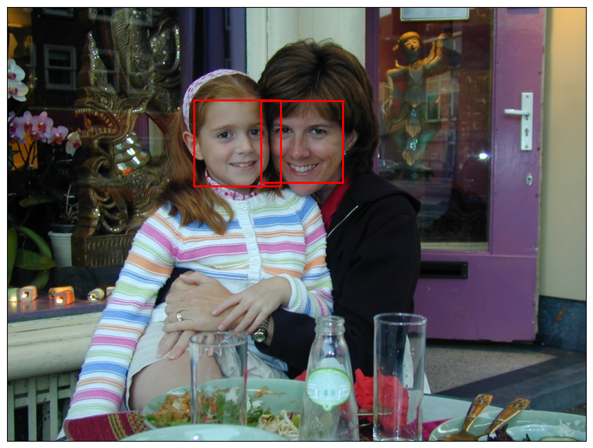

# Face Detection with Viola-Jones


- [<span class="toc-section-number">1</span> Using the OpenCV
  implementation of
  Viola-Jones](#using-the-opencv-implementation-of-viola-jones)

## Using the OpenCV implementation of Viola-Jones

``` python
import cv2
import matplotlib.pyplot as plt
from cv2 import CascadeClassifier
from matplotlib.patches import Rectangle
```

``` python
image = plt.imread("Data/Amsterdam.jpg")
fig, ax = plt.subplots(figsize=(12, 8), subplot_kw={"xticks": [], "yticks": []})
ax.imshow(image)

model = CascadeClassifier(cv2.data.haarcascades + "haarcascade_frontalface_default.xml")
faces = model.detectMultiScale(image)

for face in faces:
    x, y, w, h = face
    rect = Rectangle((x, y), w, h, color="red", fill=False, lw=2)
    ax.add_patch(rect)
```



``` python
fig, ax = plt.subplots(figsize=(12, 8), subplot_kw={"xticks": [], "yticks": []})
ax.imshow(image)

# set minNeighbors to avoid false positives.
faces = model.detectMultiScale(image, minNeighbors=20)
for face in faces:
    x, y, w, h = face
    rect = Rectangle((x, y), w, h, color="red", fill=False, lw=2)
    ax.add_patch(rect)
```


