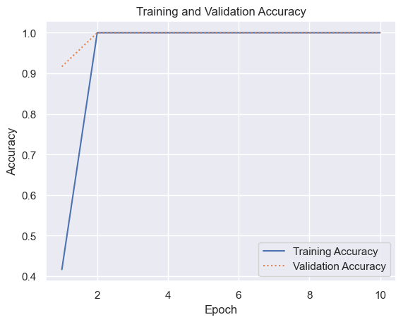
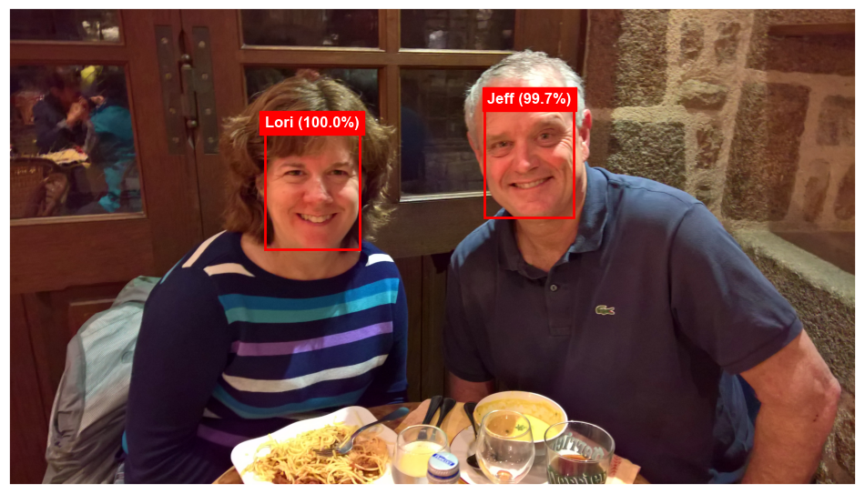
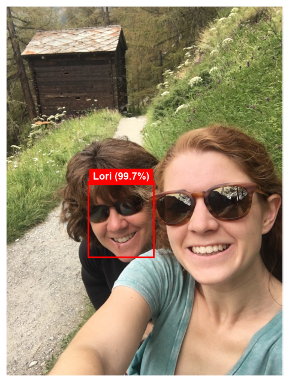
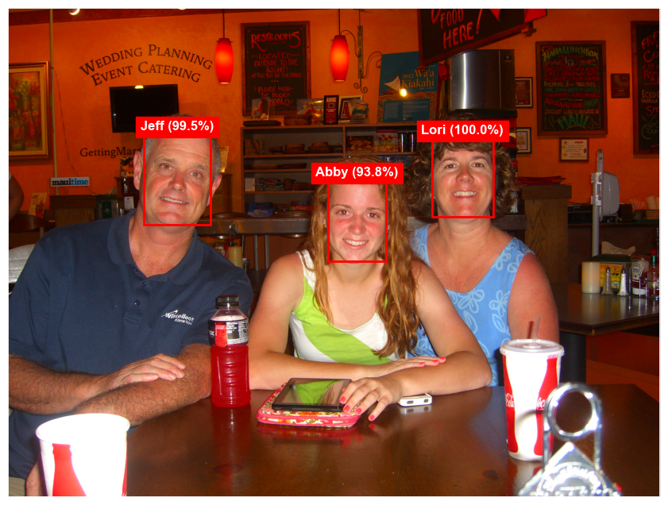

``` python
import os

import matplotlib.pyplot as plt
from tensorflow.keras.preprocessing import image
```

``` python
def load_images_from_path(path, label):
    images, labels = [], []

    for file in os.listdir(path):
        images.append(
            image.img_to_array(
                image.load_img(os.path.join(path, file), target_size=(224, 224, 3))
            )
        )
        labels.append((label))

    return images, labels


def show_images(images):
    fig, axes = plt.subplots(
        1, 8, figsize=(20, 20), subplot_kw={"xticks": [], "yticks": []}
    )

    for i, ax in enumerate(axes.flat):
        ax.imshow(images[i] / 255)
```

``` python
faces = ["Jeff", "Lori", "Abby"]
X, y = [], []

for i, face in enumerate(faces):
    images, labels = load_images_from_path("Faces/" + face, i)
    show_images(images)

    X += images
    y += labels
```


``` python
import numpy as np
from sklearn.model_selection import train_test_split
from tensorflow.keras.applications.resnet50 import preprocess_input

faces = preprocess_input(np.array(X))
labels = np.array(y)

X_train, X_test, y_train, y_test = train_test_split(
    faces, labels, train_size=0.5, stratify=labels, random_state=0
)
```

``` python
from tensorflow.keras.models import load_model

base_model = load_model("Data/vggface.h5")
base_model.trainable = False
```

    WARNING:tensorflow:No training configuration found in the save file, so the model was *not* compiled. Compile it manually.

``` python
from tensorflow.keras.layers import Dense, Flatten, Resizing
from tensorflow.keras.models import Sequential

model = Sequential()
model.add(Resizing(224, 224))
model.add(base_model)
model.add(Flatten())
model.add(Dense(8, activation="relu"))
model.add(Dense(3, activation="softmax"))
model.compile(
    optimizer="adam", loss="sparse_categorical_crossentropy", metrics=["accuracy"]
)
```

``` python
hist = model.fit(
    X_train, y_train, validation_data=(X_test, y_test), batch_size=2, epochs=10
)
```

    Epoch 1/10
    6/6 [==============================] - 1s 148ms/step - loss: 2.7975 - accuracy: 0.4167 - val_loss: 0.1961 - val_accuracy: 0.9167
    Epoch 2/10
    6/6 [==============================] - 1s 107ms/step - loss: 0.1890 - accuracy: 1.0000 - val_loss: 0.1040 - val_accuracy: 1.0000
    Epoch 3/10
    6/6 [==============================] - 1s 112ms/step - loss: 0.0387 - accuracy: 1.0000 - val_loss: 0.0394 - val_accuracy: 1.0000
    Epoch 4/10
    6/6 [==============================] - 1s 106ms/step - loss: 0.0153 - accuracy: 1.0000 - val_loss: 0.0152 - val_accuracy: 1.0000
    Epoch 5/10
    6/6 [==============================] - 1s 105ms/step - loss: 0.0074 - accuracy: 1.0000 - val_loss: 0.0092 - val_accuracy: 1.0000
    Epoch 6/10
    6/6 [==============================] - 1s 106ms/step - loss: 0.0048 - accuracy: 1.0000 - val_loss: 0.0070 - val_accuracy: 1.0000
    Epoch 7/10
    6/6 [==============================] - 1s 105ms/step - loss: 0.0039 - accuracy: 1.0000 - val_loss: 0.0057 - val_accuracy: 1.0000
    Epoch 8/10
    6/6 [==============================] - 1s 110ms/step - loss: 0.0032 - accuracy: 1.0000 - val_loss: 0.0050 - val_accuracy: 1.0000
    Epoch 9/10
    6/6 [==============================] - 1s 105ms/step - loss: 0.0028 - accuracy: 1.0000 - val_loss: 0.0045 - val_accuracy: 1.0000
    Epoch 10/10
    6/6 [==============================] - 1s 111ms/step - loss: 0.0026 - accuracy: 1.0000 - val_loss: 0.0042 - val_accuracy: 1.0000

``` python
import matplotlib.pyplot as plt
import seaborn as sns

sns.set_theme()


acc = hist.history["accuracy"]
val_acc = hist.history["val_accuracy"]
epochs = range(1, len(acc) + 1)

plt.plot(epochs, acc, "-", label="Training Accuracy")
plt.plot(epochs, val_acc, ":", label="Validation Accuracy")
plt.title("Training and Validation Accuracy")
plt.xlabel("Epoch")
plt.ylabel("Accuracy")
plt.legend(loc="lower right");
```



``` python
from matplotlib.patches import Rectangle
from mtcnn.mtcnn import MTCNN
from PIL import Image, ImageOps
from tensorflow.keras.preprocessing import image


def get_face(image, face):
    x1, y1, w, h = face["box"]

    # Compute crop coordinates.
    if w > h:
        x1 = x1 + ((w - h) // 2)
        w = h
    elif h > w:
        y1 = y1 + ((h - w) // 2)
        h = w

    x2 = x1 + h
    y2 = y1 + w

    return image[y1:y2, x1:x2]


def label_faces(
    path,
    model,
    names,
    face_threshold=0.9,
    prediction_threshold=0.9,
    show_outline=True,
    size=(12, 8),
):
    # Load the image and orient it correctly.
    pil_image = Image.open(path)
    exif = pil_image.getexif()
    for k in exif.keys():
        if (
            k != 0x0112
        ):  # In EXIF data, 0x0112 (or 274 in decimal) represents the Orientation tag, which indicates how an image should be displayed
            exif[k] = None
            del exif[k]

    pil_image.info["exif"] = exif.tobytes()
    pil_image = ImageOps.exif_transpose(pil_image)
    np_image = np.array(pil_image)

    fig, ax = plt.subplots(figsize=size, subplot_kw={"xticks": [], "yticks": []})
    ax.imshow(np_image)

    # Find the faces in the image.
    detector = MTCNN()
    faces = detector.detect_faces(np_image)
    faces = [face for face in faces if face["confidence"] >= face_threshold]
    results = []

    for face in faces:
        x, y, w, h = face["box"]

        # Use the model to identify the face
        face_image = get_face(np_image, face)
        face_image = image.array_to_img(face_image)
        face_image = preprocess_input(np.array(face_image))
        predictions = model.predict(np.expand_dims(face_image, axis=0))
        confidence = np.max(predictions)

        if confidence > prediction_threshold:
            # Optionally draw a box around the face
            if show_outline:
                rect = Rectangle((x, y), w, h, color="red", fill=False, lw=2)
                ax.add_patch(rect)

            # Label the face
            index = int(np.argmax(predictions))
            text = f"{names[index]} ({confidence:.1%})"
            ax.text(
                x + (w / 2),
                y,
                text,
                color="white",
                backgroundcolor="red",
                ha="center",
                va="bottom",
                fontweight="bold",
                bbox=dict(color="red"),
            )
```

``` python
labels = ["Jeff", "Lori", "Abby"]
label_faces("Faces/Samples/Sample-1.jpg", model, labels)
```

    1/1 [==============================] - 0s 35ms/step
    1/1 [==============================] - 0s 214ms/step



``` python
label_faces("Faces/Samples/Sample-2.jpg", model, labels)
```

    1/1 [==============================] - 0s 34ms/step
    1/1 [==============================] - 0s 34ms/step



``` python
label_faces("Faces/Samples/Sample-3.jpg", model, labels)
```

    1/1 [==============================] - 0s 35ms/step
    1/1 [==============================] - 0s 34ms/step
    1/1 [==============================] - 0s 34ms/step


