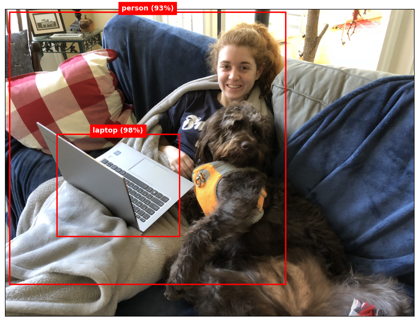
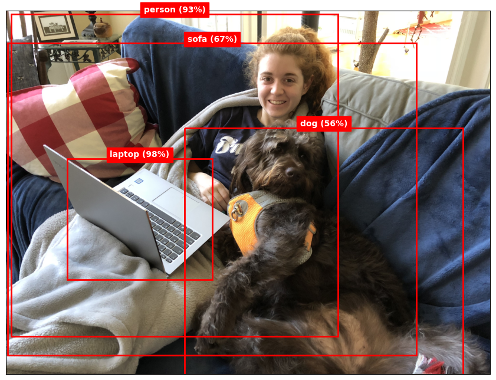

``` python
from yolov3 import *

model = make_yolov3_model()
weight_reader = WeightReader("Data/yolov3.weights")
weight_reader.load_weights(model)
model.summary()
```

    Model: "model_2"
    __________________________________________________________________________________________________
     Layer (type)                Output Shape                 Param #   Connected to                  
    ==================================================================================================
     input_3 (InputLayer)        [(None, None, None, 3)]      0         []                            
                                                                                                      
     conv_0 (Conv2D)             (None, None, None, 32)       864       ['input_3[0][0]']             
                                                                                                      
     bnorm_0 (BatchNormalizatio  (None, None, None, 32)       128       ['conv_0[0][0]']              
     n)                                                                                               
                                                                                                      
     leaky_0 (LeakyReLU)         (None, None, None, 32)       0         ['bnorm_0[0][0]']             
                                                                                                      
     zero_padding2d_10 (ZeroPad  (None, None, None, 32)       0         ['leaky_0[0][0]']             
     ding2D)                                                                                          
                                                                                                      
     conv_1 (Conv2D)             (None, None, None, 64)       18432     ['zero_padding2d_10[0][0]']   
                                                                                                      
     bnorm_1 (BatchNormalizatio  (None, None, None, 64)       256       ['conv_1[0][0]']              
     n)                                                                                               
                                                                                                      
     leaky_1 (LeakyReLU)         (None, None, None, 64)       0         ['bnorm_1[0][0]']             
                                                                                                      
     conv_2 (Conv2D)             (None, None, None, 32)       2048      ['leaky_1[0][0]']             
                                                                                                      
     bnorm_2 (BatchNormalizatio  (None, None, None, 32)       128       ['conv_2[0][0]']              
     n)                                                                                               
                                                                                                      
     leaky_2 (LeakyReLU)         (None, None, None, 32)       0         ['bnorm_2[0][0]']             
                                                                                                      
     conv_3 (Conv2D)             (None, None, None, 64)       18432     ['leaky_2[0][0]']             
                                                                                                      
     bnorm_3 (BatchNormalizatio  (None, None, None, 64)       256       ['conv_3[0][0]']              
     n)                                                                                               
                                                                                                      
     leaky_3 (LeakyReLU)         (None, None, None, 64)       0         ['bnorm_3[0][0]']             
                                                                                                      
     add_46 (Add)                (None, None, None, 64)       0         ['leaky_1[0][0]',             
                                                                         'leaky_3[0][0]']             
                                                                                                      
     zero_padding2d_11 (ZeroPad  (None, None, None, 64)       0         ['add_46[0][0]']              
     ding2D)                                                                                          
                                                                                                      
     conv_5 (Conv2D)             (None, None, None, 128)      73728     ['zero_padding2d_11[0][0]']   
                                                                                                      
     bnorm_5 (BatchNormalizatio  (None, None, None, 128)      512       ['conv_5[0][0]']              
     n)                                                                                               
                                                                                                      
     leaky_5 (LeakyReLU)         (None, None, None, 128)      0         ['bnorm_5[0][0]']             
                                                                                                      
     conv_6 (Conv2D)             (None, None, None, 64)       8192      ['leaky_5[0][0]']             
                                                                                                      
     bnorm_6 (BatchNormalizatio  (None, None, None, 64)       256       ['conv_6[0][0]']              
     n)                                                                                               
                                                                                                      
     leaky_6 (LeakyReLU)         (None, None, None, 64)       0         ['bnorm_6[0][0]']             
                                                                                                      
     conv_7 (Conv2D)             (None, None, None, 128)      73728     ['leaky_6[0][0]']             
                                                                                                      
     bnorm_7 (BatchNormalizatio  (None, None, None, 128)      512       ['conv_7[0][0]']              
     n)                                                                                               
                                                                                                      
     leaky_7 (LeakyReLU)         (None, None, None, 128)      0         ['bnorm_7[0][0]']             
                                                                                                      
     add_47 (Add)                (None, None, None, 128)      0         ['leaky_5[0][0]',             
                                                                         'leaky_7[0][0]']             
                                                                                                      
     conv_9 (Conv2D)             (None, None, None, 64)       8192      ['add_47[0][0]']              
                                                                                                      
     bnorm_9 (BatchNormalizatio  (None, None, None, 64)       256       ['conv_9[0][0]']              
     n)                                                                                               
                                                                                                      
     leaky_9 (LeakyReLU)         (None, None, None, 64)       0         ['bnorm_9[0][0]']             
                                                                                                      
     conv_10 (Conv2D)            (None, None, None, 128)      73728     ['leaky_9[0][0]']             
                                                                                                      
     bnorm_10 (BatchNormalizati  (None, None, None, 128)      512       ['conv_10[0][0]']             
     on)                                                                                              
                                                                                                      
     leaky_10 (LeakyReLU)        (None, None, None, 128)      0         ['bnorm_10[0][0]']            
                                                                                                      
     add_48 (Add)                (None, None, None, 128)      0         ['add_47[0][0]',              
                                                                         'leaky_10[0][0]']            
                                                                                                      
     zero_padding2d_12 (ZeroPad  (None, None, None, 128)      0         ['add_48[0][0]']              
     ding2D)                                                                                          
                                                                                                      
     conv_12 (Conv2D)            (None, None, None, 256)      294912    ['zero_padding2d_12[0][0]']   
                                                                                                      
     bnorm_12 (BatchNormalizati  (None, None, None, 256)      1024      ['conv_12[0][0]']             
     on)                                                                                              
                                                                                                      
     leaky_12 (LeakyReLU)        (None, None, None, 256)      0         ['bnorm_12[0][0]']            
                                                                                                      
     conv_13 (Conv2D)            (None, None, None, 128)      32768     ['leaky_12[0][0]']            
                                                                                                      
     bnorm_13 (BatchNormalizati  (None, None, None, 128)      512       ['conv_13[0][0]']             
     on)                                                                                              
                                                                                                      
     leaky_13 (LeakyReLU)        (None, None, None, 128)      0         ['bnorm_13[0][0]']            
                                                                                                      
     conv_14 (Conv2D)            (None, None, None, 256)      294912    ['leaky_13[0][0]']            
                                                                                                      
     bnorm_14 (BatchNormalizati  (None, None, None, 256)      1024      ['conv_14[0][0]']             
     on)                                                                                              
                                                                                                      
     leaky_14 (LeakyReLU)        (None, None, None, 256)      0         ['bnorm_14[0][0]']            
                                                                                                      
     add_49 (Add)                (None, None, None, 256)      0         ['leaky_12[0][0]',            
                                                                         'leaky_14[0][0]']            
                                                                                                      
     conv_16 (Conv2D)            (None, None, None, 128)      32768     ['add_49[0][0]']              
                                                                                                      
     bnorm_16 (BatchNormalizati  (None, None, None, 128)      512       ['conv_16[0][0]']             
     on)                                                                                              
                                                                                                      
     leaky_16 (LeakyReLU)        (None, None, None, 128)      0         ['bnorm_16[0][0]']            
                                                                                                      
     conv_17 (Conv2D)            (None, None, None, 256)      294912    ['leaky_16[0][0]']            
                                                                                                      
     bnorm_17 (BatchNormalizati  (None, None, None, 256)      1024      ['conv_17[0][0]']             
     on)                                                                                              
                                                                                                      
     leaky_17 (LeakyReLU)        (None, None, None, 256)      0         ['bnorm_17[0][0]']            
                                                                                                      
     add_50 (Add)                (None, None, None, 256)      0         ['add_49[0][0]',              
                                                                         'leaky_17[0][0]']            
                                                                                                      
     conv_19 (Conv2D)            (None, None, None, 128)      32768     ['add_50[0][0]']              
                                                                                                      
     bnorm_19 (BatchNormalizati  (None, None, None, 128)      512       ['conv_19[0][0]']             
     on)                                                                                              
                                                                                                      
     leaky_19 (LeakyReLU)        (None, None, None, 128)      0         ['bnorm_19[0][0]']            
                                                                                                      
     conv_20 (Conv2D)            (None, None, None, 256)      294912    ['leaky_19[0][0]']            
                                                                                                      
     bnorm_20 (BatchNormalizati  (None, None, None, 256)      1024      ['conv_20[0][0]']             
     on)                                                                                              
                                                                                                      
     leaky_20 (LeakyReLU)        (None, None, None, 256)      0         ['bnorm_20[0][0]']            
                                                                                                      
     add_51 (Add)                (None, None, None, 256)      0         ['add_50[0][0]',              
                                                                         'leaky_20[0][0]']            
                                                                                                      
     conv_22 (Conv2D)            (None, None, None, 128)      32768     ['add_51[0][0]']              
                                                                                                      
     bnorm_22 (BatchNormalizati  (None, None, None, 128)      512       ['conv_22[0][0]']             
     on)                                                                                              
                                                                                                      
     leaky_22 (LeakyReLU)        (None, None, None, 128)      0         ['bnorm_22[0][0]']            
                                                                                                      
     conv_23 (Conv2D)            (None, None, None, 256)      294912    ['leaky_22[0][0]']            
                                                                                                      
     bnorm_23 (BatchNormalizati  (None, None, None, 256)      1024      ['conv_23[0][0]']             
     on)                                                                                              
                                                                                                      
     leaky_23 (LeakyReLU)        (None, None, None, 256)      0         ['bnorm_23[0][0]']            
                                                                                                      
     add_52 (Add)                (None, None, None, 256)      0         ['add_51[0][0]',              
                                                                         'leaky_23[0][0]']            
                                                                                                      
     conv_25 (Conv2D)            (None, None, None, 128)      32768     ['add_52[0][0]']              
                                                                                                      
     bnorm_25 (BatchNormalizati  (None, None, None, 128)      512       ['conv_25[0][0]']             
     on)                                                                                              
                                                                                                      
     leaky_25 (LeakyReLU)        (None, None, None, 128)      0         ['bnorm_25[0][0]']            
                                                                                                      
     conv_26 (Conv2D)            (None, None, None, 256)      294912    ['leaky_25[0][0]']            
                                                                                                      
     bnorm_26 (BatchNormalizati  (None, None, None, 256)      1024      ['conv_26[0][0]']             
     on)                                                                                              
                                                                                                      
     leaky_26 (LeakyReLU)        (None, None, None, 256)      0         ['bnorm_26[0][0]']            
                                                                                                      
     add_53 (Add)                (None, None, None, 256)      0         ['add_52[0][0]',              
                                                                         'leaky_26[0][0]']            
                                                                                                      
     conv_28 (Conv2D)            (None, None, None, 128)      32768     ['add_53[0][0]']              
                                                                                                      
     bnorm_28 (BatchNormalizati  (None, None, None, 128)      512       ['conv_28[0][0]']             
     on)                                                                                              
                                                                                                      
     leaky_28 (LeakyReLU)        (None, None, None, 128)      0         ['bnorm_28[0][0]']            
                                                                                                      
     conv_29 (Conv2D)            (None, None, None, 256)      294912    ['leaky_28[0][0]']            
                                                                                                      
     bnorm_29 (BatchNormalizati  (None, None, None, 256)      1024      ['conv_29[0][0]']             
     on)                                                                                              
                                                                                                      
     leaky_29 (LeakyReLU)        (None, None, None, 256)      0         ['bnorm_29[0][0]']            
                                                                                                      
     add_54 (Add)                (None, None, None, 256)      0         ['add_53[0][0]',              
                                                                         'leaky_29[0][0]']            
                                                                                                      
     conv_31 (Conv2D)            (None, None, None, 128)      32768     ['add_54[0][0]']              
                                                                                                      
     bnorm_31 (BatchNormalizati  (None, None, None, 128)      512       ['conv_31[0][0]']             
     on)                                                                                              
                                                                                                      
     leaky_31 (LeakyReLU)        (None, None, None, 128)      0         ['bnorm_31[0][0]']            
                                                                                                      
     conv_32 (Conv2D)            (None, None, None, 256)      294912    ['leaky_31[0][0]']            
                                                                                                      
     bnorm_32 (BatchNormalizati  (None, None, None, 256)      1024      ['conv_32[0][0]']             
     on)                                                                                              
                                                                                                      
     leaky_32 (LeakyReLU)        (None, None, None, 256)      0         ['bnorm_32[0][0]']            
                                                                                                      
     add_55 (Add)                (None, None, None, 256)      0         ['add_54[0][0]',              
                                                                         'leaky_32[0][0]']            
                                                                                                      
     conv_34 (Conv2D)            (None, None, None, 128)      32768     ['add_55[0][0]']              
                                                                                                      
     bnorm_34 (BatchNormalizati  (None, None, None, 128)      512       ['conv_34[0][0]']             
     on)                                                                                              
                                                                                                      
     leaky_34 (LeakyReLU)        (None, None, None, 128)      0         ['bnorm_34[0][0]']            
                                                                                                      
     conv_35 (Conv2D)            (None, None, None, 256)      294912    ['leaky_34[0][0]']            
                                                                                                      
     bnorm_35 (BatchNormalizati  (None, None, None, 256)      1024      ['conv_35[0][0]']             
     on)                                                                                              
                                                                                                      
     leaky_35 (LeakyReLU)        (None, None, None, 256)      0         ['bnorm_35[0][0]']            
                                                                                                      
     add_56 (Add)                (None, None, None, 256)      0         ['add_55[0][0]',              
                                                                         'leaky_35[0][0]']            
                                                                                                      
     zero_padding2d_13 (ZeroPad  (None, None, None, 256)      0         ['add_56[0][0]']              
     ding2D)                                                                                          
                                                                                                      
     conv_37 (Conv2D)            (None, None, None, 512)      1179648   ['zero_padding2d_13[0][0]']   
                                                                                                      
     bnorm_37 (BatchNormalizati  (None, None, None, 512)      2048      ['conv_37[0][0]']             
     on)                                                                                              
                                                                                                      
     leaky_37 (LeakyReLU)        (None, None, None, 512)      0         ['bnorm_37[0][0]']            
                                                                                                      
     conv_38 (Conv2D)            (None, None, None, 256)      131072    ['leaky_37[0][0]']            
                                                                                                      
     bnorm_38 (BatchNormalizati  (None, None, None, 256)      1024      ['conv_38[0][0]']             
     on)                                                                                              
                                                                                                      
     leaky_38 (LeakyReLU)        (None, None, None, 256)      0         ['bnorm_38[0][0]']            
                                                                                                      
     conv_39 (Conv2D)            (None, None, None, 512)      1179648   ['leaky_38[0][0]']            
                                                                                                      
     bnorm_39 (BatchNormalizati  (None, None, None, 512)      2048      ['conv_39[0][0]']             
     on)                                                                                              
                                                                                                      
     leaky_39 (LeakyReLU)        (None, None, None, 512)      0         ['bnorm_39[0][0]']            
                                                                                                      
     add_57 (Add)                (None, None, None, 512)      0         ['leaky_37[0][0]',            
                                                                         'leaky_39[0][0]']            
                                                                                                      
     conv_41 (Conv2D)            (None, None, None, 256)      131072    ['add_57[0][0]']              
                                                                                                      
     bnorm_41 (BatchNormalizati  (None, None, None, 256)      1024      ['conv_41[0][0]']             
     on)                                                                                              
                                                                                                      
     leaky_41 (LeakyReLU)        (None, None, None, 256)      0         ['bnorm_41[0][0]']            
                                                                                                      
     conv_42 (Conv2D)            (None, None, None, 512)      1179648   ['leaky_41[0][0]']            
                                                                                                      
     bnorm_42 (BatchNormalizati  (None, None, None, 512)      2048      ['conv_42[0][0]']             
     on)                                                                                              
                                                                                                      
     leaky_42 (LeakyReLU)        (None, None, None, 512)      0         ['bnorm_42[0][0]']            
                                                                                                      
     add_58 (Add)                (None, None, None, 512)      0         ['add_57[0][0]',              
                                                                         'leaky_42[0][0]']            
                                                                                                      
     conv_44 (Conv2D)            (None, None, None, 256)      131072    ['add_58[0][0]']              
                                                                                                      
     bnorm_44 (BatchNormalizati  (None, None, None, 256)      1024      ['conv_44[0][0]']             
     on)                                                                                              
                                                                                                      
     leaky_44 (LeakyReLU)        (None, None, None, 256)      0         ['bnorm_44[0][0]']            
                                                                                                      
     conv_45 (Conv2D)            (None, None, None, 512)      1179648   ['leaky_44[0][0]']            
                                                                                                      
     bnorm_45 (BatchNormalizati  (None, None, None, 512)      2048      ['conv_45[0][0]']             
     on)                                                                                              
                                                                                                      
     leaky_45 (LeakyReLU)        (None, None, None, 512)      0         ['bnorm_45[0][0]']            
                                                                                                      
     add_59 (Add)                (None, None, None, 512)      0         ['add_58[0][0]',              
                                                                         'leaky_45[0][0]']            
                                                                                                      
     conv_47 (Conv2D)            (None, None, None, 256)      131072    ['add_59[0][0]']              
                                                                                                      
     bnorm_47 (BatchNormalizati  (None, None, None, 256)      1024      ['conv_47[0][0]']             
     on)                                                                                              
                                                                                                      
     leaky_47 (LeakyReLU)        (None, None, None, 256)      0         ['bnorm_47[0][0]']            
                                                                                                      
     conv_48 (Conv2D)            (None, None, None, 512)      1179648   ['leaky_47[0][0]']            
                                                                                                      
     bnorm_48 (BatchNormalizati  (None, None, None, 512)      2048      ['conv_48[0][0]']             
     on)                                                                                              
                                                                                                      
     leaky_48 (LeakyReLU)        (None, None, None, 512)      0         ['bnorm_48[0][0]']            
                                                                                                      
     add_60 (Add)                (None, None, None, 512)      0         ['add_59[0][0]',              
                                                                         'leaky_48[0][0]']            
                                                                                                      
     conv_50 (Conv2D)            (None, None, None, 256)      131072    ['add_60[0][0]']              
                                                                                                      
     bnorm_50 (BatchNormalizati  (None, None, None, 256)      1024      ['conv_50[0][0]']             
     on)                                                                                              
                                                                                                      
     leaky_50 (LeakyReLU)        (None, None, None, 256)      0         ['bnorm_50[0][0]']            
                                                                                                      
     conv_51 (Conv2D)            (None, None, None, 512)      1179648   ['leaky_50[0][0]']            
                                                                                                      
     bnorm_51 (BatchNormalizati  (None, None, None, 512)      2048      ['conv_51[0][0]']             
     on)                                                                                              
                                                                                                      
     leaky_51 (LeakyReLU)        (None, None, None, 512)      0         ['bnorm_51[0][0]']            
                                                                                                      
     add_61 (Add)                (None, None, None, 512)      0         ['add_60[0][0]',              
                                                                         'leaky_51[0][0]']            
                                                                                                      
     conv_53 (Conv2D)            (None, None, None, 256)      131072    ['add_61[0][0]']              
                                                                                                      
     bnorm_53 (BatchNormalizati  (None, None, None, 256)      1024      ['conv_53[0][0]']             
     on)                                                                                              
                                                                                                      
     leaky_53 (LeakyReLU)        (None, None, None, 256)      0         ['bnorm_53[0][0]']            
                                                                                                      
     conv_54 (Conv2D)            (None, None, None, 512)      1179648   ['leaky_53[0][0]']            
                                                                                                      
     bnorm_54 (BatchNormalizati  (None, None, None, 512)      2048      ['conv_54[0][0]']             
     on)                                                                                              
                                                                                                      
     leaky_54 (LeakyReLU)        (None, None, None, 512)      0         ['bnorm_54[0][0]']            
                                                                                                      
     add_62 (Add)                (None, None, None, 512)      0         ['add_61[0][0]',              
                                                                         'leaky_54[0][0]']            
                                                                                                      
     conv_56 (Conv2D)            (None, None, None, 256)      131072    ['add_62[0][0]']              
                                                                                                      
     bnorm_56 (BatchNormalizati  (None, None, None, 256)      1024      ['conv_56[0][0]']             
     on)                                                                                              
                                                                                                      
     leaky_56 (LeakyReLU)        (None, None, None, 256)      0         ['bnorm_56[0][0]']            
                                                                                                      
     conv_57 (Conv2D)            (None, None, None, 512)      1179648   ['leaky_56[0][0]']            
                                                                                                      
     bnorm_57 (BatchNormalizati  (None, None, None, 512)      2048      ['conv_57[0][0]']             
     on)                                                                                              
                                                                                                      
     leaky_57 (LeakyReLU)        (None, None, None, 512)      0         ['bnorm_57[0][0]']            
                                                                                                      
     add_63 (Add)                (None, None, None, 512)      0         ['add_62[0][0]',              
                                                                         'leaky_57[0][0]']            
                                                                                                      
     conv_59 (Conv2D)            (None, None, None, 256)      131072    ['add_63[0][0]']              
                                                                                                      
     bnorm_59 (BatchNormalizati  (None, None, None, 256)      1024      ['conv_59[0][0]']             
     on)                                                                                              
                                                                                                      
     leaky_59 (LeakyReLU)        (None, None, None, 256)      0         ['bnorm_59[0][0]']            
                                                                                                      
     conv_60 (Conv2D)            (None, None, None, 512)      1179648   ['leaky_59[0][0]']            
                                                                                                      
     bnorm_60 (BatchNormalizati  (None, None, None, 512)      2048      ['conv_60[0][0]']             
     on)                                                                                              
                                                                                                      
     leaky_60 (LeakyReLU)        (None, None, None, 512)      0         ['bnorm_60[0][0]']            
                                                                                                      
     add_64 (Add)                (None, None, None, 512)      0         ['add_63[0][0]',              
                                                                         'leaky_60[0][0]']            
                                                                                                      
     zero_padding2d_14 (ZeroPad  (None, None, None, 512)      0         ['add_64[0][0]']              
     ding2D)                                                                                          
                                                                                                      
     conv_62 (Conv2D)            (None, None, None, 1024)     4718592   ['zero_padding2d_14[0][0]']   
                                                                                                      
     bnorm_62 (BatchNormalizati  (None, None, None, 1024)     4096      ['conv_62[0][0]']             
     on)                                                                                              
                                                                                                      
     leaky_62 (LeakyReLU)        (None, None, None, 1024)     0         ['bnorm_62[0][0]']            
                                                                                                      
     conv_63 (Conv2D)            (None, None, None, 512)      524288    ['leaky_62[0][0]']            
                                                                                                      
     bnorm_63 (BatchNormalizati  (None, None, None, 512)      2048      ['conv_63[0][0]']             
     on)                                                                                              
                                                                                                      
     leaky_63 (LeakyReLU)        (None, None, None, 512)      0         ['bnorm_63[0][0]']            
                                                                                                      
     conv_64 (Conv2D)            (None, None, None, 1024)     4718592   ['leaky_63[0][0]']            
                                                                                                      
     bnorm_64 (BatchNormalizati  (None, None, None, 1024)     4096      ['conv_64[0][0]']             
     on)                                                                                              
                                                                                                      
     leaky_64 (LeakyReLU)        (None, None, None, 1024)     0         ['bnorm_64[0][0]']            
                                                                                                      
     add_65 (Add)                (None, None, None, 1024)     0         ['leaky_62[0][0]',            
                                                                         'leaky_64[0][0]']            
                                                                                                      
     conv_66 (Conv2D)            (None, None, None, 512)      524288    ['add_65[0][0]']              
                                                                                                      
     bnorm_66 (BatchNormalizati  (None, None, None, 512)      2048      ['conv_66[0][0]']             
     on)                                                                                              
                                                                                                      
     leaky_66 (LeakyReLU)        (None, None, None, 512)      0         ['bnorm_66[0][0]']            
                                                                                                      
     conv_67 (Conv2D)            (None, None, None, 1024)     4718592   ['leaky_66[0][0]']            
                                                                                                      
     bnorm_67 (BatchNormalizati  (None, None, None, 1024)     4096      ['conv_67[0][0]']             
     on)                                                                                              
                                                                                                      
     leaky_67 (LeakyReLU)        (None, None, None, 1024)     0         ['bnorm_67[0][0]']            
                                                                                                      
     add_66 (Add)                (None, None, None, 1024)     0         ['add_65[0][0]',              
                                                                         'leaky_67[0][0]']            
                                                                                                      
     conv_69 (Conv2D)            (None, None, None, 512)      524288    ['add_66[0][0]']              
                                                                                                      
     bnorm_69 (BatchNormalizati  (None, None, None, 512)      2048      ['conv_69[0][0]']             
     on)                                                                                              
                                                                                                      
     leaky_69 (LeakyReLU)        (None, None, None, 512)      0         ['bnorm_69[0][0]']            
                                                                                                      
     conv_70 (Conv2D)            (None, None, None, 1024)     4718592   ['leaky_69[0][0]']            
                                                                                                      
     bnorm_70 (BatchNormalizati  (None, None, None, 1024)     4096      ['conv_70[0][0]']             
     on)                                                                                              
                                                                                                      
     leaky_70 (LeakyReLU)        (None, None, None, 1024)     0         ['bnorm_70[0][0]']            
                                                                                                      
     add_67 (Add)                (None, None, None, 1024)     0         ['add_66[0][0]',              
                                                                         'leaky_70[0][0]']            
                                                                                                      
     conv_72 (Conv2D)            (None, None, None, 512)      524288    ['add_67[0][0]']              
                                                                                                      
     bnorm_72 (BatchNormalizati  (None, None, None, 512)      2048      ['conv_72[0][0]']             
     on)                                                                                              
                                                                                                      
     leaky_72 (LeakyReLU)        (None, None, None, 512)      0         ['bnorm_72[0][0]']            
                                                                                                      
     conv_73 (Conv2D)            (None, None, None, 1024)     4718592   ['leaky_72[0][0]']            
                                                                                                      
     bnorm_73 (BatchNormalizati  (None, None, None, 1024)     4096      ['conv_73[0][0]']             
     on)                                                                                              
                                                                                                      
     leaky_73 (LeakyReLU)        (None, None, None, 1024)     0         ['bnorm_73[0][0]']            
                                                                                                      
     add_68 (Add)                (None, None, None, 1024)     0         ['add_67[0][0]',              
                                                                         'leaky_73[0][0]']            
                                                                                                      
     conv_75 (Conv2D)            (None, None, None, 512)      524288    ['add_68[0][0]']              
                                                                                                      
     bnorm_75 (BatchNormalizati  (None, None, None, 512)      2048      ['conv_75[0][0]']             
     on)                                                                                              
                                                                                                      
     leaky_75 (LeakyReLU)        (None, None, None, 512)      0         ['bnorm_75[0][0]']            
                                                                                                      
     conv_76 (Conv2D)            (None, None, None, 1024)     4718592   ['leaky_75[0][0]']            
                                                                                                      
     bnorm_76 (BatchNormalizati  (None, None, None, 1024)     4096      ['conv_76[0][0]']             
     on)                                                                                              
                                                                                                      
     leaky_76 (LeakyReLU)        (None, None, None, 1024)     0         ['bnorm_76[0][0]']            
                                                                                                      
     conv_77 (Conv2D)            (None, None, None, 512)      524288    ['leaky_76[0][0]']            
                                                                                                      
     bnorm_77 (BatchNormalizati  (None, None, None, 512)      2048      ['conv_77[0][0]']             
     on)                                                                                              
                                                                                                      
     leaky_77 (LeakyReLU)        (None, None, None, 512)      0         ['bnorm_77[0][0]']            
                                                                                                      
     conv_78 (Conv2D)            (None, None, None, 1024)     4718592   ['leaky_77[0][0]']            
                                                                                                      
     bnorm_78 (BatchNormalizati  (None, None, None, 1024)     4096      ['conv_78[0][0]']             
     on)                                                                                              
                                                                                                      
     leaky_78 (LeakyReLU)        (None, None, None, 1024)     0         ['bnorm_78[0][0]']            
                                                                                                      
     conv_79 (Conv2D)            (None, None, None, 512)      524288    ['leaky_78[0][0]']            
                                                                                                      
     bnorm_79 (BatchNormalizati  (None, None, None, 512)      2048      ['conv_79[0][0]']             
     on)                                                                                              
                                                                                                      
     leaky_79 (LeakyReLU)        (None, None, None, 512)      0         ['bnorm_79[0][0]']            
                                                                                                      
     conv_84 (Conv2D)            (None, None, None, 256)      131072    ['leaky_79[0][0]']            
                                                                                                      
     bnorm_84 (BatchNormalizati  (None, None, None, 256)      1024      ['conv_84[0][0]']             
     on)                                                                                              
                                                                                                      
     leaky_84 (LeakyReLU)        (None, None, None, 256)      0         ['bnorm_84[0][0]']            
                                                                                                      
     up_sampling2d_4 (UpSamplin  (None, None, None, 256)      0         ['leaky_84[0][0]']            
     g2D)                                                                                             
                                                                                                      
     concatenate_4 (Concatenate  (None, None, None, 768)      0         ['up_sampling2d_4[0][0]',     
     )                                                                   'add_64[0][0]']              
                                                                                                      
     conv_87 (Conv2D)            (None, None, None, 256)      196608    ['concatenate_4[0][0]']       
                                                                                                      
     bnorm_87 (BatchNormalizati  (None, None, None, 256)      1024      ['conv_87[0][0]']             
     on)                                                                                              
                                                                                                      
     leaky_87 (LeakyReLU)        (None, None, None, 256)      0         ['bnorm_87[0][0]']            
                                                                                                      
     conv_88 (Conv2D)            (None, None, None, 512)      1179648   ['leaky_87[0][0]']            
                                                                                                      
     bnorm_88 (BatchNormalizati  (None, None, None, 512)      2048      ['conv_88[0][0]']             
     on)                                                                                              
                                                                                                      
     leaky_88 (LeakyReLU)        (None, None, None, 512)      0         ['bnorm_88[0][0]']            
                                                                                                      
     conv_89 (Conv2D)            (None, None, None, 256)      131072    ['leaky_88[0][0]']            
                                                                                                      
     bnorm_89 (BatchNormalizati  (None, None, None, 256)      1024      ['conv_89[0][0]']             
     on)                                                                                              
                                                                                                      
     leaky_89 (LeakyReLU)        (None, None, None, 256)      0         ['bnorm_89[0][0]']            
                                                                                                      
     conv_90 (Conv2D)            (None, None, None, 512)      1179648   ['leaky_89[0][0]']            
                                                                                                      
     bnorm_90 (BatchNormalizati  (None, None, None, 512)      2048      ['conv_90[0][0]']             
     on)                                                                                              
                                                                                                      
     leaky_90 (LeakyReLU)        (None, None, None, 512)      0         ['bnorm_90[0][0]']            
                                                                                                      
     conv_91 (Conv2D)            (None, None, None, 256)      131072    ['leaky_90[0][0]']            
                                                                                                      
     bnorm_91 (BatchNormalizati  (None, None, None, 256)      1024      ['conv_91[0][0]']             
     on)                                                                                              
                                                                                                      
     leaky_91 (LeakyReLU)        (None, None, None, 256)      0         ['bnorm_91[0][0]']            
                                                                                                      
     conv_96 (Conv2D)            (None, None, None, 128)      32768     ['leaky_91[0][0]']            
                                                                                                      
     bnorm_96 (BatchNormalizati  (None, None, None, 128)      512       ['conv_96[0][0]']             
     on)                                                                                              
                                                                                                      
     leaky_96 (LeakyReLU)        (None, None, None, 128)      0         ['bnorm_96[0][0]']            
                                                                                                      
     up_sampling2d_5 (UpSamplin  (None, None, None, 128)      0         ['leaky_96[0][0]']            
     g2D)                                                                                             
                                                                                                      
     concatenate_5 (Concatenate  (None, None, None, 384)      0         ['up_sampling2d_5[0][0]',     
     )                                                                   'add_56[0][0]']              
                                                                                                      
     conv_99 (Conv2D)            (None, None, None, 128)      49152     ['concatenate_5[0][0]']       
                                                                                                      
     bnorm_99 (BatchNormalizati  (None, None, None, 128)      512       ['conv_99[0][0]']             
     on)                                                                                              
                                                                                                      
     leaky_99 (LeakyReLU)        (None, None, None, 128)      0         ['bnorm_99[0][0]']            
                                                                                                      
     conv_100 (Conv2D)           (None, None, None, 256)      294912    ['leaky_99[0][0]']            
                                                                                                      
     bnorm_100 (BatchNormalizat  (None, None, None, 256)      1024      ['conv_100[0][0]']            
     ion)                                                                                             
                                                                                                      
     leaky_100 (LeakyReLU)       (None, None, None, 256)      0         ['bnorm_100[0][0]']           
                                                                                                      
     conv_101 (Conv2D)           (None, None, None, 128)      32768     ['leaky_100[0][0]']           
                                                                                                      
     bnorm_101 (BatchNormalizat  (None, None, None, 128)      512       ['conv_101[0][0]']            
     ion)                                                                                             
                                                                                                      
     leaky_101 (LeakyReLU)       (None, None, None, 128)      0         ['bnorm_101[0][0]']           
                                                                                                      
     conv_102 (Conv2D)           (None, None, None, 256)      294912    ['leaky_101[0][0]']           
                                                                                                      
     bnorm_102 (BatchNormalizat  (None, None, None, 256)      1024      ['conv_102[0][0]']            
     ion)                                                                                             
                                                                                                      
     leaky_102 (LeakyReLU)       (None, None, None, 256)      0         ['bnorm_102[0][0]']           
                                                                                                      
     conv_103 (Conv2D)           (None, None, None, 128)      32768     ['leaky_102[0][0]']           
                                                                                                      
     bnorm_103 (BatchNormalizat  (None, None, None, 128)      512       ['conv_103[0][0]']            
     ion)                                                                                             
                                                                                                      
     leaky_103 (LeakyReLU)       (None, None, None, 128)      0         ['bnorm_103[0][0]']           
                                                                                                      
     conv_80 (Conv2D)            (None, None, None, 1024)     4718592   ['leaky_79[0][0]']            
                                                                                                      
     conv_92 (Conv2D)            (None, None, None, 512)      1179648   ['leaky_91[0][0]']            
                                                                                                      
     conv_104 (Conv2D)           (None, None, None, 256)      294912    ['leaky_103[0][0]']           
                                                                                                      
     bnorm_80 (BatchNormalizati  (None, None, None, 1024)     4096      ['conv_80[0][0]']             
     on)                                                                                              
                                                                                                      
     bnorm_92 (BatchNormalizati  (None, None, None, 512)      2048      ['conv_92[0][0]']             
     on)                                                                                              
                                                                                                      
     bnorm_104 (BatchNormalizat  (None, None, None, 256)      1024      ['conv_104[0][0]']            
     ion)                                                                                             
                                                                                                      
     leaky_80 (LeakyReLU)        (None, None, None, 1024)     0         ['bnorm_80[0][0]']            
                                                                                                      
     leaky_92 (LeakyReLU)        (None, None, None, 512)      0         ['bnorm_92[0][0]']            
                                                                                                      
     leaky_104 (LeakyReLU)       (None, None, None, 256)      0         ['bnorm_104[0][0]']           
                                                                                                      
     conv_81 (Conv2D)            (None, None, None, 255)      261375    ['leaky_80[0][0]']            
                                                                                                      
     conv_93 (Conv2D)            (None, None, None, 255)      130815    ['leaky_92[0][0]']            
                                                                                                      
     conv_105 (Conv2D)           (None, None, None, 255)      65535     ['leaky_104[0][0]']           
                                                                                                      
    ==================================================================================================
    Total params: 62001757 (236.52 MB)
    Trainable params: 61949149 (236.32 MB)
    Non-trainable params: 52608 (205.50 KB)
    __________________________________________________________________________________________________

``` python
import matplotlib.pyplot as plt
from PIL import Image


def show_image(path: str):
    image = Image.open(path)
    fig, ax = plt.subplots(figsize=(12, 8), subplot_kw={"xticks": [], "yticks": []})
    ax.imshow(image)


show_image("Data/xian.jpg")
```


``` python
import numpy as np
from tensorflow.keras.preprocessing.image import img_to_array, load_img

X = load_img("Data/xian.jpg", target_size=(YOLO3.width, YOLO3.height))
X = img_to_array(X) / 255
X = np.expand_dims(X, axis=0)
y = model.predict(X)
```

    1/1 [==============================] - 0s 140ms/step

``` python
image = plt.imread("Data/xian.jpg")
width, height = image.shape[1], image.shape[0]

boxes = decode_predictions(y, width, height)

for box in boxes:
    print(
        f"({box.xmin}, {box.ymin}), ({box.xmax}, {box.ymax}), {box.label}, {box.score}"
    )
```

    (692, 232), (1303, 1490), person, 0.9970048069953918
    (1314, 327), (1920, 1496), person, 0.9957387447357178
    (716, 786), (1277, 1634), bicycle, 0.9924144744873047
    (1210, 845), (2397, 1600), bicycle, 0.9957170486450195

``` python
annotate_image("Data/xian.jpg", boxes)
```


``` python
show_image("Data/abby-lady.jpg")

image = plt.imread("Data/abby-lady.jpg")
width, height = image.shape[1], image.shape[0]


X = load_img("Data/abby-lady.jpg", target_size=(YOLO3.width, YOLO3.height))
X = img_to_array(X) / 255
X = np.expand_dims(X, axis=0)
y = model.predict(X)
boxes = decode_predictions(y, width, height)

for box in boxes:
    print(
        f"({box.xmin}, {box.ymin}), ({box.xmax}, {box.ymax}), {box.label}, {box.score}"
    )

annotate_image("Data/abby-lady.jpg", boxes)
```

    1/1 [==============================] - 0s 141ms/step
    (46, 27), (2763, 2707), person, 0.9308187961578369
    (510, 1232), (1716, 2237), laptop, 0.9789466857910156




``` python
boxes = decode_predictions(y, width, height, min_score=0.55)

for box in boxes:
    print(
        f"({box.xmin}, {box.ymin}), ({box.xmax}, {box.ymax}), {box.label}, {box.score}"
    )

annotate_image("Data/abby-lady.jpg", boxes)
```

    (46, 27), (2763, 2707), person, 0.9308187961578369
    (14, 271), (3418, 2866), sofa, 0.6722344756126404
    (510, 1232), (1716, 2237), laptop, 0.9789466857910156
    (1485, 975), (3804, 3185), dog, 0.5572287440299988


