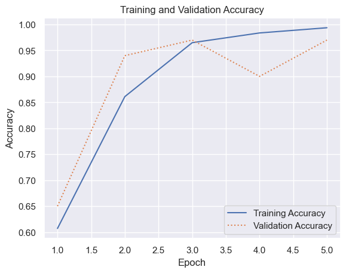
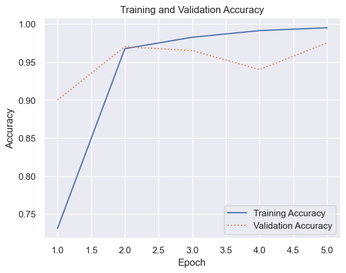

# Text Classification


- [<span class="toc-section-number">1</span> Automating Text
  Vectorization](#automating-text-vectorization)

``` python
import pandas as pd

df = pd.read_csv("Data/ham-spam.csv")
df = df.sample(frac=1, random_state=0)
df.head()
```

<div>
<style scoped>
    .dataframe tbody tr th:only-of-type {
        vertical-align: middle;
    }
&#10;    .dataframe tbody tr th {
        vertical-align: top;
    }
&#10;    .dataframe thead th {
        text-align: right;
    }
</style>

|     | IsSpam | Text                                              |
|-----|--------|---------------------------------------------------|
| 993 | 1      | utf date course utf diminish weight our table...  |
| 859 | 1      | utf any drugs eur utf for dose have you ever ...  |
| 298 | 0      | expert finderhttps expertfinder enron com         |
| 553 | 1      | and courtiers ministerssubsegment founded res...  |
| 672 | 1      | for our clients fargo dear customer have updat... |

</div>

``` python
df = df.drop_duplicates()
df.groupby("IsSpam").describe()
```

<div>
<style scoped>
    .dataframe tbody tr th:only-of-type {
        vertical-align: middle;
    }
&#10;    .dataframe tbody tr th {
        vertical-align: top;
    }
&#10;    .dataframe thead tr th {
        text-align: left;
    }
&#10;    .dataframe thead tr:last-of-type th {
        text-align: right;
    }
</style>

|        | Text  |        |                                                  |      |
|--------|-------|--------|--------------------------------------------------|------|
|        | count | unique | top                                              | freq |
| IsSpam |       |        |                                                  |      |
| 0      | 499   | 499    | expert finderhttps expertfinder enron com        | 1    |
| 1      | 500   | 500    | utf date course utf diminish weight our table... | 1    |

</div>

``` python
from tensorflow.keras.preprocessing.sequence import pad_sequences
from tensorflow.keras.preprocessing.text import Tokenizer

X = df["Text"]
y = df["IsSpam"]

max_words = 10000  # Limit the vocabulary to the 10,000 most common words
max_length = 500

tokenizer = Tokenizer(num_words=max_words)
tokenizer.fit_on_texts(X)
sequences = tokenizer.texts_to_sequences(X)
X = pad_sequences(sequences, maxlen=max_length)
```

``` python
from tensorflow.keras.layers import Dense, Embedding, Flatten
from tensorflow.keras.models import Sequential

model = Sequential()
model.add(Embedding(max_words, 32, input_length=max_length))
model.add(Flatten())
model.add(Dense(128, activation="relu"))
model.add(Dense(1, activation="sigmoid"))
model.compile(optimizer="adam", loss="binary_crossentropy", metrics=["accuracy"])
model.summary()
```

    Model: "sequential_2"
    _________________________________________________________________
     Layer (type)                Output Shape              Param #   
    =================================================================
     embedding_2 (Embedding)     (None, 500, 32)           320000    
                                                                     
     flatten_2 (Flatten)         (None, 16000)             0         
                                                                     
     dense_4 (Dense)             (None, 128)               2048128   
                                                                     
     dense_5 (Dense)             (None, 1)                 129       
                                                                     
    =================================================================
    Total params: 2368257 (9.03 MB)
    Trainable params: 2368257 (9.03 MB)
    Non-trainable params: 0 (0.00 Byte)
    _________________________________________________________________

``` python
hist = model.fit(X, y, validation_split=0.2, epochs=5, batch_size=20)
```

    Epoch 1/5
    40/40 [==============================] - 0s 4ms/step - loss: 0.6601 - accuracy: 0.6070 - val_loss: 0.6233 - val_accuracy: 0.6500
    Epoch 2/5
    40/40 [==============================] - 0s 3ms/step - loss: 0.3883 - accuracy: 0.8611 - val_loss: 0.2688 - val_accuracy: 0.9400
    Epoch 3/5
    40/40 [==============================] - 0s 3ms/step - loss: 0.1121 - accuracy: 0.9650 - val_loss: 0.1311 - val_accuracy: 0.9700
    Epoch 4/5
    40/40 [==============================] - 0s 3ms/step - loss: 0.0533 - accuracy: 0.9837 - val_loss: 0.2160 - val_accuracy: 0.9000
    Epoch 5/5
    40/40 [==============================] - 0s 3ms/step - loss: 0.0243 - accuracy: 0.9937 - val_loss: 0.1176 - val_accuracy: 0.9700

``` python
import matplotlib.pyplot as plt
import seaborn as sns

sns.set_theme()


acc = hist.history["accuracy"]
val_acc = hist.history["val_accuracy"]
epochs = range(1, len(acc) + 1)

plt.plot(epochs, acc, "-", label="Training Accuracy")
plt.plot(epochs, val_acc, ":", label="Validation Accuracy")
plt.title("Training and Validation Accuracy")
plt.xlabel("Epoch")
plt.ylabel("Accuracy")
plt.legend(loc="lower right");
```



``` python
def is_spam(text: str) -> int:
    sequence = tokenizer.texts_to_sequences([text])
    padded_sequence = pad_sequences(sequence, maxlen=max_length)
    return model.predict(padded_sequence)[0][0]


is_spam(
    "Can you attend a code review on Tuesday? Need to make sure the logic is rock solid."
)
```

    1/1 [==============================] - 0s 12ms/step

    0.34400487

``` python
is_spam("Why pay for more expensive meds when you can order them online and save $$$")
```

    1/1 [==============================] - 0s 10ms/step

    0.9877728

## Automating Text Vectorization

``` python
import tensorflow as tf
from tensorflow.keras.layers import (
    Dense,
    Embedding,
    Flatten,
    InputLayer,
    TextVectorization,
)
from tensorflow.keras.models import Sequential

model = Sequential()
model.add(InputLayer(input_shape=(1,), dtype=tf.string))
model.add(TextVectorization(max_tokens=max_words, output_sequence_length=max_length))
model.add(Embedding(max_words, 32, input_length=max_length))
model.add(Flatten())
model.add(Dense(128, activation="relu"))
model.add(Dense(1, activation="sigmoid"))
model.compile(optimizer="adam", loss="binary_crossentropy", metrics=["accuracy"])
model.summary()
```

    Model: "sequential_3"
    _________________________________________________________________
     Layer (type)                Output Shape              Param #   
    =================================================================
     text_vectorization (TextVe  (None, 500)               0         
     ctorization)                                                    
                                                                     
     embedding_3 (Embedding)     (None, 500, 32)           320000    
                                                                     
     flatten_3 (Flatten)         (None, 16000)             0         
                                                                     
     dense_6 (Dense)             (None, 128)               2048128   
                                                                     
     dense_7 (Dense)             (None, 1)                 129       
                                                                     
    =================================================================
    Total params: 2368257 (9.03 MB)
    Trainable params: 2368257 (9.03 MB)
    Non-trainable params: 0 (0.00 Byte)
    _________________________________________________________________

``` python
X = df["Text"]
y = df["IsSpam"]

model.layers[0].adapt(X)
```

``` python
hist = model.fit(X, y, validation_split=0.2, epochs=5, batch_size=20)
```

    Epoch 1/5
    40/40 [==============================] - 0s 4ms/step - loss: 0.5398 - accuracy: 0.7309 - val_loss: 0.3014 - val_accuracy: 0.9000
    Epoch 2/5
    40/40 [==============================] - 0s 3ms/step - loss: 0.1555 - accuracy: 0.9675 - val_loss: 0.1059 - val_accuracy: 0.9700
    Epoch 3/5
    40/40 [==============================] - 0s 3ms/step - loss: 0.0549 - accuracy: 0.9825 - val_loss: 0.0863 - val_accuracy: 0.9650
    Epoch 4/5
    40/40 [==============================] - 0s 4ms/step - loss: 0.0366 - accuracy: 0.9912 - val_loss: 0.1425 - val_accuracy: 0.9400
    Epoch 5/5
    40/40 [==============================] - 0s 4ms/step - loss: 0.0266 - accuracy: 0.9950 - val_loss: 0.0717 - val_accuracy: 0.9750

``` python
import matplotlib.pyplot as plt
import seaborn as sns

sns.set_theme()


acc = hist.history["accuracy"]
val_acc = hist.history["val_accuracy"]
epochs = range(1, len(acc) + 1)

plt.plot(epochs, acc, "-", label="Training Accuracy")
plt.plot(epochs, val_acc, ":", label="Validation Accuracy")
plt.title("Training and Validation Accuracy")
plt.xlabel("Epoch")
plt.ylabel("Accuracy")
plt.legend(loc="lower right");
```



``` python
text = "Why pay for more expensive meds when you can order them online and save $$$"
model.predict([text])[0][0]
```

    1/1 [==============================] - 0s 45ms/step

    0.9150761
